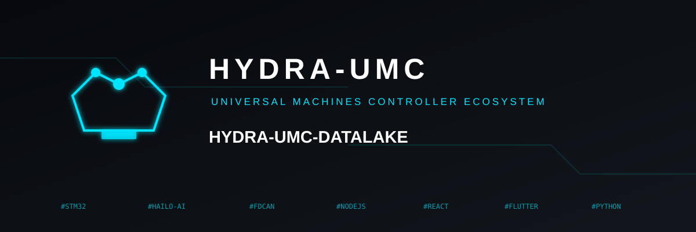
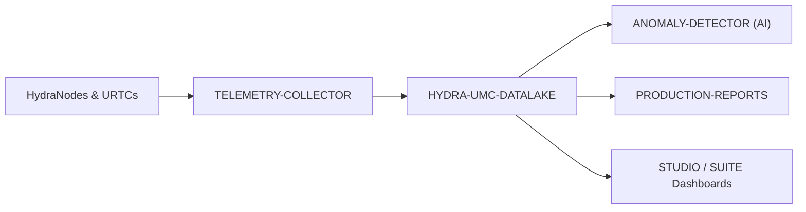

<p align="center">
  
</p>

# 🗄️ HYDRA-UMC-DATALAKE

<p align="center">🇺🇸 <b>English</b> | <a href="README_spa.md">🇪🇸 Español</a> | <a href="README_fra.md">🇫🇷 Français</a> | <a href="README_ita.md">🇮🇹 Italiano</a> | <a href="README_deu.md">🇩🇪 Deutsch</a> | <a href="README_zho.md">🇨🇳 简体中文</a> | <a href="README_jpn.md">🇯🇵 日本語</a></p>

### 📊 Scalable Time-Series Storage for Industrial Robotic Data

<p align="left">
  
  
  
</p>

---

## 1. 🛠️ TECHNICAL OVERVIEW

**HYDRA-UMC-DATALAKE** is the current time-series store for the factory. It provides a real SQLite-backed repository for normalized telemetry generated by the ecosystem, including motor currents, joint angles, sensor readings, and AI inference logs.

It is the software foundation for analytics, predictive maintenance and production reporting. Its current SQLite implementation is tested locally; an external InfluxDB/TimescaleDB deployment remains a future infrastructure decision, not a feature claimed as already running.

### Key Features:
* 🗄️ **SQLite-backed Storage:** Real, ACID, on-disk time-series storage using Python's stdlib `sqlite3`. *(implemented)*
* 📊 **Unified Data Schema:** Normalized long-form telemetry (`source/kind/field/timestamp/value`) for HYDRA-UMC and URTC sources. *(implemented)*
* 🔍 **Deterministic Queries:** Raw results are ordered by timestamp and stable tie-breakers; bounded reads reject non-positive limits. *(implemented)*
* 🔁 **Idempotent Retry Handling:** Re-delivering one `(source, kind, field, timestamp)` point replaces its value (last write wins), avoiding duplicate retry inflation. *(implemented)*
* 🧬 **Reversible Schema Migrations:** Real, tested `migrate_up()`/`migrate_down()` tracked via SQLite's own `PRAGMA user_version` - never edit a released migration, add a new one. *(implemented)*
* 🕐 **Explicit UTC Timestamps:** `GET /stats/range` reports real oldest/newest data as both raw ms and explicit UTC ISO 8601 strings. *(implemented)*
* 🗑️ **Validated Retention:** Per-series, opt-in retention windows (`GET`/`POST /retention`, `POST /retention/apply`) - a non-positive window is rejected outright. *(implemented)*

---

## 2. 🔄 DATA ARCHITECTURE



---

## 3. 🧱 ARCHITECTURE & DESIGN DECISIONS

* **Why this is the integration parent, not a peer, of its 3 children.** HYDRA-UMC-TELEMETRY-COLLECTOR, HYDRA-UMC-ANOMALY-DETECTOR and HYDRA-UMC-PRODUCTION-REPORTS all read/write the SAME underlying time-series store - owning that store in one place (this repo) avoids 3 independent, potentially-diverging schema decisions.
* **Why sqlite3 today, not InfluxDB/TimescaleDB yet.** An external database remains a possible long-term deployment choice, but standing one up is real infrastructure work (a service to deploy and operate), not something to claim or add unasked. `src/hydra_umc_datalake/store.py`'s `TimeSeriesStore` is a genuinely real, ACID, queryable time-series store today (Python's stdlib `sqlite3`) - not a placeholder - and is kept behind its own class so a future backend can replace it without rewriting the HTTP contract.
* **Why one narrow "long" table (source/kind/field/timestamp/value), not one column per telemetry field.** HYDRA-UMC-TELEMETRY-COLLECTOR's own `Sample.Fields` is open-ended (any field name, any source can report new ones) - a narrow schema accepts any of them without a migration, at the real cost of one row per field per sample rather than one row per sample.
* **Why `aggregate()` does real SQL time-bucketing, not just raw `query()`.** A dashboard or report asking "average motor temp per minute over the last week" over millions of raw rows needs real downsampling done by the database, not fetched raw and averaged in application code - `aggregate()`'s bucket boundaries are deterministic (aligned to the query's own `start`), so the same query against the same data always draws the same bucket lines.
* **How this fits the rest of the ecosystem.** The integration parent of the Data & Analytics family - HYDRA-UMC-TELEMETRY-COLLECTOR feeds it from HYDRA-UMC-SERVER, HYDRA-UMC-ANOMALY-DETECTOR and HYDRA-UMC-PRODUCTION-REPORTS both read back from its own stored telemetry.
* **Why schema versioning uses SQLite's own `PRAGMA user_version`, not a hand-rolled table.** SQLite already provides exactly this real mechanism (an integer in the file header) - a parallel bookkeeping table would just be a second, potentially-diverging source of truth for the same fact.
* **Why retention is opt-in per `(kind, field)`, not a global default.** A store with dozens of real telemetry series shouldn't have one operator's retention assumption silently apply to every series - `apply_retention()` only ever touches a series that was explicitly given a policy via `set_retention_policy()`/`POST /retention`.
* **Why retry identity is `(source, kind, field, timestamp)`.** The normalized telemetry contract has no sequence/event identifier, so a repeated exact point is treated as an uncertain network retry and is coalesced with deterministic last-write-wins behavior. This stops duplicate rows from distorting counts and aggregates without silently running a destructive cleanup across historical data.
* **Why `/stats/range` is a new endpoint instead of extending `/stats`.** `/stats`'s existing `{"sampleCount": <int>}` shape is already real and tested - adding fields to it would be a real, breaking change for no reason when a second, additive endpoint costs nothing.

---

## 📂 DIRECTORY STRUCTURE

Pure-software service (ingestion/analytics integrator) - no hardware, firmware or OS of its own; those folders are omitted by repository structure policy.

```text
HYDRA-UMC-DATALAKE/
├── src/hydra_umc_datalake/  # Source code
│   ├── __init__.py          # Package version
│   ├── store.py             # TimeSeriesStore: real sqlite3-backed ingest/query/aggregate
│   ├── api.py                # Bounded JSON/HTTP handlers wrapping the store
│   └── main.py               # Entry point: wires store+API, starts the HTTP server
├── tests/                   # pytest - store logic, real migrations, real HTTP round-trips
├── docs/
│   └── API.md               # Real HTTP endpoint reference (requests, responses, status codes)
├── images/                  # Media and diagrams
├── systemd/
│   └── hydra-umc-datalake.service # Local CM5 ingestion/analytics API systemd unit
├── tools/
│   ├── build_test.py        # Build/compile check without bumping version
│   └── ci_validate.py       # Manifest/CHANGELOG/docs validation used by CI
├── build/                   # Build output (gitignored)
├── pyproject.toml           # Package metadata, version, dependencies
├── bump_version.py          # Odometer-style version bump (run by build)
├── bump_manifest_version.py # Syncs hydra-umc.project.json's version to the native one (--sync)
├── docker-compose.yml       # Integrates TELEMETRY-COLLECTOR / ANOMALY-DETECTOR / PRODUCTION-REPORTS
├── build.sh / build.bat     # Real build: venv + editable install + bump + tests
├── run.sh / run.bat         # Real run: starts the HTTP API
└── README.md
```

Pruned from the original template: `hardware/`, `firmware/` and `os/` —
this is a pure software service (Python package) with no dedicated
hardware or firmware of its own and no operating system image to
maintain. See [`docs/API.md`](docs/API.md) for the full HTTP endpoint
reference.

---

## 4. ⚙️ BUILD & RUN GUIDE

Requires Python >= 3.10. A real, queryable time-series store with an HTTP
API, not just a skeleton that imports.

```bash
# Linux/macOS
./build.sh
./run.sh --port 8095

# Windows
build.bat
run.bat --port 8095
```

`build` creates/activates a local `.venv`, installs the package (editable,
with dev extras) into it, verifies the import, and runs the real test
suite (`pytest`). `run` starts the HTTP API and forwards any flags to it
(`--addr`, `--port`, `--db`).

```bash
# Ingest one sample (same normalized shape as HYDRA-UMC-TELEMETRY-COLLECTOR's own Sample)
curl -X POST localhost:8095/ingest \
  -d '{"sourceId":"robot-1","kind":"motor_temp","timestamp":1700000000000,"fields":{"value":42.5}}'

# Query it back
curl "localhost:8095/query?sourceId=robot-1"

# Downsample to 1-minute buckets over a real time range
curl "localhost:8095/aggregate?kind=motor_temp&field=value&bucketMs=60000&start=0&end=1800000000000&agg=avg"

curl localhost:8095/stats
```

```bash
python -m pytest tests/ -v   # store.py (insert/query/aggregate, including
                              # hand-checkable bucketing math) and api.py
                              # (real HTTP round-trips against a genuine
                              # ThreadingHTTPServer on an ephemeral port)
```

To bring up this project together with its three children (Telemetry-Collector, Anomaly-Detector, Production-Reports) checked out as sibling directories:

```bash
docker compose up --build
```

---

## 🚀 ROADMAP
* **Phase 1:** Datalake high-throughput ingestion and indexing for historical analysis.
* **Phase 2:** Telemetry collector edge-compression and secure transmission protocols.
* **Phase 3:** Anomaly detection using unsupervised learning and motor vibration analysis.
* **Phase 4:** Integration with Grafana for advanced real-time visualization and production report automation.

---

## 🔗 Related Projects

This project is part of a larger robotics ecosystem by the same author (JuanenRac / Electro Hobby 3D), spanning firmware, control software, AI nodes, and fleet tooling. Worth knowing about, since a request might actually be about one of these rather than this repository.

### Family

**Parent:** none — this project is itself the integration parent of the Data & Analytics family.

**Children:**
- **[HYDRA-UMC-TELEMETRY-COLLECTOR](https://github.com/JuanenRac/HYDRA-UMC-TELEMETRY-COLLECTOR)** — feeds this data lake with aggregated per-robot telemetry.
- **[HYDRA-UMC-ANOMALY-DETECTOR](https://github.com/JuanenRac/HYDRA-UMC-ANOMALY-DETECTOR)** — runs anomaly detection over this data lake's own stored telemetry.
- **[HYDRA-UMC-PRODUCTION-REPORTS](https://github.com/JuanenRac/HYDRA-UMC-PRODUCTION-REPORTS)** — generates shift/OEE reports from this data lake's own stored telemetry.

### Directly Related (outside the family)

- **[HYDRA-UMC-SERVER](https://github.com/JuanenRac/HYDRA-UMC-SERVER)** — the source of the logs/telemetry this project ingests.
- **[HYDRA-UMC-DASHBOARD-AI](https://github.com/JuanenRac/HYDRA-UMC-DASHBOARD-AI)** — computes its Smart Summaries directly from this data lake's real query/aggregate history.

### Rest of the Ecosystem

**HYDRA-UMC platform** — the multi-robot micro-factory cell
- **[HYDRA-UMC](https://github.com/JuanenRac/HYDRA-UMC)** — the CM5 + STM32H745 motherboard orchestrating up to 8 robot arms.
- **[HYDRA-UMC-SERVER](https://github.com/JuanenRac/HYDRA-UMC-SERVER)** — the Express/WebSocket backend every control client talks to.
- **[HYDRA-UMC-STUDIO](https://github.com/JuanenRac/HYDRA-UMC-STUDIO)** — web-based control dashboard, multi-robot 3D visualization.
- **[HYDRA-UMC-ANDROID-CONTROL](https://github.com/JuanenRac/HYDRA-UMC-ANDROID-CONTROL)** — Android control app over Wi-Fi/Bluetooth.
- **[HYDRA-UMC-IOS-CONTROL](https://github.com/JuanenRac/HYDRA-UMC-IOS-CONTROL)** — iOS/iPadOS control app built in Flutter.
- **[HYDRA-UMC-SUITE](https://github.com/JuanenRac/HYDRA-UMC-SUITE)** — desktop swarm command center (Python/PySide6).
- **[HYDRA-UMC-EDITOR-URDF](https://github.com/JuanenRac/HYDRA-UMC-EDITOR-URDF)** — desktop URDF model editor for the robot catalog.
- **[HYDRA-UMC-DSI](https://github.com/JuanenRac/HYDRA-UMC-DSI)** — native touch UI for the onboard DSI touchscreen.

**URTC platform** — the tool head controller every HYDRA-UMC robot arm carries
- **[URTC](https://github.com/JuanenRac/URTC)** — CAN bus tool head controller, 25 tool profiles.
- **[URTC-FLASHER](https://github.com/JuanenRac/URTC-FLASHER)** — desktop CAN-OTA + SWD/JTAG flashing tool.
- **[URTC-TESTER](https://github.com/JuanenRac/URTC-TESTER)** — desktop live CAN-bus diagnostic tool.
- **[URTC-WEB-STUDIO](https://github.com/JuanenRac/URTC-WEB-STUDIO)** — browser-based alternative via Web Serial API.

**🎥 Vision AI Node (Hailo-8)**
- [HYDRA-UMC-VISION-NODE](https://github.com/JuanenRac/HYDRA-UMC-VISION-NODE)
- [HYDRA-UMC-VISION-STREAMER](https://github.com/JuanenRac/HYDRA-UMC-VISION-STREAMER)
- [HYDRA-UMC-DETECTION-HEF](https://github.com/JuanenRac/HYDRA-UMC-DETECTION-HEF)
- [HYDRA-UMC-SAFETY-ZONES](https://github.com/JuanenRac/HYDRA-UMC-SAFETY-ZONES)
- [HYDRA-UMC-VISUAL-SERVOING-API](https://github.com/JuanenRac/HYDRA-UMC-VISUAL-SERVOING-API)

**🧠 Cognitive AI Node (Hailo-10)**
- [HYDRA-UMC-COGNITIVE-NODE](https://github.com/JuanenRac/HYDRA-UMC-COGNITIVE-NODE)
- [HYDRA-UMC-VLA-ENGINE](https://github.com/JuanenRac/HYDRA-UMC-VLA-ENGINE)
- [HYDRA-UMC-VOICE-UI](https://github.com/JuanenRac/HYDRA-UMC-VOICE-UI)
- [HYDRA-UMC-SEMANTIC-PLANNER](https://github.com/JuanenRac/HYDRA-UMC-SEMANTIC-PLANNER)
- [HYDRA-UMC-DOCS-QA](https://github.com/JuanenRac/HYDRA-UMC-DOCS-QA)

**🐝 Orchestration & Swarm**
- [HYDRA-UMC-ORCHESTRATOR](https://github.com/JuanenRac/HYDRA-UMC-ORCHESTRATOR)
- [HYDRA-UMC-SWARM-SYNC](https://github.com/JuanenRac/HYDRA-UMC-SWARM-SYNC)
- [HYDRA-UMC-PATH-PLANNER-3D](https://github.com/JuanenRac/HYDRA-UMC-PATH-PLANNER-3D)
- [HYDRA-UMC-JOB-DISPATCHER](https://github.com/JuanenRac/HYDRA-UMC-JOB-DISPATCHER)
- [HYDRA-UMC-NODE-HEALING](https://github.com/JuanenRac/HYDRA-UMC-NODE-HEALING)

**🎮 Digital Twin & Simulation**
- [HYDRA-UMC-TWIN](https://github.com/JuanenRac/HYDRA-UMC-TWIN)
- [HYDRA-UMC-PHYSICS-REPLICA](https://github.com/JuanenRac/HYDRA-UMC-PHYSICS-REPLICA)
- [HYDRA-UMC-HIL-BRIDGE](https://github.com/JuanenRac/HYDRA-UMC-HIL-BRIDGE)
- [HYDRA-UMC-SYNTHETIC-DATA-GEN](https://github.com/JuanenRac/HYDRA-UMC-SYNTHETIC-DATA-GEN)

**🏭 Industrial Gateway**
- [HYDRA-UMC-GATEWAY-INDUSTRIAL](https://github.com/JuanenRac/HYDRA-UMC-GATEWAY-INDUSTRIAL)
- [HYDRA-UMC-OPCUA-SERVER](https://github.com/JuanenRac/HYDRA-UMC-OPCUA-SERVER)
- [HYDRA-UMC-MQTT-BROKER](https://github.com/JuanenRac/HYDRA-UMC-MQTT-BROKER)
- [HYDRA-UMC-MTCONNECT-ADAPTER](https://github.com/JuanenRac/HYDRA-UMC-MTCONNECT-ADAPTER)

**🛠️ Complementary Tools**
- [URTC-SMART-RACK](https://github.com/JuanenRac/URTC-SMART-RACK)
- [URTC-VISION-TOOL](https://github.com/JuanenRac/URTC-VISION-TOOL)
- [HYDRA-UMC-WATCH](https://github.com/JuanenRac/HYDRA-UMC-WATCH)
- [HYDRA-UMC-TOOL-CLI](https://github.com/JuanenRac/HYDRA-UMC-TOOL-CLI)
- [HYDRA-UMC-DASHBOARD-AI](https://github.com/JuanenRac/HYDRA-UMC-DASHBOARD-AI)


## 👤 AUTHOR
**JuanenRac** (Electro Hobby 3D)
📧 electrohobby3d@gmail.com
📺 [youtube.com/@electrohobby3d](https://youtube.com/@electrohobby3d)

## 📜 LICENSE
GPL-3.0 - See LICENSE for details.
