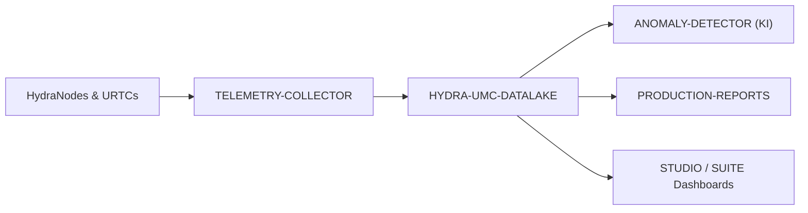

<p align="center">
  
</p>

# 🗄️ HYDRA-UMC-DATALAKE

<p align="center"><a href="README.md">🇺🇸 English</a> | <a href="README_spa.md">🇪🇸 Español</a> | <a href="README_fra.md">🇫🇷 Français</a> | <a href="README_ita.md">🇮🇹 Italiano</a> | 🇩🇪 <b>Deutsch</b> | <a href="README_zho.md">🇨🇳 简体中文</a> | <a href="README_jpn.md">🇯🇵 日本語</a></p>

### 📊 Skalierbarer Zeitreihenspeicher für industrielle Roboterdaten

<p align="left">
  
  
  
</p>

---

## 1. 🛠️ TECHNISCHER ÜBERBLICK

**HYDRA-UMC-DATALAKE** ist das Langzeitgedächtnis der Fabrik. Er bietet ein skalierbares Hochleistungs-Repository für alle vom Ökosystem generierten Zeitreihendaten, einschließlich Motorströmen, Gelenkwinkeln, Sensormesswerten und KI-Inferenzprotokollen.

Er dient als Grundlage für fortschrittliche Analysen, vorausschauende Wartung und Produktionsoptimierung und ermöglicht es Betriebsleitern, auf Jahre millisekundengenauer Roboterleistung zurückzublicken.

### Hauptmerkmale:
* 🗄️ **Hochauflösende Speicherung:** Optimiert für Millionen von Punkten pro Sekunde mit InfluxDB/TimescaleDB.
* 📊 **Einheitliches Datenschema:** Standardisiertes Format für die gesamte HydraNode- und URTC-Telemetrie.
* 🔍 **Schnelle Abfragen:** Schnelles Abrufen historischer Daten für Produktionsaudits und Qualitätssicherung.
* 🛡️ **Datenintegritàt:** Redundante Speicherung und automatische Backups für kritische Industrieprotokolle.
* 🧬 **Reversible Schema-Migrationen:** Echte, getestete `migrate_up()`/`migrate_down()`, nachverfolgt über SQLites eigenes `PRAGMA user_version` - eine veröffentlichte Migration nie bearbeiten, stattdessen eine neue hinzufügen. *(implementiert)*
* 🕐 **Explizite UTC-Zeitstempel:** `GET /stats/range` meldet die echten ältesten/neuesten Daten sowohl als rohe ms als auch als explizite UTC-ISO-8601-Strings. *(implementiert)*
* 🗑️ **Validierte Aufbewahrung:** Pro Serie opt-in wählbare Aufbewahrungsfenster (`GET`/`POST /retention`, `POST /retention/apply`) - ein nicht-positives Fenster wird rundweg abgelehnt. *(implementiert)*

---

## 2. 🔄 DATENARCHITEKTUR



---

## 3. 🧱 ARCHITEKTUR & DESIGNENTSCHEIDUNGEN

* **Warum es der Integrations-Elternteil, kein Gleichrangiger, seiner 3 Kinder ist.** HYDRA-UMC-TELEMETRY-COLLECTOR, HYDRA-UMC-ANOMALY-DETECTOR und HYDRA-UMC-PRODUCTION-REPORTS lesen/schreiben alle denselben zugrunde liegenden Zeitreihenspeicher - diesen Speicher an einem Ort (diesem Repo) zu besitzen vermeidet 3 unabhängige, potenziell divergierende Schema-Entscheidungen.
* **Warum sqlite3 heute, noch nicht InfluxDB/TimescaleDB.** Beide stehen in den eigenen Badges/Keywords dieses Projekts und bleiben die echte langfristige Richtung - aber eines aufzusetzen ist eine echte Infrastrukturentscheidung (ein Dienst, der bereitgestellt und betrieben werden muss), die demjenigen obliegt, der dies produktiv einsetzt, nicht etwas, das ungefragt hinzugefügt wird. Der `TimeSeriesStore` in `src/hydra_umc_datalake/store.py` ist heute ein echter, ACID-konformer, abfragbarer Zeitreihenspeicher (Pythons stdlib-`sqlite3`) - kein Platzhalter, der nur so tut - absichtlich hinter seiner eigenen Klasse gehalten, damit eine echte InfluxDB/TimescaleDB-gestützte Implementierung ihn später ersetzen kann. Siehe `mejoras_futuras.txt`.
* **Warum eine einzige schmale "lange" Tabelle (source/kind/field/timestamp/value) statt einer Spalte pro Telemetriefeld.** Das eigene `Sample.Fields` von HYDRA-UMC-TELEMETRY-COLLECTOR ist offen (jeder Feldname, jede Quelle kann neue melden) - ein schmales Schema akzeptiert sie alle ohne Migration, zum echten Preis einer Zeile pro Feld pro Sample statt einer Zeile pro Sample.
* **Warum `aggregate()` echtes SQL-Zeit-Bucketing macht, nicht nur rohes `query()`.** Ein Dashboard oder Bericht, der nach "durchschnittlicher Motortemperatur pro Minute in der letzten Woche" über Millionen roher Zeilen fragt, braucht echtes Downsampling durch die Datenbank, nicht roh abgerufen und im Anwendungscode gemittelt - die Bucket-Grenzen von `aggregate()` sind deterministisch (am `start` der Abfrage selbst ausgerichtet), sodass dieselbe Abfrage über dieselben Daten immer dieselben Bucket-Grenzen zieht.
* **Wie sich das ins restliche Ökosystem einfügt.** Der Integrations-Elternteil der Data-&-Analytics-Familie - HYDRA-UMC-TELEMETRY-COLLECTOR speist ihn von HYDRA-UMC-SERVER aus, HYDRA-UMC-ANOMALY-DETECTOR und HYDRA-UMC-PRODUCTION-REPORTS lesen beide aus seiner eigenen gespeicherten Telemetrie zurück.
* **Warum die Schema-Versionierung SQLites eigenes `PRAGMA user_version` nutzt, keine handgestrickte Tabelle.** SQLite bietet bereits genau diesen echten Mechanismus (eine Ganzzahl im Datei-Header) - eine parallele Buchführungstabelle wäre nur eine zweite, potenziell abweichende Quelle der Wahrheit für denselben Sachverhalt.
* **Warum die Aufbewahrung opt-in pro `(kind, field)` ist, kein globaler Standard.** Ein Speicher mit Dutzenden echter Telemetrie-Serien sollte nicht die Aufbewahrungsannahme eines Betreibers stillschweigend auf jede Serie anwenden lassen - `apply_retention()` fasst immer nur eine Serie an, der explizit über `set_retention_policy()`/`POST /retention` eine Richtlinie zugewiesen wurde.
* **Warum `/stats/range` ein neuer Endpunkt ist statt `/stats` zu erweitern.** Die bestehende Form von `/stats`, `{"sampleCount": <int>}`, ist bereits echt und getestet - Felder hinzuzufügen wäre ein echter, breaking Change ohne Grund, wenn ein zweiter, additiver Endpunkt nichts kostet.

---

## 📂 VERZEICHNISSTRUKTUR

Reiner Software-Dienst (Ingestion-/Analytik-Integrator) - ohne eigene Hardware, Firmware oder Betriebssystem; diese Ordner werden gemäß der Repository-Strukturpolitik ausgelassen.

```text
HYDRA-UMC-DATALAKE/
├── src/hydra_umc_datalake/  # Quellcode
│   ├── __init__.py          # Paketversion
│   ├── store.py             # TimeSeriesStore: echte Ingestion/Abfrage/Aggregation via sqlite3
│   ├── api.py                # Einfache JSON/HTTP-Handler, die den Store umschließen
│   └── main.py               # Einstiegspunkt: verbindet Store+API, startet den HTTP-Server
├── tests/                   # pytest - Store-Logik, echte Migrationen, echte HTTP-Roundtrips
├── docs/
│   └── API.md               # Echte HTTP-Endpunktreferenz (Requests, Responses, Statuscodes)
├── build/                   # Build-Ausgabe (von git ignoriert)
├── pyproject.toml           # Paketmetadaten, Version, Abhängigkeiten
├── bump_version.py          # Versionserhöhung im "Kilometerzähler"-Stil (vom Build ausgeführt)
├── docker-compose.yml       # Integriert TELEMETRY-COLLECTOR / ANOMALY-DETECTOR / PRODUCTION-REPORTS
├── build.sh / build.bat     # Echter Build: venv + editierbare Installation + Bump + Tests
├── run.sh / run.bat         # Echte Ausführung: startet die HTTP-API
└── README.md
```

Aus der ursprünglichen Vorlage entfernt: `hardware/`, `firmware/`, `os/`,
`images/` und `scripts/` — dies ist ein reiner Softwaredienst
(Python-Paket) ohne eigene Hardware oder Firmware, ohne zu pflegendes
Betriebssystem-Image, und ohne Medien-/Utility-Skript-Inhalt, der eigene
Ordner bislang rechtfertigen würde. Siehe [`docs/API.md`](docs/API.md)
für die vollständige HTTP-Endpunktreferenz.

---

## 4. ⚙️ BUILD & AUSFÜHRUNG

Erfordert Python >= 3.10. Ein echter, abfragbarer Zeitreihenspeicher mit
HTTP-API, nicht nur ein Skelett, das sich importieren lässt.

```bash
# Linux/macOS
./build.sh
./run.sh --port 8095

# Windows
build.bat
run.bat --port 8095
```

`build` erstellt/aktiviert eine lokale `.venv`, installiert das Paket
(editierbar, mit Dev-Extras) darin, prüft den Import und führt die echte
Testsuite (`pytest`) aus. `run` startet die HTTP-API und reicht jedes Flag
weiter (`--addr`, `--port`, `--db`).

```bash
# Ein Sample einspeisen (dieselbe normalisierte Form wie HYDRA-UMC-TELEMETRY-COLLECTORs eigenes Sample)
curl -X POST localhost:8095/ingest \
  -d '{"sourceId":"robot-1","kind":"motor_temp","timestamp":1700000000000,"fields":{"value":42.5}}'

# Es wieder abfragen
curl "localhost:8095/query?sourceId=robot-1"

# Auf 1-Minuten-Buckets über einen echten Zeitraum herunterrechnen
curl "localhost:8095/aggregate?kind=motor_temp&field=value&bucketMs=60000&start=0&end=1800000000000&agg=avg"

curl localhost:8095/stats
```

```bash
python -m pytest tests/ -v   # store.py (insert/query/aggregate,
                              # einschließlich von Hand nachrechenbarer
                              # Bucketing-Mathematik) und api.py (echte
                              # HTTP-Roundtrips gegen einen echten
                              # ThreadingHTTPServer auf einem ephemeren Port)
```

Um dieses Projekt zusammen mit seinen drei Kindern (Telemetry-Collector, Anomaly-Detector, Production-Reports) als Geschwisterverzeichnisse zu starten:

```bash
docker compose up --build
```

---

## 🚀 ROADMAP
* **Phase 1:** Hochdurchsatz-Ingestion und Indexierung des Datalakes für historische Analysen.
* **Phase 2:** Edge-Kompression des Telemetrie-Collectors und sichere Übertragungsprotokolle.
* **Phase 3:** Anomalieerkennung mittels unüberwachtem Lernen und Motorvibrationsanalyse.
* **Phase 4:** Integration mit Grafana für erweiterte Echtzeit-Visualisierung und Automatisierung von Produktionsberichten.

---

## 🔗 Verwandte Projekte

Dieses Projekt ist Teil eines größeren Robotik-Ökosystems desselben Autors (JuanenRac / Electro Hobby 3D), das Firmware, Steuerungssoftware, KI-Knoten und Flotten-Tools umfasst. Gut zu wissen, denn eine Anfrage könnte tatsächlich eines dieser Projekte betreffen statt dieses Repository.

### Familie

**Elternteil:** keiner — dieses Projekt ist selbst der Integrations-Elternteil der Data & Analytics-Familie.

**Kinder:**
- **[HYDRA-UMC-TELEMETRY-COLLECTOR](https://github.com/JuanenRac/HYDRA-UMC-TELEMETRY-COLLECTOR)** — speist diesen Data Lake mit pro Roboter aggregierter Telemetrie.
- **[HYDRA-UMC-ANOMALY-DETECTOR](https://github.com/JuanenRac/HYDRA-UMC-ANOMALY-DETECTOR)** — führt Anomalieerkennung über die in diesem Data Lake gespeicherte Telemetrie aus.
- **[HYDRA-UMC-PRODUCTION-REPORTS](https://github.com/JuanenRac/HYDRA-UMC-PRODUCTION-REPORTS)** — erstellt Schicht-/OEE-Berichte aus der in diesem Data Lake gespeicherten Telemetrie.

### Direkte Beziehung (außerhalb der Familie)

- **[HYDRA-UMC-SERVER](https://github.com/JuanenRac/HYDRA-UMC-SERVER)** — die Quelle der von diesem Projekt aufgenommenen Logs/Telemetrie.

### Restliches Ökosystem

**HYDRA-UMC-Plattform** — die Multi-Roboter-Mikrofabrikzelle
- **[HYDRA-UMC](https://github.com/JuanenRac/HYDRA-UMC)** — das CM5 + STM32H745-Motherboard, das bis zu 8 Roboterarme orchestriert.
- **[HYDRA-UMC-SERVER](https://github.com/JuanenRac/HYDRA-UMC-SERVER)** — das Express/WebSocket-Backend, mit dem jeder Steuerungsclient spricht.
- **[HYDRA-UMC-STUDIO](https://github.com/JuanenRac/HYDRA-UMC-STUDIO)** — webbasiertes Steuerungs-Dashboard, Multi-Roboter-3D-Visualisierung.
- **[HYDRA-UMC-ANDROID-CONTROL](https://github.com/JuanenRac/HYDRA-UMC-ANDROID-CONTROL)** — Android-Steuerungs-App über Wi-Fi/Bluetooth.
- **[HYDRA-UMC-IOS-CONTROL](https://github.com/JuanenRac/HYDRA-UMC-IOS-CONTROL)** — iOS/iPadOS-Steuerungs-App, gebaut in Flutter.
- **[HYDRA-UMC-SUITE](https://github.com/JuanenRac/HYDRA-UMC-SUITE)** — Desktop-Schwarm-Kommandozentrale (Python/PySide6).
- **[HYDRA-UMC-EDITOR-URDF](https://github.com/JuanenRac/HYDRA-UMC-EDITOR-URDF)** — Desktop-URDF-Modelleditor für den Roboterkatalog.
- **[HYDRA-UMC-DSI](https://github.com/JuanenRac/HYDRA-UMC-DSI)** — native Touch-UI für den eingebauten DSI-Touchscreen.

**URTC-Plattform** — der Werkzeugkopf-Controller, den jeder HYDRA-UMC-Roboterarm trägt
- **[URTC](https://github.com/JuanenRac/URTC)** — CAN-Bus-Werkzeugkopf-Controller, 25 Werkzeugprofile.
- **[URTC-FLASHER](https://github.com/JuanenRac/URTC-FLASHER)** — Desktop-Tool für CAN-OTA + SWD/JTAG-Flashing.
- **[URTC-TESTER](https://github.com/JuanenRac/URTC-TESTER)** — Desktop-Tool für Live-CAN-Bus-Diagnose.
- **[URTC-WEB-STUDIO](https://github.com/JuanenRac/URTC-WEB-STUDIO)** — browserbasierte Alternative über die Web-Serial-API.

**🎥 Vision AI Node (Hailo-8)**
- [HYDRA-UMC-VISION-NODE](https://github.com/JuanenRac/HYDRA-UMC-VISION-NODE)
- [HYDRA-UMC-VISION-STREAMER](https://github.com/JuanenRac/HYDRA-UMC-VISION-STREAMER)
- [HYDRA-UMC-DETECTION-HEF](https://github.com/JuanenRac/HYDRA-UMC-DETECTION-HEF)
- [HYDRA-UMC-SAFETY-ZONES](https://github.com/JuanenRac/HYDRA-UMC-SAFETY-ZONES)
- [HYDRA-UMC-VISUAL-SERVOING-API](https://github.com/JuanenRac/HYDRA-UMC-VISUAL-SERVOING-API)

**🧠 Cognitive AI Node (Hailo-10)**
- [HYDRA-UMC-COGNITIVE-NODE](https://github.com/JuanenRac/HYDRA-UMC-COGNITIVE-NODE)
- [HYDRA-UMC-VLA-ENGINE](https://github.com/JuanenRac/HYDRA-UMC-VLA-ENGINE)
- [HYDRA-UMC-VOICE-UI](https://github.com/JuanenRac/HYDRA-UMC-VOICE-UI)
- [HYDRA-UMC-SEMANTIC-PLANNER](https://github.com/JuanenRac/HYDRA-UMC-SEMANTIC-PLANNER)
- [HYDRA-UMC-DOCS-QA](https://github.com/JuanenRac/HYDRA-UMC-DOCS-QA)

**🐝 Orchestration & Swarm**
- [HYDRA-UMC-ORCHESTRATOR](https://github.com/JuanenRac/HYDRA-UMC-ORCHESTRATOR)
- [HYDRA-UMC-SWARM-SYNC](https://github.com/JuanenRac/HYDRA-UMC-SWARM-SYNC)
- [HYDRA-UMC-PATH-PLANNER-3D](https://github.com/JuanenRac/HYDRA-UMC-PATH-PLANNER-3D)
- [HYDRA-UMC-JOB-DISPATCHER](https://github.com/JuanenRac/HYDRA-UMC-JOB-DISPATCHER)
- [HYDRA-UMC-NODE-HEALING](https://github.com/JuanenRac/HYDRA-UMC-NODE-HEALING)

**🎮 Digital Twin & Simulation**
- [HYDRA-UMC-TWIN](https://github.com/JuanenRac/HYDRA-UMC-TWIN)
- [HYDRA-UMC-PHYSICS-REPLICA](https://github.com/JuanenRac/HYDRA-UMC-PHYSICS-REPLICA)
- [HYDRA-UMC-HIL-BRIDGE](https://github.com/JuanenRac/HYDRA-UMC-HIL-BRIDGE)
- [HYDRA-UMC-SYNTHETIC-DATA-GEN](https://github.com/JuanenRac/HYDRA-UMC-SYNTHETIC-DATA-GEN)

**🏭 Industrial Gateway**
- [HYDRA-UMC-GATEWAY-INDUSTRIAL](https://github.com/JuanenRac/HYDRA-UMC-GATEWAY-INDUSTRIAL)
- [HYDRA-UMC-OPCUA-SERVER](https://github.com/JuanenRac/HYDRA-UMC-OPCUA-SERVER)
- [HYDRA-UMC-MQTT-BROKER](https://github.com/JuanenRac/HYDRA-UMC-MQTT-BROKER)
- [HYDRA-UMC-MTCONNECT-ADAPTER](https://github.com/JuanenRac/HYDRA-UMC-MTCONNECT-ADAPTER)

**🛠️ Complementary Tools**
- [URTC-SMART-RACK](https://github.com/JuanenRac/URTC-SMART-RACK)
- [URTC-VISION-TOOL](https://github.com/JuanenRac/URTC-VISION-TOOL)
- [HYDRA-UMC-WATCH](https://github.com/JuanenRac/HYDRA-UMC-WATCH)
- [HYDRA-UMC-TOOL-CLI](https://github.com/JuanenRac/HYDRA-UMC-TOOL-CLI)
- [HYDRA-UMC-DASHBOARD-AI](https://github.com/JuanenRac/HYDRA-UMC-DASHBOARD-AI)


## 👤 AUTOR
**JuanenRac** (Electro Hobby 3D)
📧 electrohobby3d@gmail.com

## 📜 LIZENZ
GPL-3.0 - Siehe LICENSE für Details.

## 🛠️ BUILD & RUN

Verwenden Sie den Build-Check ohne Versionierung vor einem Release-Build:

| Aktion | Windows | Linux / macOS |
|---|---|---|
| Build-Check (ohne Änderung von Version oder CHANGELOG) | `build-test.bat` | `./build-test.sh` |
| Ausführung / Entwicklung (falls vorhanden) | `run*.bat` oder `dev*.bat` | `./run*.sh` oder `./dev*.sh` |

`build-test.bat` und `build-test.sh` kompilieren oder validieren den Projekt-Stack, ohne `hydra-umc.project.json` zu erhöhen oder `CHANGELOG.md` zu verändern. Sie dürfen nur normale Compiler-Ausgaben erzeugen. Die vorhandenen Skripte `build*.bat`, `build*.sh`, `run*` und `dev*` behalten ihr projektbezogenes Versions- oder Laufzeitverhalten bei; verwenden Sie sie, wenn dieses Verhalten benötigt wird.