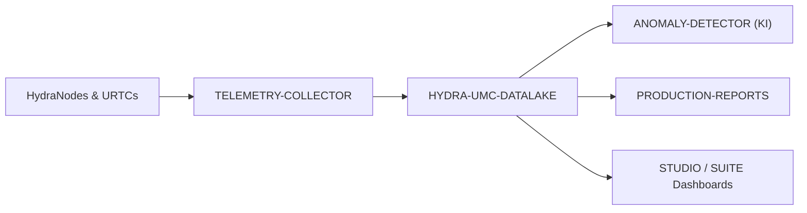

<p align="center">
  
</p>

# 🗄️ HYDRA-UMC-DATALAKE

<p align="center"><a href="README.md">🇺🇸 English</a> | <a href="README_spa.md">🇪🇸 Español</a> | <a href="README_fra.md">🇫🇷 Français</a> | <a href="README_ita.md">🇮🇹 Italiano</a> | 🇩🇪 <b>Deutsch</b> | <a href="README_zho.md">🇨🇳 简体中文</a> | <a href="README_jpn.md">🇯🇵 日本語</a></p>

### 📊 Skalierbarer Zeitreihenspeicher für industrielle Roboterdaten

<p align="left">
  
  
  
</p>

---

## 1. 🛠️ TECHNISCHER ÜBERBLICK

**HYDRA-UMC-DATALAKE** ist der aktuelle Zeitreihenspeicher der Fabrik. Er bietet ein echtes SQLite-gestütztes Repository für normalisierte Telemetrie des Ökosystems, einschließlich Motorströmen, Gelenkwinkeln, Sensormesswerten und KI-Inferenzprotokollen.

Er bildet die Softwaregrundlage für Analysen, vorausschauende Wartung und Produktionsberichte. Die aktuelle SQLite-Implementierung ist lokal getestet; ein externer InfluxDB-/TimescaleDB-Einsatz bleibt eine künftige Infrastrukturentscheidung und wird nicht als bereits laufende Funktion behauptet.

### Hauptmerkmale:
* 🗄️ **SQLite-gestützter Speicher:** Echter, ACID-konformer Zeitreihenspeicher auf Datenträger mit Pythons stdlib-`sqlite3`. *(implementiert)*
* 📊 **Einheitliches Datenschema:** Normalisierte Long-Form-Telemetrie (`source/kind/field/timestamp/value`) für HYDRA-UMC- und URTC-Quellen. *(implementiert)*
* 🔍 **Deterministische Abfragen:** Ergebnisse werden nach Timestamp und stabilen Tie-Breakern geordnet; begrenzte Lesevorgänge lehnen nicht-positive Limits ab. *(implementiert)*
* 🔁 **Idempotente Wiederholungen:** Die erneute Zustellung eines Punkts `(source, kind, field, timestamp)` ersetzt seinen Wert (letzte Schreiboperation gewinnt) und verhindert aufgeblähte Duplikate durch Wiederholungen. *(implementiert)*
* 🧬 **Reversible Schema-Migrationen:** Echte, getestete `migrate_up()`/`migrate_down()`, nachverfolgt über SQLites eigenes `PRAGMA user_version` - eine veröffentlichte Migration nie bearbeiten, stattdessen eine neue hinzufügen. *(implementiert)*
* 🕐 **Explizite UTC-Zeitstempel:** `GET /stats/range` meldet die echten ältesten/neuesten Daten sowohl als rohe ms als auch als explizite UTC-ISO-8601-Strings. *(implementiert)*
* 🗑️ **Validierte Aufbewahrung:** Pro Serie opt-in wählbare Aufbewahrungsfenster (`GET`/`POST /retention`, `POST /retention/apply`) - ein nicht-positives Fenster wird rundweg abgelehnt. *(implementiert)*

---

## 2. 🔄 DATENARCHITEKTUR



---

## 3. 🧱 ARCHITEKTUR & DESIGNENTSCHEIDUNGEN

* **Warum es der Integrations-Elternteil, kein Gleichrangiger, seiner 3 Kinder ist.** HYDRA-UMC-TELEMETRY-COLLECTOR, HYDRA-UMC-ANOMALY-DETECTOR und HYDRA-UMC-PRODUCTION-REPORTS lesen/schreiben alle denselben zugrunde liegenden Zeitreihenspeicher - diesen Speicher an einem Ort (diesem Repo) zu besitzen vermeidet 3 unabhängige, potenziell divergierende Schema-Entscheidungen.
* **Warum sqlite3 heute, noch nicht InfluxDB/TimescaleDB.** Eine externe Datenbank bleibt eine mögliche langfristige Deployment-Entscheidung, doch ihr Betrieb ist echte Infrastrukturarbeit und nichts, das ungefragt behauptet oder ergänzt werden sollte. Der `TimeSeriesStore` in `src/hydra_umc_datalake/store.py` ist heute ein echter, ACID-konformer, abfragbarer Zeitreihenspeicher (Pythons stdlib-`sqlite3`), kein Platzhalter, und bleibt hinter seiner eigenen Klasse, sodass ein zukünftiges Backend den HTTP-Vertrag ohne Neuschreiben ersetzen kann.
* **Warum eine einzige schmale "lange" Tabelle (source/kind/field/timestamp/value) statt einer Spalte pro Telemetriefeld.** Das eigene `Sample.Fields` von HYDRA-UMC-TELEMETRY-COLLECTOR ist offen (jeder Feldname, jede Quelle kann neue melden) - ein schmales Schema akzeptiert sie alle ohne Migration, zum echten Preis einer Zeile pro Feld pro Sample statt einer Zeile pro Sample.
* **Warum `aggregate()` echtes SQL-Zeit-Bucketing macht, nicht nur rohes `query()`.** Ein Dashboard oder Bericht, der nach "durchschnittlicher Motortemperatur pro Minute in der letzten Woche" über Millionen roher Zeilen fragt, braucht echtes Downsampling durch die Datenbank, nicht roh abgerufen und im Anwendungscode gemittelt - die Bucket-Grenzen von `aggregate()` sind deterministisch (am `start` der Abfrage selbst ausgerichtet), sodass dieselbe Abfrage über dieselben Daten immer dieselben Bucket-Grenzen zieht.
* **Wie sich das ins restliche Ökosystem einfügt.** Der Integrations-Elternteil der Data-&-Analytics-Familie - HYDRA-UMC-TELEMETRY-COLLECTOR speist ihn von HYDRA-UMC-SERVER aus, HYDRA-UMC-ANOMALY-DETECTOR und HYDRA-UMC-PRODUCTION-REPORTS lesen beide aus seiner eigenen gespeicherten Telemetrie zurück.
* **Warum die Schema-Versionierung SQLites eigenes `PRAGMA user_version` nutzt, keine handgestrickte Tabelle.** SQLite bietet bereits genau diesen echten Mechanismus (eine Ganzzahl im Datei-Header) - eine parallele Buchführungstabelle wäre nur eine zweite, potenziell abweichende Quelle der Wahrheit für denselben Sachverhalt.
* **Warum die Aufbewahrung opt-in pro `(kind, field)` ist, kein globaler Standard.** Ein Speicher mit Dutzenden echter Telemetrie-Serien sollte nicht die Aufbewahrungsannahme eines Betreibers stillschweigend auf jede Serie anwenden lassen - `apply_retention()` fasst immer nur eine Serie an, der explizit über `set_retention_policy()`/`POST /retention` eine Richtlinie zugewiesen wurde.
* **Warum die Wiederholungsidentität `(source, kind, field, timestamp)` lautet.** Der normalisierte Telemetrievertrag besitzt keine Sequenz-/Ereignis-ID; ein exakt wiederholter Punkt wird deshalb als unsichere Netzwerkwiederholung behandelt und mit deterministischem Last-Write-Wins-Verhalten zusammengeführt. Das verhindert verzerrende Duplikate in Zählungen und Aggregaten, ohne historische Daten global destruktiv zu bereinigen.
* **Warum `/stats/range` ein neuer Endpunkt ist statt `/stats` zu erweitern.** Die bestehende Form von `/stats`, `{"sampleCount": <int>}`, ist bereits echt und getestet - Felder hinzuzufügen wäre ein echter, breaking Change ohne Grund, wenn ein zweiter, additiver Endpunkt nichts kostet.

---

## 📂 VERZEICHNISSTRUKTUR

Reiner Software-Dienst (Ingestion-/Analytik-Integrator) - ohne eigene Hardware, Firmware oder Betriebssystem; diese Ordner werden gemäß der Repository-Strukturpolitik ausgelassen.

```text
HYDRA-UMC-DATALAKE/
├── src/hydra_umc_datalake/  # Quellcode
│   ├── __init__.py          # Paketversion
│   ├── store.py             # TimeSeriesStore: echte Ingestion/Abfrage/Aggregation via sqlite3
│   ├── api.py                # Begrenzte JSON/HTTP-Handler, die den Store umschließen
│   └── main.py               # Einstiegspunkt: verbindet Store+API, startet den HTTP-Server
├── tests/                   # pytest - Store-Logik, echte Migrationen, echte HTTP-Roundtrips
├── docs/
│   └── API.md               # Echte HTTP-Endpunktreferenz (Requests, Responses, Statuscodes)
├── images/                  # Medien und Diagramme
├── systemd/
│   └── hydra-umc-datalake.service # systemd-Unit der lokalen Ingestion-/Analytik-API auf der CM5
├── tools/
│   ├── build_test.py        # Build-/Kompilierprüfung ohne Versionserhöhung
│   └── ci_validate.py       # Manifest-/CHANGELOG-/Doku-Validierung, von der CI genutzt
├── build/                   # Build-Ausgabe (von git ignoriert)
├── pyproject.toml           # Paketmetadaten, Version, Abhängigkeiten
├── bump_version.py          # Versionserhöhung im "Kilometerzähler"-Stil (vom Build ausgeführt)
├── bump_manifest_version.py # Synchronisiert die Version von hydra-umc.project.json mit der nativen (--sync)
├── docker-compose.yml       # Integriert TELEMETRY-COLLECTOR / ANOMALY-DETECTOR / PRODUCTION-REPORTS
├── build.sh / build.bat     # Echter Build: venv + editierbare Installation + Bump + Tests
├── run.sh / run.bat         # Echte Ausführung: startet die HTTP-API
└── README.md
```

Aus der ursprünglichen Vorlage entfernt: `hardware/`, `firmware/` und
`os/` — dies ist ein reiner Softwaredienst (Python-Paket) ohne eigene
Hardware oder Firmware und ohne zu pflegendes Betriebssystem-Image. Siehe
[`docs/API.md`](docs/API.md) für die vollständige HTTP-Endpunktreferenz.

---

## 4. ⚙️ BUILD & AUSFÜHRUNG

Erfordert Python >= 3.10. Ein echter, abfragbarer Zeitreihenspeicher mit
HTTP-API, nicht nur ein Skelett, das sich importieren lässt.

```bash
# Linux/macOS
./build.sh
./run.sh --port 8095

# Windows
build.bat
run.bat --port 8095
```

`build` erstellt/aktiviert eine lokale `.venv`, installiert das Paket
(editierbar, mit Dev-Extras) darin, prüft den Import und führt die echte
Testsuite (`pytest`) aus. `run` startet die HTTP-API und reicht jedes Flag
weiter (`--addr`, `--port`, `--db`).

```bash
# Ein Sample einspeisen (dieselbe normalisierte Form wie HYDRA-UMC-TELEMETRY-COLLECTORs eigenes Sample)
curl -X POST localhost:8095/ingest \
  -d '{"sourceId":"robot-1","kind":"motor_temp","timestamp":1700000000000,"fields":{"value":42.5}}'

# Es wieder abfragen
curl "localhost:8095/query?sourceId=robot-1"

# Auf 1-Minuten-Buckets über einen echten Zeitraum herunterrechnen
curl "localhost:8095/aggregate?kind=motor_temp&field=value&bucketMs=60000&start=0&end=1800000000000&agg=avg"

curl localhost:8095/stats
```

```bash
python -m pytest tests/ -v   # store.py (insert/query/aggregate,
                              # einschließlich von Hand nachrechenbarer
                              # Bucketing-Mathematik) und api.py (echte
                              # HTTP-Roundtrips gegen einen echten
                              # ThreadingHTTPServer auf einem ephemeren Port)
```

Um dieses Projekt zusammen mit seinen drei Kindern (Telemetry-Collector, Anomaly-Detector, Production-Reports) als Geschwisterverzeichnisse zu starten:

```bash
docker compose up --build
```

---

## 🚀 FAHRPLAN
* **Phase 1:** Hochdurchsatz-Ingestion und Indexierung des Datalakes für historische Analysen.
* **Phase 2:** Edge-Kompression des Telemetrie-Collectors und sichere Übertragungsprotokolle.
* **Phase 3:** Anomalieerkennung mittels unüberwachtem Lernen und Motorvibrationsanalyse.
* **Phase 4:** Integration mit Grafana für erweiterte Echtzeit-Visualisierung und Automatisierung von Produktionsberichten.

---

## 🔗 Verwandte Projekte

Dieses Projekt ist Teil des HYDRA-UMC-Robotik-Ökosystems desselben Autors (JuanenRac / Electro Hobby 3D). Gut zu wissen, da eine Anfrage eigentlich eines dieser Projekte betreffen könnte statt dieses Repositorys.

**Untergeordnete Projekte** — jedes davon schreibt in oder liest aus dem eigenen Speicher dieses Data Lakes
- **[HYDRA-UMC-TELEMETRY-COLLECTOR](https://github.com/JuanenRac/HYDRA-UMC-TELEMETRY-COLLECTOR)** — echte CAN/WebSocket-Ingestion-Pipeline in DATALAKE, mit Sequenz-Deduplizierung.
- **[HYDRA-UMC-ANOMALY-DETECTOR](https://github.com/JuanenRac/HYDRA-UMC-ANOMALY-DETECTOR)** — echter FFT- + statistischer Basislinien-Anomaliedetektor mit Drift-Überwachung.
- **[HYDRA-UMC-PRODUCTION-REPORTS](https://github.com/JuanenRac/HYDRA-UMC-PRODUCTION-REPORTS)** — echte OEE-/Verfügbarkeitsberechnung über den DATALAKE-Verlauf, mit reproduzierbarem CSV-Export.

**Direkt verwandt**
- **[HYDRA-UMC-SERVER](https://github.com/JuanenRac/HYDRA-UMC-SERVER)** — das reale Headless-Backend (REST/WebSocket), mit dem jeder Steuerungsclient tatsächlich spricht; die Quelle der Logs/Telemetrie, die dieses Projekt aufnimmt.
- **[HYDRA-UMC-DASHBOARD-AI](https://github.com/JuanenRac/HYDRA-UMC-DASHBOARD-AI)** — Smart-Summaries- und Anomaly-Highlighting-Panels über DATALAKE/ANOMALY-DETECTOR, mit einem ehrlichen statistischen Fallback; berechnet seine Smart Summaries direkt aus der eigenen Abfrage-/Aggregat-Historie dieses Data Lakes.

**Ebenfalls Teil des Ökosystems**

*Kern-Hardware & Plattform*
- **[HYDRA-UMC](https://github.com/JuanenRac/HYDRA-UMC)** — das physische Motherboard des Roboterarms: CM5-Host + Dual-Core-STM32H745, koordiniert bis zu 8 Werkzeugarme über CAN-OTA/SPI-OTA.
- **[HYDRA-UMC-OS](https://github.com/JuanenRac/HYDRA-UMC-OS)** — reproduzierbare Raspberry-Pi-OS-Produktschicht für den CM5: schreibgeschützter Agent, validierte Konfiguration/Profile, WiFi-Ersteinrichtung.
- **[HYDRA-UMC-SDK](https://github.com/JuanenRac/HYDRA-UMC-SDK)** — der gemeinsame JSON-Schema-Vertrag und die Sicherheitsschranke, gegen die jede Bridge ihre Befehle validiert.

*Kern-Backend & Clients*
- **[HYDRA-UMC-STUDIO](https://github.com/JuanenRac/HYDRA-UMC-STUDIO)** — Web-Steuerungs-Dashboard mit Echtzeit-3D-Visualisierung mehrerer Roboter.
- **[HYDRA-UMC-SUITE](https://github.com/JuanenRac/HYDRA-UMC-SUITE)** — Desktop-Schwarmleitstand (PySide6) für mehrere Server gleichzeitig, verpackt als eigenständige ausführbare Datei.
- **[HYDRA-UMC-ANDROID-CONTROL](https://github.com/JuanenRac/HYDRA-UMC-ANDROID-CONTROL)** — native Android-Steuerungs-App mit biometrischem Login und einer gekoppelten Wear-OS-Begleit-App.
- **[HYDRA-UMC-IOS-CONTROL](https://github.com/JuanenRac/HYDRA-UMC-IOS-CONTROL)** — iOS/iPadOS-Steuerungs-App (Flutter) mit Echtzeit-WebSocket-Synchronisierung.
- **[HYDRA-UMC-DSI](https://github.com/JuanenRac/HYDRA-UMC-DSI)** — native Touch-UI für das eingebaute 7"-DSI-Touchscreen, direkt auf dem CM5 eingebettet.
- **[HYDRA-UMC-EDITOR-URDF](https://github.com/JuanenRac/HYDRA-UMC-EDITOR-URDF)** — grafischer Desktop-URDF-Ersteller/-Editor, der fertige Modelle in STUDIOs eigenen Katalog überträgt.
- **[HYDRA-UMC-BRIDGE-AMR](https://github.com/JuanenRac/HYDRA-UMC-BRIDGE-AMR)** — Koordinationsschranke für AGV-/AMR-Flotten über einen echten VDA-5050-MQTT-Publisher.
- **[HYDRA-UMC-BRIDGE-CNC](https://github.com/JuanenRac/HYDRA-UMC-BRIDGE-CNC)** — High-Level-Koordinator für CNC-Zellen mit echtem GRBL-Status-/Steuerbyte-Zugriff.
- **[HYDRA-UMC-BRIDGE-DROIDS](https://github.com/JuanenRac/HYDRA-UMC-BRIDGE-DROIDS)** — Koordinationsschranke für laufende/humanoide Droiden, mit einem echten Boston-Dynamics-Spot-Befehlssender.
- **[HYDRA-UMC-BRIDGE-LASER](https://github.com/JuanenRac/HYDRA-UMC-BRIDGE-LASER)** — Sicherheitskoordinator für Laserzellen, liest 3 echte Schlüssel-/Gehäuse-/Verriegelungs-GPIO-Sicherungen.
- **[HYDRA-UMC-BRIDGE-OPENPNP](https://github.com/JuanenRac/HYDRA-UMC-BRIDGE-OPENPNP)** — sicherer High-Level-Koordinator für den Leiterplattenfluss von OpenPnP Pick-and-Place.
- **[HYDRA-UMC-BRIDGE-PRINTER3D](https://github.com/JuanenRac/HYDRA-UMC-BRIDGE-PRINTER3D)** — sichere Koordinationsschranke für Moonraker/Klipper-3D-Drucker, mit echten gesicherten Job-Befehlen.
- **[HYDRA-UMC-BRIDGE-ROS2](https://github.com/JuanenRac/HYDRA-UMC-BRIDGE-ROS2)** — Sicherheitskoordinator mit einem echten, träge importierten rclpy-ROS-2-Transport.
- **[HYDRA-UMC-BRIDGE-UAV](https://github.com/JuanenRac/HYDRA-UMC-BRIDGE-UAV)** — Koordinationsschranke für kameraausgestattete UAVs, mit einem echten MAVLink-Befehlssender.

*URTC-Werkzeugplattform*
- **[URTC](https://github.com/JuanenRac/URTC)** — Firmware für die physische Universal-Robot-Tool-Controller-Platine, 25+ Werkzeugprofile über CAN-Bus.
- **[URTC-FLASHER](https://github.com/JuanenRac/URTC-FLASHER)** — Desktop-GUI-Flash-Tool für URTC-Platinen, CAN-OTA plus Full-Chip-SWD/JTAG.
- **[URTC-TESTER](https://github.com/JuanenRac/URTC-TESTER)** — Desktop-Live-CAN-Bus-Diagnosetool für URTC-Platinen, ein Panel pro Werkzeugprofil.
- **[URTC-WEB-STUDIO](https://github.com/JuanenRac/URTC-WEB-STUDIO)** — browserbasierte Alternative zu URTC-TESTER über die Web-Serial-API, ohne lokale Installation.

*Vision-KI-Knoten (Hailo-8)*
- **[HYDRA-UMC-VISION-NODE](https://github.com/JuanenRac/HYDRA-UMC-VISION-NODE)** — Integrationsknoten für die Hailo-8-Vision-Pipeline, mit einer echten stufenweisen Hardware-Bereitschaftsprüfung.
- **[HYDRA-UMC-DETECTION-HEF](https://github.com/JuanenRac/HYDRA-UMC-DETECTION-HEF)** — echte Registry für kompilierte Modelle mit Hailo-Architektur-/Prüfsummen-Safe-Load-Verifizierung.
- **[HYDRA-UMC-VISION-STREAMER](https://github.com/JuanenRac/HYDRA-UMC-VISION-STREAMER)** — echter GStreamer-Pipeline- + MediaMTX-Konfigurationsgenerator mit einer echten HailoRT-Integrationsschranke.
- **[HYDRA-UMC-VISUAL-SERVOING-API](https://github.com/JuanenRac/HYDRA-UMC-VISUAL-SERVOING-API)** — echtes Position-Based-Visual-Servoing-Korrekturgesetz, sicherheitsgesteuert nach vorgelagertem Zonenstatus.
- **[HYDRA-UMC-SAFETY-ZONES](https://github.com/JuanenRac/HYDRA-UMC-SAFETY-ZONES)** — echte Zonenverletzungsprüfung und E-STOP-Anforderung, mit erzwungener Kalibrierungsaktualität.

*Kognitiver KI-Knoten (Hailo-10)*
- **[HYDRA-UMC-COGNITIVE-NODE](https://github.com/JuanenRac/HYDRA-UMC-COGNITIVE-NODE)** — Integrationsknoten für die Hailo-10-Cognitive-Pipeline (LLM-/VLA-/Sprach-Orchestrierung).
- **[HYDRA-UMC-VLA-ENGINE](https://github.com/JuanenRac/HYDRA-UMC-VLA-ENGINE)** — echte Aktions-Token-Kodierung/-Dekodierung und Trajektoriengenerierung für ein Vision-Language-Action-Modell.
- **[HYDRA-UMC-VOICE-UI](https://github.com/JuanenRac/HYDRA-UMC-VOICE-UI)** — echtes Sprach-Frontend (VAD + Intent-Parser) mit einem begrenzten, bestätigungsgesicherten Watch-Relay.
- **[HYDRA-UMC-SEMANTIC-PLANNER](https://github.com/JuanenRac/HYDRA-UMC-SEMANTIC-PLANNER)** — echte regelbasierte Aufgabenzerlegung und semantische Fehlerbehebung über MCU-Fehlercodes.
- **[HYDRA-UMC-DOCS-QA](https://github.com/JuanenRac/HYDRA-UMC-DOCS-QA)** — echte, nur auf der Standardbibliothek basierende TF-IDF-Dokumentensuche über die eigenen Markdown-Dokumente dieses Ökosystems.

*Orchestrierung & Schwarm*
- **[HYDRA-UMC-ORCHESTRATOR](https://github.com/JuanenRac/HYDRA-UMC-ORCHESTRATOR)** — Integrationsknoten mit einem echten gRPC/Protobuf-Health-Report-Vertrag und einer Missions-Zustandsmaschine.
- **[HYDRA-UMC-JOB-DISPATCHER](https://github.com/JuanenRac/HYDRA-UMC-JOB-DISPATCHER)** — echte prioritätsbasierte Job-Queue mit Deduplizierung, über eine echte HTTP-API.
- **[HYDRA-UMC-NODE-HEALING](https://github.com/JuanenRac/HYDRA-UMC-NODE-HEALING)** — echter gRPC-basierter Flotten-Health-Watchdog mit Retry/Backoff und Identitäts-Mismatch-Erkennung.
- **[HYDRA-UMC-PATH-PLANNER-3D](https://github.com/JuanenRac/HYDRA-UMC-PATH-PLANNER-3D)** — echter RRT-basierter 3D-Pfadplaner mit echter Hindernis-/Arbeitsraum-Kollisionsvalidierung.
- **[HYDRA-UMC-SWARM-SYNC](https://github.com/JuanenRac/HYDRA-UMC-SWARM-SYNC)** — echte CRDT-LWW-Element-Map-Zustandssynchronisation, eigenschaftsgetestet auf Multi-Zellen-Konvergenz.

*Digitaler Zwilling & Simulation*
- **[HYDRA-UMC-TWIN](https://github.com/JuanenRac/HYDRA-UMC-TWIN)** — Integrationsknoten für die Digital-Twin-Engine, mit einem echten Versionskompatibilitäts-Sync-Vertrag.
- **[HYDRA-UMC-HIL-BRIDGE](https://github.com/JuanenRac/HYDRA-UMC-HIL-BRIDGE)** — echte Hardware-in-the-Loop-Sicherheitsverriegelung, die Befehle zwischen Simulation und echter Hardware routet.
- **[HYDRA-UMC-PHYSICS-REPLICA](https://github.com/JuanenRac/HYDRA-UMC-PHYSICS-REPLICA)** — echte Vorwärtskinematik und Gelenkgrenzenvalidierung über eine echte URDF-Teilmenge.
- **[HYDRA-UMC-SYNTHETIC-DATA-GEN](https://github.com/JuanenRac/HYDRA-UMC-SYNTHETIC-DATA-GEN)** — echter prozeduraler 2D-Szenengenerator mit YOLO/COCO-Annotationsexport.

*Industrie-Gateway*
- **[HYDRA-UMC-GATEWAY-INDUSTRIAL](https://github.com/JuanenRac/HYDRA-UMC-GATEWAY-INDUSTRIAL)** — Integrationsknoten, der zu Industrieprotokollen weiterleitet, mit einer echten Befehls-Allowlist-/Backpressure-Schicht.
- **[HYDRA-UMC-OPCUA-SERVER](https://github.com/JuanenRac/HYDRA-UMC-OPCUA-SERVER)** — echter OPC-UA-Adressraum, verifiziert mit einer echten Binärprotokoll-Client-Session.
- **[HYDRA-UMC-MQTT-BROKER](https://github.com/JuanenRac/HYDRA-UMC-MQTT-BROKER)** — echter MQTT-Broker mit optionaler Pro-Client-Authentifizierung und Topic-ACLs.
- **[HYDRA-UMC-MTCONNECT-ADAPTER](https://github.com/JuanenRac/HYDRA-UMC-MTCONNECT-ADAPTER)** — echte MTConnect-`/probe`- und `/current`-XML-Endpunkte mit Degraded-Mode-Ausgabe.

*Ergänzende Tools & Ökosystembetrieb*
- **[HYDRA-UMC-TOOL-CLI](https://github.com/JuanenRac/HYDRA-UMC-TOOL-CLI)** — Flotten-CLI mit einem echten, stabilen Exit-Code-Vertrag, ein echter Live-Client der eigenen API von HYDRA-UMC-SERVER.
- **[HYDRA-UMC-WATCH](https://github.com/JuanenRac/HYDRA-UMC-WATCH)** — WearOS-Begleit-App mit echten haptischen Alarmen und einem Sprach-Relay zum gekoppelten Telefon.
- **[URTC-SMART-RACK](https://github.com/JuanenRac/URTC-SMART-RACK)** — Firmware für ein Platinenmontagegestell mit echter Werkzeug-ID-Dekodierung und Smart-Idle-Vorheizlogik.
- **[URTC-VISION-TOOL](https://github.com/JuanenRac/URTC-VISION-TOOL)** — Firmware plus ein echter Python-Vision-Begleiter für einen Thermal-/RGB-Inspektionswerkzeugkopf.
- **[HYDRA-UMC-UPDATER](https://github.com/JuanenRac/HYDRA-UMC-UPDATER)** — administratives Desktop-Tool, das jedes Repository in diesem Ökosystem entdeckt, klont und aktualisiert.
- **[HYDRA-UMC-OS-REBUILDER](https://github.com/JuanenRac/HYDRA-UMC-OS-REBUILDER)** — Windows/Linux-Desktop-Tool, das ein flashbereites CM5-Image baut, vorgeladen mit den aktuellsten Versionen des Ökosystems, mit Ersteinrichtungs-Konfiguration für WLAN/Benutzer/SSH im Stil von Raspberry Pi Imager.


---

## 📚 Dokumentation & Community

- **[CONTRIBUTING.md](CONTRIBUTING.md)** — Technologie-Stack und Coding-Richtlinien für einen Pull Request.
- **[CODE_OF_CONDUCT.md](CODE_OF_CONDUCT.md)** — die in dieser Community erwarteten Verhaltensstandards.
- **[SECURITY.md](SECURITY.md)** — wie man eine Schwachstelle meldet, und die echten Sicherheitsschwerpunkte dieses Projekts.
- **[SUPPORT.md](SUPPORT.md)** — wo man Fragen stellt und Fehler meldet.
- **[LICENSE.md](LICENSE.md)** — die eigene Lizenz dieses Projekts.

## 👤 AUTOR
**JuanenRac** (Electro Hobby 3D)
📧 electrohobby3d@gmail.com
📺 [youtube.com/@electrohobby3d](https://youtube.com/@electrohobby3d)

## 📜 LIZENZ
GPL-3.0 - Siehe LICENSE für Details.
