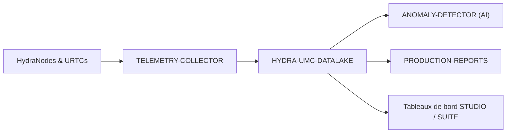

<p align="center">
  
</p>

# 🗄️ HYDRA-UMC-DATALAKE

<p align="center"><a href="README.md">🇺🇸 English</a> | <a href="README_spa.md">🇪🇸 Español</a> | 🇫🇷 <b>Français</b> | <a href="README_ita.md">🇮🇹 Italiano</a> | <a href="README_deu.md">🇩🇪 Deutsch</a> | <a href="README_zho.md">🇨🇳 简体中文</a> | <a href="README_jpn.md">🇯🇵 日本語</a></p>

### 📊 Stockage de séries chronologiques évolutif pour les données robotiques industrielles

<p align="left">
  
  
  
</p>

---

## 1. 🛠️ APERÇU TECHNIQUE

**HYDRA-UMC-DATALAKE** est le stockage actuel de séries chronologiques de l'usine. Il fournit un référentiel réel adossé à SQLite pour la télémétrie normalisée générée par l'écosystème, notamment les courants moteurs, angles d'articulation, lectures de capteurs et journaux d'inférence IA.

Il est la base logicielle des analyses, de la maintenance prédictive et des rapports de production. L'implémentation SQLite actuelle est testée localement ; un déploiement externe InfluxDB/TimescaleDB reste une décision d'infrastructure future, et non une fonction prétendue déjà en service.

### Caractéristiques principales :
* 🗄️ **Stockage adossé à SQLite :** Stockage de séries chronologiques réel, ACID et sur disque avec `sqlite3` de la stdlib Python. *(implémenté)*
* 📊 **Schéma de données unifié :** Télémétrie normalisée au format long (`source/kind/field/timestamp/value`) pour les sources HYDRA-UMC et URTC. *(implémenté)*
* 🔍 **Requêtes déterministes :** Les résultats sont ordonnés par horodatage et critères de départage stables ; les lectures bornées refusent les limites non positives. *(implémenté)*
* 🔁 **Gestion idempotente des retries :** Renvoyer un point `(source, kind, field, timestamp)` remplace sa valeur (dernière écriture gagnante), évitant que les retries gonflent les doublons. *(implémenté)*
* 🧬 **Migrations de schéma réversibles :** `migrate_up()`/`migrate_down()` réelles et testées, suivies via le `PRAGMA user_version` propre à SQLite - ne jamais modifier une migration déjà publiée, en ajouter une nouvelle. *(implémenté)*
* 🕐 **Horodatages UTC explicites :** `GET /stats/range` rapporte les données réelles les plus anciennes/récentes à la fois en ms brutes et en chaînes ISO 8601 UTC explicites. *(implémenté)*
* 🗑️ **Rétention validée :** Fenêtres de rétention par série, opt-in (`GET`/`POST /retention`, `POST /retention/apply`) - une fenêtre non positive est rejetée d'emblée. *(implémenté)*

---

## 2. 🔄 ARCHITECTURE DES DONNÉES



---

## 3. 🧱 ARCHITECTURE & DÉCISIONS DE CONCEPTION

* **Pourquoi c'est le parent d'intégration, pas un pair, de ses 3 enfants.** HYDRA-UMC-TELEMETRY-COLLECTOR, HYDRA-UMC-ANOMALY-DETECTOR et HYDRA-UMC-PRODUCTION-REPORTS lisent/écrivent tous le MÊME entrepôt de séries temporelles sous-jacent - posséder cet entrepôt à un seul endroit (ce dépôt) évite 3 décisions de schéma indépendantes et potentiellement divergentes.
* **Pourquoi sqlite3 aujourd'hui, pas encore InfluxDB/TimescaleDB.** Une base externe reste un choix possible à long terme, mais son exploitation est un véritable travail d'infrastructure, pas quelque chose à déclarer ou ajouter sans demande. Le `TimeSeriesStore` de `src/hydra_umc_datalake/store.py` est aujourd'hui un entrepôt de séries temporelles réel, ACID et interrogeable (`sqlite3` de la stdlib Python), pas un placeholder, et reste derrière sa propre classe afin qu'un backend futur puisse le remplacer sans réécrire le contrat HTTP.
* **Pourquoi une seule table "longue" et étroite (source/kind/field/timestamp/value), pas une colonne par champ de télémétrie.** Le propre `Sample.Fields` de HYDRA-UMC-TELEMETRY-COLLECTOR est ouvert (n'importe quel nom de champ, n'importe quelle source peut en signaler de nouveaux) - un schéma étroit les accepte tous sans migration, au prix réel d'une ligne par champ par échantillon plutôt qu'une ligne par échantillon.
* **Pourquoi `aggregate()` fait un vrai regroupement SQL par temps, pas juste `query()` en brut.** Un tableau de bord ou un rapport demandant « température moyenne du moteur par minute sur la dernière semaine » sur des millions de lignes brutes a besoin d'un vrai sous-échantillonnage fait par la base de données, pas récupéré en brut puis moyenné dans le code applicatif - les limites des buckets d'`aggregate()` sont déterministes (alignées sur le `start` de la requête elle-même), donc la même requête sur les mêmes données trace toujours les mêmes limites de bucket.
* **Comment cela s'intègre dans le reste de l'écosystème.** Le parent d'intégration de la famille Données et Analytique - HYDRA-UMC-TELEMETRY-COLLECTOR l'alimente depuis HYDRA-UMC-SERVER, HYDRA-UMC-ANOMALY-DETECTOR et HYDRA-UMC-PRODUCTION-REPORTS relisent tous deux sa propre télémétrie stockée.
* **Pourquoi le versionnement de schéma utilise le `PRAGMA user_version` propre à SQLite, pas une table faite maison.** SQLite fournit déjà exactement ce mécanisme réel (un entier dans l'en-tête du fichier) - une table de suivi parallèle ne serait qu'une seconde source de vérité, potentiellement divergente, pour le même fait.
* **Pourquoi la rétention est opt-in par `(kind, field)`, pas une valeur par défaut globale.** Un entrepôt avec des dizaines de séries de télémétrie réelles ne devrait pas avoir l'hypothèse de rétention d'un opérateur appliquée silencieusement à chaque série - `apply_retention()` ne touche jamais qu'une série ayant explicitement reçu une politique via `set_retention_policy()`/`POST /retention`.
* **Pourquoi l'identité de retry est `(source, kind, field, timestamp)`.** Le contrat de télémétrie normalisé n'a pas d'identifiant de séquence/événement ; un point exactement répété est donc traité comme un retry réseau incertain et consolidé selon une règle déterministe de dernière écriture gagnante. Cela empêche les doublons de fausser les comptes et agrégats sans nettoyage destructif global des données historiques.
* **Pourquoi `/stats/range` est un nouvel endpoint plutôt qu'une extension de `/stats`.** La forme existante de `/stats`, `{"sampleCount": <int>}`, est déjà réelle et testée - lui ajouter des champs serait un changement réel et cassant sans raison, alors qu'un second endpoint additif ne coûte rien.

---

## 📂 STRUCTURE DES RÉPERTOIRES

Service purement logiciel (intégrateur d'ingestion/analytique) - sans matériel, micrologiciel ou système d'exploitation propres ; ces dossiers sont omis conformément à la politique de structure du dépôt.

```text
HYDRA-UMC-DATALAKE/
├── src/hydra_umc_datalake/  # Code source
│   ├── __init__.py          # Version du paquet
│   ├── store.py             # TimeSeriesStore : ingestion/requete/agregation reelles via sqlite3
│   ├── api.py                # Handlers JSON/HTTP simples encapsulant le store
│   └── main.py               # Point d'entree : relie store+API, demarre le serveur HTTP
├── tests/                   # pytest - logique du store, migrations reelles, allers-retours HTTP reels
├── docs/
│   └── API.md               # Référence réelle des endpoints HTTP (requêtes, réponses, codes de statut)
├── build/                   # Sortie de build (ignorée par git)
├── pyproject.toml           # Metadonnees du paquet, version, dependances
├── bump_version.py          # Incrément de version type compteur kilométrique (exécuté par le build)
├── docker-compose.yml       # Intègre TELEMETRY-COLLECTOR / ANOMALY-DETECTOR / PRODUCTION-REPORTS
├── build.sh / build.bat     # Build réel : venv + installation éditable + bump + tests
├── run.sh / run.bat         # Exécution réelle : démarre l'API HTTP
└── README.md
```

Élagué du modèle original : `hardware/`, `firmware/`, `os/`,
`images/` et `scripts/` — il s'agit d'un service purement logiciel
(paquet Python) sans matériel ni firmware propres, sans image de système
d'exploitation à maintenir, et sans contenu de médias/scripts utilitaires
encore suffisant pour justifier leurs propres dossiers. Voir
[`docs/API.md`](docs/API.md) pour la référence complète des endpoints HTTP.

---

## 4. ⚙️ BUILD ET EXÉCUTION

Nécessite Python >= 3.10. Un véritable entrepôt de séries temporelles
interrogeable avec une API HTTP, pas seulement un squelette qui s'importe.

```bash
# Linux/macOS
./build.sh
./run.sh --port 8095

# Windows
build.bat
run.bat --port 8095
```

`build` crée/active un `.venv` local, installe le paquet (éditable, avec
les extras de dev) dedans, vérifie l'import, et exécute la véritable suite
de tests (`pytest`). `run` démarre l'API HTTP et transmet tout indicateur
(`--addr`, `--port`, `--db`).

```bash
# Ingérer un échantillon (même forme normalisée que le Sample de HYDRA-UMC-TELEMETRY-COLLECTOR)
curl -X POST localhost:8095/ingest \
  -d '{"sourceId":"robot-1","kind":"motor_temp","timestamp":1700000000000,"fields":{"value":42.5}}'

# Le requêter en retour
curl "localhost:8095/query?sourceId=robot-1"

# Sous-échantillonner en buckets d'1 minute sur une vraie plage de temps
curl "localhost:8095/aggregate?kind=motor_temp&field=value&bucketMs=60000&start=0&end=1800000000000&agg=avg"

curl localhost:8095/stats
```

```bash
python -m pytest tests/ -v   # store.py (insert/query/aggregate, y compris
                              # des maths de bucketing verifiables a la main)
                              # et api.py (allers-retours HTTP reels contre
                              # un vrai ThreadingHTTPServer sur un port
                              # ephemere)
```

Pour démarrer ce projet avec ses trois enfants (Telemetry-Collector, Anomaly-Detector, Production-Reports) placés comme répertoires frères :

```bash
docker compose up --build
```

---

## 🚀 FEUILLE DE ROUTE
* **Phase 1 :** Ingestion à haut débit du Datalake et indexation pour l'analyse historique.
* **Phase 2 :** Compression à la périphérie du collecteur de télémétrie et protocoles de transmission sécurisés.
* **Phase 3 :** Détection d'anomalies à l'aide de l'apprentissage non supervisé et analyse des vibrations du moteur.
* **Phase 4 :** Intégration avec Grafana pour une visualisation avancée en temps réel et l'automatisation des rapports de production.

---

## 🔗 Projets Liés

Ce projet fait partie d'un écosystème robotique plus large du même auteur (JuanenRac / Electro Hobby 3D), couvrant firmware, logiciel de contrôle, nœuds IA et outillage de flotte. Bon à savoir, car une demande pourrait en réalité concerner l'un de ces projets plutôt que ce dépôt.

### Famille

**Parent :** aucun — ce projet est lui-même le parent d'intégration de la famille Données et Analytique.

**Enfants :**
- **[HYDRA-UMC-TELEMETRY-COLLECTOR](https://github.com/JuanenRac/HYDRA-UMC-TELEMETRY-COLLECTOR)** — alimente ce lac de données avec la télémétrie agrégée par robot.
- **[HYDRA-UMC-ANOMALY-DETECTOR](https://github.com/JuanenRac/HYDRA-UMC-ANOMALY-DETECTOR)** — exécute la détection d'anomalies sur la télémétrie stockée dans ce lac de données.
- **[HYDRA-UMC-PRODUCTION-REPORTS](https://github.com/JuanenRac/HYDRA-UMC-PRODUCTION-REPORTS)** — génère des rapports de poste/OEE à partir de la télémétrie stockée dans ce lac de données.

### Relation Directe (hors de la famille)

- **[HYDRA-UMC-SERVER](https://github.com/JuanenRac/HYDRA-UMC-SERVER)** — la source des logs/télémétrie ingérés par ce projet.
- **[HYDRA-UMC-DASHBOARD-AI](https://github.com/JuanenRac/HYDRA-UMC-DASHBOARD-AI)** — calcule ses Résumés Intelligents directement à partir de l'historique réel de requêtes/agrégats de ce lac de données.

### Reste de l'Écosystème

**Plateforme HYDRA-UMC** — la cellule de micro-usine multi-robot
- **[HYDRA-UMC](https://github.com/JuanenRac/HYDRA-UMC)** — la carte mère CM5 + STM32H745 orchestrant jusqu'à 8 bras robotiques.
- **[HYDRA-UMC-SERVER](https://github.com/JuanenRac/HYDRA-UMC-SERVER)** — le backend Express/WebSocket auquel parle chaque client de contrôle.
- **[HYDRA-UMC-STUDIO](https://github.com/JuanenRac/HYDRA-UMC-STUDIO)** — tableau de bord de contrôle web, visualisation 3D multi-robot.
- **[HYDRA-UMC-ANDROID-CONTROL](https://github.com/JuanenRac/HYDRA-UMC-ANDROID-CONTROL)** — application de contrôle Android via Wi-Fi/Bluetooth.
- **[HYDRA-UMC-IOS-CONTROL](https://github.com/JuanenRac/HYDRA-UMC-IOS-CONTROL)** — application de contrôle iOS/iPadOS construite en Flutter.
- **[HYDRA-UMC-SUITE](https://github.com/JuanenRac/HYDRA-UMC-SUITE)** — centre de commande d'essaim de bureau (Python/PySide6).
- **[HYDRA-UMC-EDITOR-URDF](https://github.com/JuanenRac/HYDRA-UMC-EDITOR-URDF)** — éditeur de modèles URDF de bureau pour le catalogue de robots.
- **[HYDRA-UMC-DSI](https://github.com/JuanenRac/HYDRA-UMC-DSI)** — interface tactile native pour l'écran DSI embarqué.

**Plateforme URTC** — le contrôleur de tête d'outil que porte chaque bras HYDRA-UMC
- **[URTC](https://github.com/JuanenRac/URTC)** — contrôleur de tête d'outil sur bus CAN, 25 profils d'outil.
- **[URTC-FLASHER](https://github.com/JuanenRac/URTC-FLASHER)** — outil de bureau de flashage CAN-OTA + SWD/JTAG.
- **[URTC-TESTER](https://github.com/JuanenRac/URTC-TESTER)** — outil de bureau de diagnostic CAN en direct.
- **[URTC-WEB-STUDIO](https://github.com/JuanenRac/URTC-WEB-STUDIO)** — alternative basée navigateur via l'API Web Serial.

**🎥 Nœud de Vision IA (Hailo-8)**
- [HYDRA-UMC-VISION-NODE](https://github.com/JuanenRac/HYDRA-UMC-VISION-NODE)
- [HYDRA-UMC-VISION-STREAMER](https://github.com/JuanenRac/HYDRA-UMC-VISION-STREAMER)
- [HYDRA-UMC-DETECTION-HEF](https://github.com/JuanenRac/HYDRA-UMC-DETECTION-HEF)
- [HYDRA-UMC-SAFETY-ZONES](https://github.com/JuanenRac/HYDRA-UMC-SAFETY-ZONES)
- [HYDRA-UMC-VISUAL-SERVOING-API](https://github.com/JuanenRac/HYDRA-UMC-VISUAL-SERVOING-API)

**🧠 Nœud Cognitif IA (Hailo-10)**
- [HYDRA-UMC-COGNITIVE-NODE](https://github.com/JuanenRac/HYDRA-UMC-COGNITIVE-NODE)
- [HYDRA-UMC-VLA-ENGINE](https://github.com/JuanenRac/HYDRA-UMC-VLA-ENGINE)
- [HYDRA-UMC-VOICE-UI](https://github.com/JuanenRac/HYDRA-UMC-VOICE-UI)
- [HYDRA-UMC-SEMANTIC-PLANNER](https://github.com/JuanenRac/HYDRA-UMC-SEMANTIC-PLANNER)
- [HYDRA-UMC-DOCS-QA](https://github.com/JuanenRac/HYDRA-UMC-DOCS-QA)

**🐝 Orchestration et Essaim**
- [HYDRA-UMC-ORCHESTRATOR](https://github.com/JuanenRac/HYDRA-UMC-ORCHESTRATOR)
- [HYDRA-UMC-SWARM-SYNC](https://github.com/JuanenRac/HYDRA-UMC-SWARM-SYNC)
- [HYDRA-UMC-PATH-PLANNER-3D](https://github.com/JuanenRac/HYDRA-UMC-PATH-PLANNER-3D)
- [HYDRA-UMC-JOB-DISPATCHER](https://github.com/JuanenRac/HYDRA-UMC-JOB-DISPATCHER)
- [HYDRA-UMC-NODE-HEALING](https://github.com/JuanenRac/HYDRA-UMC-NODE-HEALING)

**🎮 Jumeau Numérique et Simulation**
- [HYDRA-UMC-TWIN](https://github.com/JuanenRac/HYDRA-UMC-TWIN)
- [HYDRA-UMC-PHYSICS-REPLICA](https://github.com/JuanenRac/HYDRA-UMC-PHYSICS-REPLICA)
- [HYDRA-UMC-HIL-BRIDGE](https://github.com/JuanenRac/HYDRA-UMC-HIL-BRIDGE)
- [HYDRA-UMC-SYNTHETIC-DATA-GEN](https://github.com/JuanenRac/HYDRA-UMC-SYNTHETIC-DATA-GEN)

**🏭 Passerelle Industrielle**
- [HYDRA-UMC-GATEWAY-INDUSTRIAL](https://github.com/JuanenRac/HYDRA-UMC-GATEWAY-INDUSTRIAL)
- [HYDRA-UMC-OPCUA-SERVER](https://github.com/JuanenRac/HYDRA-UMC-OPCUA-SERVER)
- [HYDRA-UMC-MQTT-BROKER](https://github.com/JuanenRac/HYDRA-UMC-MQTT-BROKER)
- [HYDRA-UMC-MTCONNECT-ADAPTER](https://github.com/JuanenRac/HYDRA-UMC-MTCONNECT-ADAPTER)

**🛠️ Outils Complémentaires**
- [URTC-SMART-RACK](https://github.com/JuanenRac/URTC-SMART-RACK)
- [URTC-VISION-TOOL](https://github.com/JuanenRac/URTC-VISION-TOOL)
- [HYDRA-UMC-WATCH](https://github.com/JuanenRac/HYDRA-UMC-WATCH)
- [HYDRA-UMC-TOOL-CLI](https://github.com/JuanenRac/HYDRA-UMC-TOOL-CLI)
- [HYDRA-UMC-DASHBOARD-AI](https://github.com/JuanenRac/HYDRA-UMC-DASHBOARD-AI)


## 👤 AUTEUR
**JuanenRac** (Electro Hobby 3D)
📧 electrohobby3d@gmail.com
📺 [youtube.com/@electrohobby3d](https://youtube.com/@electrohobby3d)

## 📜 LICENCE
GPL-3.0 - Voir le fichier LICENSE pour plus de détails.
