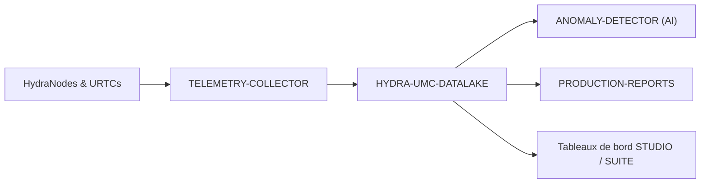

<p align="center">
  
</p>

# 🗄️ HYDRA-UMC-DATALAKE

<p align="center"><a href="README.md">🇺🇸 English</a> | <a href="README_spa.md">🇪🇸 Español</a> | 🇫🇷 <b>Français</b> | <a href="README_ita.md">🇮🇹 Italiano</a> | <a href="README_deu.md">🇩🇪 Deutsch</a> | <a href="README_zho.md">🇨🇳 简体中文</a> | <a href="README_jpn.md">🇯🇵 日本語</a></p>

### 📊 Stockage de séries chronologiques évolutif pour les données robotiques industrielles

<p align="left">
  
  
  
</p>

---

## 1. 🛠️ APERÇU TECHNIQUE

**HYDRA-UMC-DATALAKE** est le stockage actuel de séries chronologiques de l'usine. Il fournit un référentiel réel adossé à SQLite pour la télémétrie normalisée générée par l'écosystème, notamment les courants moteurs, angles d'articulation, lectures de capteurs et journaux d'inférence IA.

Il est la base logicielle des analyses, de la maintenance prédictive et des rapports de production. L'implémentation SQLite actuelle est testée localement ; un déploiement externe InfluxDB/TimescaleDB reste une décision d'infrastructure future, et non une fonction prétendue déjà en service.

### Caractéristiques principales :
* 🗄️ **Stockage adossé à SQLite :** Stockage de séries chronologiques réel, ACID et sur disque avec `sqlite3` de la stdlib Python. *(implémenté)*
* 📊 **Schéma de données unifié :** Télémétrie normalisée au format long (`source/kind/field/timestamp/value`) pour les sources HYDRA-UMC et URTC. *(implémenté)*
* 🔍 **Requêtes déterministes :** Les résultats sont ordonnés par horodatage et critères de départage stables ; les lectures bornées refusent les limites non positives. *(implémenté)*
* 🔁 **Gestion idempotente des retries :** Renvoyer un point `(source, kind, field, timestamp)` remplace sa valeur (dernière écriture gagnante), évitant que les retries gonflent les doublons. *(implémenté)*
* 🧬 **Migrations de schéma réversibles :** `migrate_up()`/`migrate_down()` réelles et testées, suivies via le `PRAGMA user_version` propre à SQLite - ne jamais modifier une migration déjà publiée, en ajouter une nouvelle. *(implémenté)*
* 🕐 **Horodatages UTC explicites :** `GET /stats/range` rapporte les données réelles les plus anciennes/récentes à la fois en ms brutes et en chaînes ISO 8601 UTC explicites. *(implémenté)*
* 🗑️ **Rétention validée :** Fenêtres de rétention par série, opt-in (`GET`/`POST /retention`, `POST /retention/apply`) - une fenêtre non positive est rejetée d'emblée. *(implémenté)*

---

## 2. 🔄 ARCHITECTURE DES DONNÉES



---

## 3. 🧱 ARCHITECTURE & DÉCISIONS DE CONCEPTION

* **Pourquoi c'est le parent d'intégration, pas un pair, de ses 3 enfants.** HYDRA-UMC-TELEMETRY-COLLECTOR, HYDRA-UMC-ANOMALY-DETECTOR et HYDRA-UMC-PRODUCTION-REPORTS lisent/écrivent tous le MÊME entrepôt de séries temporelles sous-jacent - posséder cet entrepôt à un seul endroit (ce dépôt) évite 3 décisions de schéma indépendantes et potentiellement divergentes.
* **Pourquoi sqlite3 aujourd'hui, pas encore InfluxDB/TimescaleDB.** Une base externe reste un choix possible à long terme, mais son exploitation est un véritable travail d'infrastructure, pas quelque chose à déclarer ou ajouter sans demande. Le `TimeSeriesStore` de `src/hydra_umc_datalake/store.py` est aujourd'hui un entrepôt de séries temporelles réel, ACID et interrogeable (`sqlite3` de la stdlib Python), pas un placeholder, et reste derrière sa propre classe afin qu'un backend futur puisse le remplacer sans réécrire le contrat HTTP.
* **Pourquoi une seule table "longue" et étroite (source/kind/field/timestamp/value), pas une colonne par champ de télémétrie.** Le propre `Sample.Fields` de HYDRA-UMC-TELEMETRY-COLLECTOR est ouvert (n'importe quel nom de champ, n'importe quelle source peut en signaler de nouveaux) - un schéma étroit les accepte tous sans migration, au prix réel d'une ligne par champ par échantillon plutôt qu'une ligne par échantillon.
* **Pourquoi `aggregate()` fait un vrai regroupement SQL par temps, pas juste `query()` en brut.** Un tableau de bord ou un rapport demandant « température moyenne du moteur par minute sur la dernière semaine » sur des millions de lignes brutes a besoin d'un vrai sous-échantillonnage fait par la base de données, pas récupéré en brut puis moyenné dans le code applicatif - les limites des buckets d'`aggregate()` sont déterministes (alignées sur le `start` de la requête elle-même), donc la même requête sur les mêmes données trace toujours les mêmes limites de bucket.
* **Comment cela s'intègre dans le reste de l'écosystème.** Le parent d'intégration de la famille Données et Analytique - HYDRA-UMC-TELEMETRY-COLLECTOR l'alimente depuis HYDRA-UMC-SERVER, HYDRA-UMC-ANOMALY-DETECTOR et HYDRA-UMC-PRODUCTION-REPORTS relisent tous deux sa propre télémétrie stockée.
* **Pourquoi le versionnement de schéma utilise le `PRAGMA user_version` propre à SQLite, pas une table faite maison.** SQLite fournit déjà exactement ce mécanisme réel (un entier dans l'en-tête du fichier) - une table de suivi parallèle ne serait qu'une seconde source de vérité, potentiellement divergente, pour le même fait.
* **Pourquoi la rétention est opt-in par `(kind, field)`, pas une valeur par défaut globale.** Un entrepôt avec des dizaines de séries de télémétrie réelles ne devrait pas avoir l'hypothèse de rétention d'un opérateur appliquée silencieusement à chaque série - `apply_retention()` ne touche jamais qu'une série ayant explicitement reçu une politique via `set_retention_policy()`/`POST /retention`.
* **Pourquoi l'identité de retry est `(source, kind, field, timestamp)`.** Le contrat de télémétrie normalisé n'a pas d'identifiant de séquence/événement ; un point exactement répété est donc traité comme un retry réseau incertain et consolidé selon une règle déterministe de dernière écriture gagnante. Cela empêche les doublons de fausser les comptes et agrégats sans nettoyage destructif global des données historiques.
* **Pourquoi `/stats/range` est un nouvel endpoint plutôt qu'une extension de `/stats`.** La forme existante de `/stats`, `{"sampleCount": <int>}`, est déjà réelle et testée - lui ajouter des champs serait un changement réel et cassant sans raison, alors qu'un second endpoint additif ne coûte rien.

---

## 📂 STRUCTURE DES RÉPERTOIRES

Service purement logiciel (intégrateur d'ingestion/analytique) - sans matériel, micrologiciel ou système d'exploitation propres ; ces dossiers sont omis conformément à la politique de structure du dépôt.

```text
HYDRA-UMC-DATALAKE/
├── src/hydra_umc_datalake/  # Code source
│   ├── __init__.py          # Version du paquet
│   ├── store.py             # TimeSeriesStore : ingestion/requête/agrégation réelles via sqlite3
│   ├── api.py                # Handlers JSON/HTTP limités encapsulant le store
│   └── main.py               # Point d'entrée : relie store+API, démarre le serveur HTTP
├── tests/                   # pytest - logique du store, migrations réelles, allers-retours HTTP réels
├── docs/
│   └── API.md               # Référence réelle des endpoints HTTP (requêtes, réponses, codes de statut)
├── images/                  # Médias et diagrammes
├── systemd/
│   └── hydra-umc-datalake.service # Unité systemd de l'API d'ingestion/analytique sur la CM5 locale
├── tools/
│   ├── build_test.py        # Contrôle build/compilation sans gestion de version
│   └── ci_validate.py       # Validation manifest/CHANGELOG/docs utilisée par la CI
├── build/                   # Sortie de build (ignorée par git)
├── pyproject.toml           # Métadonnées du paquet, version, dépendances
├── bump_version.py          # Incrément de version type compteur kilométrique (exécuté par le build)
├── bump_manifest_version.py # Synchronise la version de hydra-umc.project.json avec la version native (--sync)
├── docker-compose.yml       # Intègre TELEMETRY-COLLECTOR / ANOMALY-DETECTOR / PRODUCTION-REPORTS
├── build.sh / build.bat     # Build réel : venv + installation éditable + bump + tests
├── run.sh / run.bat         # Exécution réelle : démarre l'API HTTP
└── README.md
```

Élagué du modèle original : `hardware/`, `firmware/` et `os/` — il
s'agit d'un service purement logiciel (paquet Python) sans matériel ni
firmware propres et sans image de système d'exploitation à maintenir.
Voir [`docs/API.md`](docs/API.md) pour la référence complète des
endpoints HTTP.

---

## 4. ⚙️ BUILD ET EXÉCUTION

Nécessite Python >= 3.10. Un véritable entrepôt de séries temporelles
interrogeable avec une API HTTP, pas seulement un squelette qui s'importe.

```bash
# Linux/macOS
./build.sh
./run.sh --port 8095

# Windows
build.bat
run.bat --port 8095
```

`build` crée/active un `.venv` local, installe le paquet (éditable, avec
les extras de dev) dedans, vérifie l'import, et exécute la véritable suite
de tests (`pytest`). `run` démarre l'API HTTP et transmet tout indicateur
(`--addr`, `--port`, `--db`).

```bash
# Ingérer un échantillon (même forme normalisée que le Sample de HYDRA-UMC-TELEMETRY-COLLECTOR)
curl -X POST localhost:8095/ingest \
  -d '{"sourceId":"robot-1","kind":"motor_temp","timestamp":1700000000000,"fields":{"value":42.5}}'

# Le requêter en retour
curl "localhost:8095/query?sourceId=robot-1"

# Sous-échantillonner en buckets d'1 minute sur une vraie plage de temps
curl "localhost:8095/aggregate?kind=motor_temp&field=value&bucketMs=60000&start=0&end=1800000000000&agg=avg"

curl localhost:8095/stats
```

```bash
python -m pytest tests/ -v   # store.py (insert/query/aggregate, y compris
                              # des maths de bucketing vérifiables à la main)
                              # et api.py (allers-retours HTTP réels contre
                              # un vrai ThreadingHTTPServer sur un port
                              # éphémère)
```

Pour démarrer ce projet avec ses trois enfants (Telemetry-Collector, Anomaly-Detector, Production-Reports) placés comme répertoires frères :

```bash
docker compose up --build
```

---

## 🚀 FEUILLE DE ROUTE
* **Phase 1 :** Ingestion à haut débit du Datalake et indexation pour l'analyse historique.
* **Phase 2 :** Compression à la périphérie du collecteur de télémétrie et protocoles de transmission sécurisés.
* **Phase 3 :** Détection d'anomalies à l'aide de l'apprentissage non supervisé et analyse des vibrations du moteur.
* **Phase 4 :** Intégration avec Grafana pour une visualisation avancée en temps réel et l'automatisation des rapports de production.

---

## 🔗 Projets Liés

Ce projet fait partie de l'écosystème robotique HYDRA-UMC du même auteur (JuanenRac / Electro Hobby 3D). Bon à savoir, car une demande pourrait en réalité concerner l'un de ceux-ci plutôt que ce dépôt.

**Projets Enfants** — chacun écrit dans ou lit depuis le propre entrepôt de ce lac de données
- **[HYDRA-UMC-TELEMETRY-COLLECTOR](https://github.com/JuanenRac/HYDRA-UMC-TELEMETRY-COLLECTOR)** — vrai pipeline d'ingestion CAN/WebSocket vers DATALAKE, avec déduplication par séquence.
- **[HYDRA-UMC-ANOMALY-DETECTOR](https://github.com/JuanenRac/HYDRA-UMC-ANOMALY-DETECTOR)** — vrai détecteur d'anomalies FFT + ligne de base statistique, avec surveillance de dérive.
- **[HYDRA-UMC-PRODUCTION-REPORTS](https://github.com/JuanenRac/HYDRA-UMC-PRODUCTION-REPORTS)** — vrai calcul OEE/disponibilité sur l'historique de DATALAKE, avec export CSV reproductible.

**Directement Liés**
- **[HYDRA-UMC-SERVER](https://github.com/JuanenRac/HYDRA-UMC-SERVER)** — le vrai backend headless (REST/WebSocket) auquel parle réellement chaque client de contrôle ; la source des journaux/télémétrie que ce projet ingère.
- **[HYDRA-UMC-DASHBOARD-AI](https://github.com/JuanenRac/HYDRA-UMC-DASHBOARD-AI)** — panneaux Smart Summaries et Anomaly Highlighting sur DATALAKE/ANOMALY-DETECTOR, avec un repli statistique honnête ; calcule ses Résumés Intelligents directement à partir du propre historique de requêtes/agrégats de ce lac de données.

**Fait Également Partie de l'Écosystème**

*Matériel & Plateforme de Base*
- **[HYDRA-UMC](https://github.com/JuanenRac/HYDRA-UMC)** — la carte mère physique du bras robotique : hôte CM5 + coprocesseur STM32H745 double cœur, coordonnant jusqu'à 8 bras-outils via CAN-OTA/SPI-OTA.
- **[HYDRA-UMC-OS](https://github.com/JuanenRac/HYDRA-UMC-OS)** — couche produit reproductible sur Raspberry Pi OS pour le CM5 : agent en lecture seule, config/profils validés, provisionnement WiFi de premier contact.
- **[HYDRA-UMC-SDK](https://github.com/JuanenRac/HYDRA-UMC-SDK)** — le contrat JSON-Schema partagé et la barrière de sécurité contre laquelle chaque bridge valide ses commandes.

*Backend Central & Clients*
- **[HYDRA-UMC-STUDIO](https://github.com/JuanenRac/HYDRA-UMC-STUDIO)** — tableau de bord de contrôle web avec visualisation 3D multi-robot en temps réel.
- **[HYDRA-UMC-SUITE](https://github.com/JuanenRac/HYDRA-UMC-SUITE)** — centre de commande d'essaim de bureau (PySide6) pour plusieurs serveurs à la fois, empaqueté en exécutable autonome.
- **[HYDRA-UMC-ANDROID-CONTROL](https://github.com/JuanenRac/HYDRA-UMC-ANDROID-CONTROL)** — application de contrôle Android native avec connexion biométrique et un compagnon Wear OS jumelé.
- **[HYDRA-UMC-IOS-CONTROL](https://github.com/JuanenRac/HYDRA-UMC-IOS-CONTROL)** — application de contrôle iOS/iPadOS (Flutter) avec synchronisation WebSocket en temps réel.
- **[HYDRA-UMC-DSI](https://github.com/JuanenRac/HYDRA-UMC-DSI)** — interface tactile native pour l'écran tactile DSI 7" embarqué, intégrée directement sur le CM5.
- **[HYDRA-UMC-EDITOR-URDF](https://github.com/JuanenRac/HYDRA-UMC-EDITOR-URDF)** — créateur/éditeur graphique de bureau pour URDF qui envoie les modèles terminés vers le propre catalogue de STUDIO.
- **[HYDRA-UMC-BRIDGE-AMR](https://github.com/JuanenRac/HYDRA-UMC-BRIDGE-AMR)** — frontière de coordination pour les flottes AGV/AMR via un éditeur MQTT VDA 5050 réel.
- **[HYDRA-UMC-BRIDGE-CNC](https://github.com/JuanenRac/HYDRA-UMC-BRIDGE-CNC)** — coordinateur haut niveau pour cellules CNC avec accès réel au statut/octets de contrôle GRBL.
- **[HYDRA-UMC-BRIDGE-DROIDS](https://github.com/JuanenRac/HYDRA-UMC-BRIDGE-DROIDS)** — frontière de coordination pour droïdes à pattes/humanoïdes, avec un véritable émetteur de commandes Boston Dynamics Spot.
- **[HYDRA-UMC-BRIDGE-LASER](https://github.com/JuanenRac/HYDRA-UMC-BRIDGE-LASER)** — coordinateur de sécurité pour cellules laser lisant 3 vraies sécurités GPIO de clé/enceinte/verrouillage.
- **[HYDRA-UMC-BRIDGE-OPENPNP](https://github.com/JuanenRac/HYDRA-UMC-BRIDGE-OPENPNP)** — coordinateur haut niveau sûr pour le flux de cartes du pick-and-place OpenPnP.
- **[HYDRA-UMC-BRIDGE-PRINTER3D](https://github.com/JuanenRac/HYDRA-UMC-BRIDGE-PRINTER3D)** — frontière de coordination sûre pour imprimantes 3D Moonraker/Klipper, avec de vraies commandes de tâche contrôlées.
- **[HYDRA-UMC-BRIDGE-ROS2](https://github.com/JuanenRac/HYDRA-UMC-BRIDGE-ROS2)** — coordinateur de sécurité avec un vrai transport ROS 2 rclpy à importation paresseuse.
- **[HYDRA-UMC-BRIDGE-UAV](https://github.com/JuanenRac/HYDRA-UMC-BRIDGE-UAV)** — frontière de coordination pour UAV équipés de caméra, avec un véritable émetteur de commandes MAVLink.

*Plateforme d'Outils URTC*
- **[URTC](https://github.com/JuanenRac/URTC)** — firmware pour la carte physique Universal Robot Tool Controller, plus de 25 profils d'outil sur bus CAN.
- **[URTC-FLASHER](https://github.com/JuanenRac/URTC-FLASHER)** — outil de bureau à interface graphique pour flasher les cartes URTC, CAN-OTA plus SWD/JTAG puce complète.
- **[URTC-TESTER](https://github.com/JuanenRac/URTC-TESTER)** — outil de bureau de diagnostic CAN-bus en direct pour cartes URTC, un panneau par profil d'outil.
- **[URTC-WEB-STUDIO](https://github.com/JuanenRac/URTC-WEB-STUDIO)** — alternative basée navigateur à URTC-TESTER via la Web Serial API, sans installation locale.

*Nœud IA de Vision (Hailo-8)*
- **[HYDRA-UMC-VISION-NODE](https://github.com/JuanenRac/HYDRA-UMC-VISION-NODE)** — hub d'intégration pour le pipeline de vision Hailo-8, avec une vraie vérification de disponibilité matérielle par étape.
- **[HYDRA-UMC-DETECTION-HEF](https://github.com/JuanenRac/HYDRA-UMC-DETECTION-HEF)** — registre réel de modèles compilés avec vérification de chargement sécurisé par architecture Hailo/checksum.
- **[HYDRA-UMC-VISION-STREAMER](https://github.com/JuanenRac/HYDRA-UMC-VISION-STREAMER)** — générateur réel de pipeline GStreamer + config MediaMTX, avec une vraie frontière d'intégration HailoRT.
- **[HYDRA-UMC-VISUAL-SERVOING-API](https://github.com/JuanenRac/HYDRA-UMC-VISUAL-SERVOING-API)** — vraie loi de correction Position-Based Visual Servoing, verrouillée sur l'état de zone en amont.
- **[HYDRA-UMC-SAFETY-ZONES](https://github.com/JuanenRac/HYDRA-UMC-SAFETY-ZONES)** — vraie vérification de violation de zone et demande d'E-STOP, avec application de la fraîcheur de calibration.

*Nœud IA Cognitif (Hailo-10)*
- **[HYDRA-UMC-COGNITIVE-NODE](https://github.com/JuanenRac/HYDRA-UMC-COGNITIVE-NODE)** — hub d'intégration pour le pipeline cognitif Hailo-10 (orchestration LLM/VLA/voix).
- **[HYDRA-UMC-VLA-ENGINE](https://github.com/JuanenRac/HYDRA-UMC-VLA-ENGINE)** — vrai encodage/décodage de jetons d'action et génération de trajectoire pour un modèle Vision-Language-Action.
- **[HYDRA-UMC-VOICE-UI](https://github.com/JuanenRac/HYDRA-UMC-VOICE-UI)** — vrai front-end vocal (VAD + analyseur d'intention) avec un relais Watch borné et soumis à confirmation.
- **[HYDRA-UMC-SEMANTIC-PLANNER](https://github.com/JuanenRac/HYDRA-UMC-SEMANTIC-PLANNER)** — vraie décomposition de tâches basée sur des règles et récupération sémantique d'erreurs sur les codes d'erreur MCU.
- **[HYDRA-UMC-DOCS-QA](https://github.com/JuanenRac/HYDRA-UMC-DOCS-QA)** — vraie recherche documentaire TF-IDF (bibliothèque standard uniquement) sur les propres documents Markdown de cet écosystème.

*Orchestration & Essaim*
- **[HYDRA-UMC-ORCHESTRATOR](https://github.com/JuanenRac/HYDRA-UMC-ORCHESTRATOR)** — hub d'intégration avec un vrai contrat de rapport de santé gRPC/Protobuf et une machine à états de mission.
- **[HYDRA-UMC-JOB-DISPATCHER](https://github.com/JuanenRac/HYDRA-UMC-JOB-DISPATCHER)** — vraie file de tâches basée sur la priorité avec déduplication, via une vraie API HTTP.
- **[HYDRA-UMC-NODE-HEALING](https://github.com/JuanenRac/HYDRA-UMC-NODE-HEALING)** — vrai chien de garde de santé de flotte basé sur gRPC, avec retry/backoff et détection d'incohérence d'identité.
- **[HYDRA-UMC-PATH-PLANNER-3D](https://github.com/JuanenRac/HYDRA-UMC-PATH-PLANNER-3D)** — vrai planificateur de trajectoire 3D basé sur RRT, avec vraie validation des collisions obstacle/espace de travail.
- **[HYDRA-UMC-SWARM-SYNC](https://github.com/JuanenRac/HYDRA-UMC-SWARM-SYNC)** — vraie synchronisation d'état CRDT LWW-Element-Map, testée par propriétés pour la convergence multi-cellule.

*Jumeau Numérique & Simulation*
- **[HYDRA-UMC-TWIN](https://github.com/JuanenRac/HYDRA-UMC-TWIN)** — hub d'intégration pour le moteur de jumeau numérique, avec un vrai contrat de synchronisation par compatibilité de version.
- **[HYDRA-UMC-HIL-BRIDGE](https://github.com/JuanenRac/HYDRA-UMC-HIL-BRIDGE)** — vrai verrouillage de sécurité hardware-in-the-loop routant les commandes entre simulation et matériel réel.
- **[HYDRA-UMC-PHYSICS-REPLICA](https://github.com/JuanenRac/HYDRA-UMC-PHYSICS-REPLICA)** — vraie cinématique directe et validation des limites articulaires sur un vrai sous-ensemble URDF.
- **[HYDRA-UMC-SYNTHETIC-DATA-GEN](https://github.com/JuanenRac/HYDRA-UMC-SYNTHETIC-DATA-GEN)** — vrai générateur procédural de scènes 2D avec export d'annotations YOLO/COCO.

*Passerelle Industrielle*
- **[HYDRA-UMC-GATEWAY-INDUSTRIAL](https://github.com/JuanenRac/HYDRA-UMC-GATEWAY-INDUSTRIAL)** — hub d'intégration relayant vers les protocoles industriels, avec une vraie couche de liste blanche de commandes/contre-pression.
- **[HYDRA-UMC-OPCUA-SERVER](https://github.com/JuanenRac/HYDRA-UMC-OPCUA-SERVER)** — vrai espace d'adressage OPC-UA, vérifié avec une vraie session client du protocole binaire.
- **[HYDRA-UMC-MQTT-BROKER](https://github.com/JuanenRac/HYDRA-UMC-MQTT-BROKER)** — vrai broker MQTT avec authentification par client optionnelle et ACL de sujets.
- **[HYDRA-UMC-MTCONNECT-ADAPTER](https://github.com/JuanenRac/HYDRA-UMC-MTCONNECT-ADAPTER)** — vrais points de terminaison XML MTConnect `/probe` et `/current`, avec sortie en mode dégradé.

*Outils Complémentaires & Opérations de l'Écosystème*
- **[HYDRA-UMC-TOOL-CLI](https://github.com/JuanenRac/HYDRA-UMC-TOOL-CLI)** — CLI de flotte avec un vrai contrat de codes de sortie stable, un vrai client en direct de la propre API de HYDRA-UMC-SERVER.
- **[HYDRA-UMC-WATCH](https://github.com/JuanenRac/HYDRA-UMC-WATCH)** — application compagnon WearOS avec de vraies alertes haptiques et un relais vocal vers le téléphone jumelé.
- **[URTC-SMART-RACK](https://github.com/JuanenRac/URTC-SMART-RACK)** — firmware pour un rack de montage de cartes avec décodage réel d'ID d'outil et logique de préchauffage Smart Idle.
- **[URTC-VISION-TOOL](https://github.com/JuanenRac/URTC-VISION-TOOL)** — firmware plus un vrai compagnon de vision Python pour une tête d'outil d'inspection thermique/RGB.
- **[HYDRA-UMC-UPDATER](https://github.com/JuanenRac/HYDRA-UMC-UPDATER)** — outil administratif de bureau qui découvre, clone et met à jour chaque dépôt de cet écosystème.
- **[HYDRA-UMC-OS-REBUILDER](https://github.com/JuanenRac/HYDRA-UMC-OS-REBUILDER)** — outil de bureau Windows/Linux qui construit une image de la CM5 prête à graver, préchargée avec les versions les plus actuelles de l'écosystème, avec une configuration de premier démarrage Wi-Fi/utilisateur/SSH façon Raspberry Pi Imager.


---

## 📚 Documentation & Communauté

- **[CONTRIBUTING.md](CONTRIBUTING.md)** — pile technologique et lignes directrices de codage pour une pull request.
- **[CODE_OF_CONDUCT.md](CODE_OF_CONDUCT.md)** — les normes de comportement attendues dans cette communauté.
- **[SECURITY.md](SECURITY.md)** — comment signaler une vulnérabilité, et les véritables axes de sécurité de ce projet.
- **[SUPPORT.md](SUPPORT.md)** — où poser des questions et signaler des bugs.
- **[LICENSE.md](LICENSE.md)** — la licence propre de ce projet.

## 👤 AUTEUR
**JuanenRac** (Electro Hobby 3D)
📧 electrohobby3d@gmail.com
📺 [youtube.com/@electrohobby3d](https://youtube.com/@electrohobby3d)

## 📜 LICENCE
GPL-3.0 - Voir le fichier LICENSE pour plus de détails.
