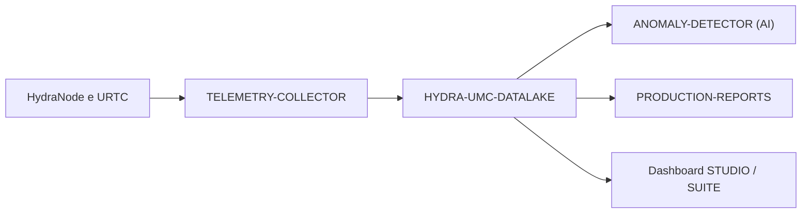

<p align="center">
  
</p>

# 🗄️ HYDRA-UMC-DATALAKE

<p align="center"><a href="README.md">🇺🇸 English</a> | <a href="README_spa.md">🇪🇸 Español</a> | <a href="README_fra.md">🇫🇷 Français</a> | 🇮🇹 <b>Italiano</b> | <a href="README_deu.md">🇩🇪 Deutsch</a> | <a href="README_zho.md">🇨🇳 简体中文</a> | <a href="README_jpn.md">🇯🇵 日本語</a></p>

### 📊 Archiviazione scalabile di serie temporali per dati robotici industriali

<p align="left">
  
  
  
</p>

---

## 1. 🛠️ PANORAMICA TECNICA

**HYDRA-UMC-DATALAKE** è la memoria a lungo termine della fabbrica. Fornisce un repository scalabile e ad alte prestazioni per tutti i dati delle serie temporali generati dall'ecosistema, comprese le correnti del motore, gli angoli dei giunti, le letture dei sensori e i log di inferenza AI.

Funge da base per l'analisi avanzata, la manutenzione predittiva e l'ottimizzazione della produzione, consentendo ai direttori di stabilimento di rivedere anni di prestazioni robotiche accurate al millisecondo.

### Caratteristiche principali:
* 🗄️ **Archiviazione ad alta risoluzione:** Ottimizzato per milioni di punti al secondo utilizzando InfluxDB/TimescaleDB.
* 📊 **Schema dati unificato:** Formato standardizzato per tutta la telemetria HydraNode e URTC.
* 🔍 **Query rapide:** Recupero veloce dei dati storici per il controllo della produzione e il controllo qualità.
* 🛡️ **Integrità dei dati:** Archiviazione ridondante e backup automatici per i log industriali critici.

---

## 2. 🔄 ARCHITETTURA DEI DATI



---

## 3. 🧱 ARCHITETTURA E DECISIONI DI PROGETTAZIONE

* **Perché è il genitore di integrazione, non un pari, dei suoi 3 figli.** HYDRA-UMC-TELEMETRY-COLLECTOR, HYDRA-UMC-ANOMALY-DETECTOR e HYDRA-UMC-PRODUCTION-REPORTS leggono/scrivono tutti sullo STESSO archivio di serie temporali sottostante - possedere quell'archivio in un unico posto (questo repo) evita 3 decisioni di schema indipendenti e potenzialmente divergenti.
* **Perché sqlite3 oggi, non ancora InfluxDB/TimescaleDB.** Entrambi compaiono nei badge/keyword propri di questo progetto, e restano la vera direzione a lungo termine - ma metterne su uno è una vera decisione infrastrutturale (un servizio da distribuire e gestire) che spetta a chi mette questo in produzione, non qualcosa da aggiungere senza che sia richiesto. Il `TimeSeriesStore` di `src/hydra_umc_datalake/store.py` è oggi un archivio di serie temporali genuinamente reale, ACID e interrogabile (`sqlite3` della stdlib Python) - non un placeholder che finge di esserlo - mantenuto dietro la propria classe proprio perché un'implementazione basata su InfluxDB/TimescaleDB possa sostituirlo più avanti. Vedi `mejoras_futuras.txt`.
* **Perché un'unica tabella "lunga" e stretta (source/kind/field/timestamp/value), non una colonna per campo di telemetria.** Il `Sample.Fields` proprio di HYDRA-UMC-TELEMETRY-COLLECTOR è aperto (qualsiasi nome di campo, qualsiasi fonte può segnalarne di nuovi) - uno schema stretto li accetta tutti senza una migrazione, al costo reale di una riga per campo per campione invece di una riga per campione.
* **Perché `aggregate()` fa un vero bucketing SQL per tempo, non solo `query()` grezza.** Una dashboard o un report che chiede "temperatura media del motore al minuto nell'ultima settimana" su milioni di righe grezze ha bisogno di un vero downsampling fatto dal database, non recuperato grezzo e mediato nel codice applicativo - i confini dei bucket di `aggregate()` sono deterministici (allineati al `start` della query stessa), quindi la stessa query sugli stessi dati traccia sempre gli stessi confini di bucket.
* **Come si inserisce nel resto dell'ecosistema.** Il genitore di integrazione della famiglia Data & Analytics - HYDRA-UMC-TELEMETRY-COLLECTOR lo alimenta da HYDRA-UMC-SERVER, HYDRA-UMC-ANOMALY-DETECTOR e HYDRA-UMC-PRODUCTION-REPORTS rileggono entrambi dalla sua stessa telemetria memorizzata.

---

## 📂 STRUTTURA DELLE CARTELLE

Servizio puramente software (integratore di ingestione/analisi) - senza hardware/firmware/os propri, rimossi dal template (vedi la convenzione dell'ecosistema in `SONNET/_papelera/`).

```text
HYDRA-UMC-DATALAKE/
├── src/hydra_umc_datalake/  # Codice sorgente
│   ├── __init__.py          # Versione del pacchetto
│   ├── store.py             # TimeSeriesStore: ingestione/query/aggregazione reali via sqlite3
│   ├── api.py                # Handler JSON/HTTP semplici che avvolgono lo store
│   └── main.py               # Punto di ingresso: collega store+API, avvia il server HTTP
├── tests/                   # pytest - logica dello store + round-trip HTTP reali
├── build/                   # Output di build (ignorato da git)
├── pyproject.toml           # Metadati del pacchetto, versione, dipendenze
├── bump_version.py          # Incremento di versione stile contachilometri (eseguito dal build)
├── docker-compose.yml       # Integra TELEMETRY-COLLECTOR / ANOMALY-DETECTOR / PRODUCTION-REPORTS
├── build.sh / build.bat     # Build reale: venv + installazione editable + bump + test
├── run.sh / run.bat         # Esecuzione reale: avvia l'API HTTP
└── README.md
```

Rimossi dal template originale: `hardware/`, `firmware/`, `os/`, `docs/`,
`images/` e `scripts/` — è un servizio puramente software (pacchetto
Python) senza hardware o firmware propri, senza un'immagine del sistema
operativo da mantenere, e senza contenuto di documentazione/media/script
di utilità ancora sufficiente da giustificare cartelle proprie.

---

## 4. ⚙️ BUILD ED ESECUZIONE

Richiede Python >= 3.10. Un vero archivio di serie temporali interrogabile
con API HTTP, non solo uno scheletro che si importa.

```bash
# Linux/macOS
./build.sh
./run.sh --port 8095

# Windows
build.bat
run.bat --port 8095
```

`build` crea/attiva un `.venv` locale, installa il pacchetto (editable, con
gli extra di dev) al suo interno, verifica l'import, ed esegue la vera
suite di test (`pytest`). `run` avvia l'API HTTP e inoltra qualsiasi flag
(`--addr`, `--port`, `--db`).

```bash
# Ingerire un campione (stessa forma normalizzata del Sample di HYDRA-UMC-TELEMETRY-COLLECTOR)
curl -X POST localhost:8095/ingest \
  -d '{"sourceId":"robot-1","kind":"motor_temp","timestamp":1700000000000,"fields":{"value":42.5}}'

# Interrogarlo di nuovo
curl "localhost:8095/query?sourceId=robot-1"

# Sottocampionare in bucket da 1 minuto su un intervallo di tempo reale
curl "localhost:8095/aggregate?kind=motor_temp&field=value&bucketMs=60000&start=0&end=1800000000000&agg=avg"

curl localhost:8095/stats
```

```bash
python -m pytest tests/ -v   # store.py (insert/query/aggregate, incluso
                              # calcolo di bucketing verificabile a mano)
                              # e api.py (round-trip HTTP reali contro un
                              # vero ThreadingHTTPServer su una porta
                              # effimera)
```

Per avviare questo progetto insieme ai suoi tre figli (Telemetry-Collector, Anomaly-Detector, Production-Reports) come directory gemelle:

```bash
docker compose up --build
```

---

## 🚀 ROADMAP
* **Fase 1:** Ingestione ad alto throughput del Datalake e indicizzazione per l'analisi storica.
* **Fase 2:** Compressione edge del collettore di telemetria e protocolli di trasmissione sicuri.
* **Fase 3:** Rilevamento delle anomalie tramite apprendimento non supervisionato e analisi delle vibrazioni del motore.
* **Fase 4:** Integrazione con Grafana per la visualizzazione avanzata in tempo reale e l'automazione dei report di produzione.

---

## 🔗 Progetti Correlati

Questo progetto fa parte di un ecosistema robotico più ampio dello stesso autore (JuanenRac / Electro Hobby 3D), che copre firmware, software di controllo, nodi IA e strumenti di flotta. Utile saperlo, perché una richiesta potrebbe in realtà riguardare uno di questi progetti anziché questo repository.

### Famiglia

**Genitore:** nessuno — questo progetto è esso stesso il genitore di integrazione della famiglia Data & Analytics.

**Figli:**
- **[HYDRA-UMC-TELEMETRY-COLLECTOR](https://github.com/JuanenRac/HYDRA-UMC-TELEMETRY-COLLECTOR)** — alimenta questo data lake con telemetria aggregata per robot.
- **[HYDRA-UMC-ANOMALY-DETECTOR](https://github.com/JuanenRac/HYDRA-UMC-ANOMALY-DETECTOR)** — esegue il rilevamento anomalie sulla telemetria memorizzata in questo data lake.
- **[HYDRA-UMC-PRODUCTION-REPORTS](https://github.com/JuanenRac/HYDRA-UMC-PRODUCTION-REPORTS)** — genera report di turno/OEE dalla telemetria memorizzata in questo data lake.

### Relazione Diretta (fuori dalla famiglia)

- **[HYDRA-UMC-SERVER](https://github.com/JuanenRac/HYDRA-UMC-SERVER)** — la fonte dei log/telemetria ingeriti da questo progetto.

### Resto dell'Ecosistema

**Piattaforma HYDRA-UMC** — la cella di micro-fabbrica multi-robot
- **[HYDRA-UMC](https://github.com/JuanenRac/HYDRA-UMC)** — la scheda madre CM5 + STM32H745 che orchestra fino a 8 bracci robotici.
- **[HYDRA-UMC-SERVER](https://github.com/JuanenRac/HYDRA-UMC-SERVER)** — il backend Express/WebSocket con cui parla ogni client di controllo.
- **[HYDRA-UMC-STUDIO](https://github.com/JuanenRac/HYDRA-UMC-STUDIO)** — dashboard di controllo web, visualizzazione 3D multi-robot.
- **[HYDRA-UMC-ANDROID-CONTROL](https://github.com/JuanenRac/HYDRA-UMC-ANDROID-CONTROL)** — app di controllo Android via Wi-Fi/Bluetooth.
- **[HYDRA-UMC-IOS-CONTROL](https://github.com/JuanenRac/HYDRA-UMC-IOS-CONTROL)** — app di controllo iOS/iPadOS costruita in Flutter.
- **[HYDRA-UMC-SUITE](https://github.com/JuanenRac/HYDRA-UMC-SUITE)** — centro di comando sciame desktop (Python/PySide6).
- **[HYDRA-UMC-EDITOR-URDF](https://github.com/JuanenRac/HYDRA-UMC-EDITOR-URDF)** — editor desktop di modelli URDF per il catalogo robot.
- **[HYDRA-UMC-DSI](https://github.com/JuanenRac/HYDRA-UMC-DSI)** — interfaccia touch nativa per lo schermo DSI a bordo.

**Piattaforma URTC** — il controller della testa utensile che ogni braccio HYDRA-UMC porta con sé
- **[URTC](https://github.com/JuanenRac/URTC)** — controller testa utensile su bus CAN, 25 profili utensile.
- **[URTC-FLASHER](https://github.com/JuanenRac/URTC-FLASHER)** — strumento desktop di flashing CAN-OTA + SWD/JTAG.
- **[URTC-TESTER](https://github.com/JuanenRac/URTC-TESTER)** — strumento desktop di diagnostica CAN live.
- **[URTC-WEB-STUDIO](https://github.com/JuanenRac/URTC-WEB-STUDIO)** — alternativa basata su browser via Web Serial API.

**🎥 Vision AI Node (Hailo-8)**
- [HYDRA-UMC-VISION-NODE](https://github.com/JuanenRac/HYDRA-UMC-VISION-NODE)
- [HYDRA-UMC-VISION-STREAMER](https://github.com/JuanenRac/HYDRA-UMC-VISION-STREAMER)
- [HYDRA-UMC-DETECTION-HEF](https://github.com/JuanenRac/HYDRA-UMC-DETECTION-HEF)
- [HYDRA-UMC-SAFETY-ZONES](https://github.com/JuanenRac/HYDRA-UMC-SAFETY-ZONES)
- [HYDRA-UMC-VISUAL-SERVOING-API](https://github.com/JuanenRac/HYDRA-UMC-VISUAL-SERVOING-API)

**🧠 Cognitive AI Node (Hailo-10)**
- [HYDRA-UMC-COGNITIVE-NODE](https://github.com/JuanenRac/HYDRA-UMC-COGNITIVE-NODE)
- [HYDRA-UMC-VLA-ENGINE](https://github.com/JuanenRac/HYDRA-UMC-VLA-ENGINE)
- [HYDRA-UMC-VOICE-UI](https://github.com/JuanenRac/HYDRA-UMC-VOICE-UI)
- [HYDRA-UMC-SEMANTIC-PLANNER](https://github.com/JuanenRac/HYDRA-UMC-SEMANTIC-PLANNER)
- [HYDRA-UMC-DOCS-QA](https://github.com/JuanenRac/HYDRA-UMC-DOCS-QA)

**🐝 Orchestration & Swarm**
- [HYDRA-UMC-ORCHESTRATOR](https://github.com/JuanenRac/HYDRA-UMC-ORCHESTRATOR)
- [HYDRA-UMC-SWARM-SYNC](https://github.com/JuanenRac/HYDRA-UMC-SWARM-SYNC)
- [HYDRA-UMC-PATH-PLANNER-3D](https://github.com/JuanenRac/HYDRA-UMC-PATH-PLANNER-3D)
- [HYDRA-UMC-JOB-DISPATCHER](https://github.com/JuanenRac/HYDRA-UMC-JOB-DISPATCHER)
- [HYDRA-UMC-NODE-HEALING](https://github.com/JuanenRac/HYDRA-UMC-NODE-HEALING)

**🎮 Digital Twin & Simulation**
- [HYDRA-UMC-TWIN](https://github.com/JuanenRac/HYDRA-UMC-TWIN)
- [HYDRA-UMC-PHYSICS-REPLICA](https://github.com/JuanenRac/HYDRA-UMC-PHYSICS-REPLICA)
- [HYDRA-UMC-HIL-BRIDGE](https://github.com/JuanenRac/HYDRA-UMC-HIL-BRIDGE)
- [HYDRA-UMC-SYNTHETIC-DATA-GEN](https://github.com/JuanenRac/HYDRA-UMC-SYNTHETIC-DATA-GEN)

**🏭 Industrial Gateway**
- [HYDRA-UMC-GATEWAY-INDUSTRIAL](https://github.com/JuanenRac/HYDRA-UMC-GATEWAY-INDUSTRIAL)
- [HYDRA-UMC-OPCUA-SERVER](https://github.com/JuanenRac/HYDRA-UMC-OPCUA-SERVER)
- [HYDRA-UMC-MQTT-BROKER](https://github.com/JuanenRac/HYDRA-UMC-MQTT-BROKER)
- [HYDRA-UMC-MTCONNECT-ADAPTER](https://github.com/JuanenRac/HYDRA-UMC-MTCONNECT-ADAPTER)

**🛠️ Complementary Tools**
- [URTC-SMART-RACK](https://github.com/JuanenRac/URTC-SMART-RACK)
- [URTC-VISION-TOOL](https://github.com/JuanenRac/URTC-VISION-TOOL)
- [HYDRA-UMC-WATCH](https://github.com/JuanenRac/HYDRA-UMC-WATCH)
- [HYDRA-UMC-TOOL-CLI](https://github.com/JuanenRac/HYDRA-UMC-TOOL-CLI)
- [HYDRA-UMC-DASHBOARD-AI](https://github.com/JuanenRac/HYDRA-UMC-DASHBOARD-AI)


## 👤 AUTORE
**JuanenRac** (Electro Hobby 3D)
📧 electrohobby3d@gmail.com

## 📜 LICENZA
GPL-3.0 - Vedere LICENSE per i dettagli.
