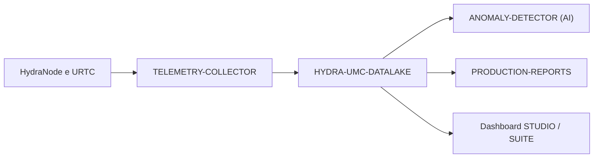

<p align="center">
  
</p>

# 🗄️ HYDRA-UMC-DATALAKE

<p align="center"><a href="README.md">🇺🇸 English</a> | <a href="README_spa.md">🇪🇸 Español</a> | <a href="README_fra.md">🇫🇷 Français</a> | 🇮🇹 <b>Italiano</b> | <a href="README_deu.md">🇩🇪 Deutsch</a> | <a href="README_zho.md">🇨🇳 简体中文</a> | <a href="README_jpn.md">🇯🇵 日本語</a></p>

### 📊 Archiviazione scalabile di serie temporali per dati robotici industriali

<p align="left">
  
  
  
</p>

---

## 1. 🛠️ PANORAMICA TECNICA

**HYDRA-UMC-DATALAKE** è l'archivio attuale di serie temporali della fabbrica. Fornisce un repository reale basato su SQLite per la telemetria normalizzata generata dall'ecosistema, comprese correnti del motore, angoli dei giunti, letture dei sensori e log di inferenza AI.

È la base software per analisi, manutenzione predittiva e report di produzione. L'implementazione SQLite attuale è testata localmente; un deployment esterno InfluxDB/TimescaleDB resta una futura decisione infrastrutturale, non una funzionalità dichiarata già in esecuzione.

### Caratteristiche principali:
* 🗄️ **Archiviazione basata su SQLite:** Archiviazione di serie temporali reale, ACID e su disco con `sqlite3` della stdlib Python. *(implementato)*
* 📊 **Schema dati unificato:** Telemetria normalizzata in formato lungo (`source/kind/field/timestamp/value`) per fonti HYDRA-UMC e URTC. *(implementato)*
* 🔍 **Query deterministiche:** I risultati sono ordinati per timestamp e spareggi stabili; le letture limitate rifiutano limiti non positivi. *(implementato)*
* 🔁 **Gestione idempotente dei retry:** La nuova consegna di un punto `(source, kind, field, timestamp)` sostituisce il valore (ultima scrittura vince), evitando che i retry gonfino i duplicati. *(implementato)*
* 🧬 **Migrazioni di Schema Reversibili:** `migrate_up()`/`migrate_down()` reali e testate, tracciate tramite il `PRAGMA user_version` proprio di SQLite - mai modificare una migrazione già rilasciata, aggiungerne una nuova. *(implementato)*
* 🕐 **Timestamp UTC Espliciti:** `GET /stats/range` riporta i dati reali più vecchi/recenti sia come ms grezzi sia come stringhe ISO 8601 UTC esplicite. *(implementato)*
* 🗑️ **Retention Validata:** Finestre di retention per serie, opt-in (`GET`/`POST /retention`, `POST /retention/apply`) - una finestra non positiva viene rifiutata categoricamente. *(implementato)*

---

## 2. 🔄 ARCHITETTURA DEI DATI



---

## 3. 🧱 ARCHITETTURA E DECISIONI DI PROGETTAZIONE

* **Perché è il genitore di integrazione, non un pari, dei suoi 3 figli.** HYDRA-UMC-TELEMETRY-COLLECTOR, HYDRA-UMC-ANOMALY-DETECTOR e HYDRA-UMC-PRODUCTION-REPORTS leggono/scrivono tutti sullo STESSO archivio di serie temporali sottostante - possedere quell'archivio in un unico posto (questo repo) evita 3 decisioni di schema indipendenti e potenzialmente divergenti.
* **Perché sqlite3 oggi, non ancora InfluxDB/TimescaleDB.** Un database esterno resta una possibile scelta di deployment a lungo termine, ma gestirlo è vero lavoro di infrastruttura e non qualcosa da dichiarare o aggiungere senza richiesta. Il `TimeSeriesStore` di `src/hydra_umc_datalake/store.py` è oggi un archivio di serie temporali reale, ACID e interrogabile (`sqlite3` della stdlib Python), non un placeholder, e resta dietro la propria classe affinché un backend futuro possa sostituirlo senza riscrivere il contratto HTTP.
* **Perché un'unica tabella "lunga" e stretta (source/kind/field/timestamp/value), non una colonna per campo di telemetria.** Il `Sample.Fields` proprio di HYDRA-UMC-TELEMETRY-COLLECTOR è aperto (qualsiasi nome di campo, qualsiasi fonte può segnalarne di nuovi) - uno schema stretto li accetta tutti senza una migrazione, al costo reale di una riga per campo per campione invece di una riga per campione.
* **Perché `aggregate()` fa un vero bucketing SQL per tempo, non solo `query()` grezza.** Una dashboard o un report che chiede "temperatura media del motore al minuto nell'ultima settimana" su milioni di righe grezze ha bisogno di un vero downsampling fatto dal database, non recuperato grezzo e mediato nel codice applicativo - i confini dei bucket di `aggregate()` sono deterministici (allineati al `start` della query stessa), quindi la stessa query sugli stessi dati traccia sempre gli stessi confini di bucket.
* **Come si inserisce nel resto dell'ecosistema.** Il genitore di integrazione della famiglia Dati e Analisi - HYDRA-UMC-TELEMETRY-COLLECTOR lo alimenta da HYDRA-UMC-SERVER, HYDRA-UMC-ANOMALY-DETECTOR e HYDRA-UMC-PRODUCTION-REPORTS rileggono entrambi dalla sua stessa telemetria memorizzata.
* **Perché il versionamento dello schema usa il `PRAGMA user_version` proprio di SQLite, non una tabella fatta a mano.** SQLite fornisce già esattamente questo meccanismo reale (un intero nell'header del file) - una tabella di contabilità parallela sarebbe solo una seconda fonte di verità, potenzialmente divergente, per lo stesso fatto.
* **Perché la retention è opt-in per `(kind, field)`, non un default globale.** Un archivio con decine di serie di telemetria reali non dovrebbe avere l'assunzione di retention di un operatore applicata silenziosamente a ogni serie - `apply_retention()` tocca sempre e solo una serie a cui è stata esplicitamente assegnata una policy tramite `set_retention_policy()`/`POST /retention`.
* **Perché l'identità di retry è `(source, kind, field, timestamp)`.** Il contratto di telemetria normalizzato non possiede un ID di sequenza/evento; un punto esattamente ripetuto viene quindi trattato come un retry di rete incerto e consolidato con il comportamento deterministico dell'ultima scrittura. Ciò evita che righe duplicate distorcano conteggi e aggregati senza eseguire una pulizia distruttiva globale dei dati storici.
* **Perché `/stats/range` è un nuovo endpoint invece di estendere `/stats`.** La forma esistente di `/stats`, `{"sampleCount": <int>}`, è già reale e testata - aggiungervi campi sarebbe un cambiamento reale e distruttivo senza motivo, quando un secondo endpoint additivo non costa nulla.

---

## 📂 STRUTTURA DELLE CARTELLE

Servizio puramente software (integratore di ingestione/analisi) - senza hardware, firmware o sistema operativo propri; tali cartelle sono omesse secondo la politica della struttura del repository.

```text
HYDRA-UMC-DATALAKE/
├── src/hydra_umc_datalake/  # Codice sorgente
│   ├── __init__.py          # Versione del pacchetto
│   ├── store.py             # TimeSeriesStore: ingestione/query/aggregazione reali via sqlite3
│   ├── api.py                # Handler JSON/HTTP con limiti che avvolgono lo store
│   └── main.py               # Punto di ingresso: collega store+API, avvia il server HTTP
├── tests/                   # pytest - logica dello store, migrazioni reali, round-trip HTTP reali
├── docs/
│   └── API.md               # Riferimento reale degli endpoint HTTP (richieste, risposte, codici di stato)
├── images/                  # Media e diagrammi
├── systemd/
│   └── hydra-umc-datalake.service # Unità systemd della API di ingestione/analisi sulla CM5 locale
├── tools/
│   ├── build_test.py        # Controllo build/compilazione senza incremento di versione
│   └── ci_validate.py       # Validazione manifest/CHANGELOG/docs usata dalla CI
├── build/                   # Output di build (ignorato da git)
├── pyproject.toml           # Metadati del pacchetto, versione, dipendenze
├── bump_version.py          # Incremento di versione stile contachilometri (eseguito dal build)
├── bump_manifest_version.py # Sincronizza la versione di hydra-umc.project.json con quella nativa (--sync)
├── docker-compose.yml       # Integra TELEMETRY-COLLECTOR / ANOMALY-DETECTOR / PRODUCTION-REPORTS
├── build.sh / build.bat     # Build reale: venv + installazione editable + bump + test
├── run.sh / run.bat         # Esecuzione reale: avvia l'API HTTP
└── README.md
```

Rimossi dal template originale: `hardware/`, `firmware/` e `os/` — è un
servizio puramente software (pacchetto Python) senza hardware o firmware
propri e senza un'immagine del sistema operativo da mantenere. Vedi
[`docs/API.md`](docs/API.md) per il riferimento completo degli endpoint HTTP.

---

## 4. ⚙️ BUILD ED ESECUZIONE

Richiede Python >= 3.10. Un vero archivio di serie temporali interrogabile
con API HTTP, non solo uno scheletro che si importa.

```bash
# Linux/macOS
./build.sh
./run.sh --port 8095

# Windows
build.bat
run.bat --port 8095
```

`build` crea/attiva un `.venv` locale, installa il pacchetto (editable, con
gli extra di dev) al suo interno, verifica l'import, ed esegue la vera
suite di test (`pytest`). `run` avvia l'API HTTP e inoltra qualsiasi flag
(`--addr`, `--port`, `--db`).

```bash
# Ingerire un campione (stessa forma normalizzata del Sample di HYDRA-UMC-TELEMETRY-COLLECTOR)
curl -X POST localhost:8095/ingest \
  -d '{"sourceId":"robot-1","kind":"motor_temp","timestamp":1700000000000,"fields":{"value":42.5}}'

# Interrogarlo di nuovo
curl "localhost:8095/query?sourceId=robot-1"

# Sottocampionare in bucket da 1 minuto su un intervallo di tempo reale
curl "localhost:8095/aggregate?kind=motor_temp&field=value&bucketMs=60000&start=0&end=1800000000000&agg=avg"

curl localhost:8095/stats
```

```bash
python -m pytest tests/ -v   # store.py (insert/query/aggregate, incluso
                              # calcolo di bucketing verificabile a mano)
                              # e api.py (round-trip HTTP reali contro un
                              # vero ThreadingHTTPServer su una porta
                              # effimera)
```

Per avviare questo progetto insieme ai suoi tre figli (Telemetry-Collector, Anomaly-Detector, Production-Reports) come directory gemelle:

```bash
docker compose up --build
```

---

## 🚀 TABELLA DI MARCIA
* **Fase 1:** Ingestione ad alto throughput del Datalake e indicizzazione per l'analisi storica.
* **Fase 2:** Compressione edge del collettore di telemetria e protocolli di trasmissione sicuri.
* **Fase 3:** Rilevamento delle anomalie tramite apprendimento non supervisionato e analisi delle vibrazioni del motore.
* **Fase 4:** Integrazione con Grafana per la visualizzazione avanzata in tempo reale e l'automazione dei report di produzione.

---

## 🔗 Progetti Correlati

Questo progetto fa parte dell'ecosistema robotico HYDRA-UMC dello stesso autore (JuanenRac / Electro Hobby 3D). Vale la pena conoscerlo, poiché una richiesta potrebbe in realtà riguardare uno di questi invece di questo repository.

**Progetti Figli** — ciascuno scrive o legge dal proprio archivio di questo data lake
- **[HYDRA-UMC-TELEMETRY-COLLECTOR](https://github.com/JuanenRac/HYDRA-UMC-TELEMETRY-COLLECTOR)** — vera pipeline di ingestione CAN/WebSocket verso DATALAKE, con deduplicazione per sequenza.
- **[HYDRA-UMC-ANOMALY-DETECTOR](https://github.com/JuanenRac/HYDRA-UMC-ANOMALY-DETECTOR)** — vero rilevatore di anomalie FFT + baseline statistica, con monitoraggio della deriva.
- **[HYDRA-UMC-PRODUCTION-REPORTS](https://github.com/JuanenRac/HYDRA-UMC-PRODUCTION-REPORTS)** — vero calcolo OEE/disponibilità sullo storico di DATALAKE, con esportazione CSV riproducibile.

**Direttamente Correlati**
- **[HYDRA-UMC-SERVER](https://github.com/JuanenRac/HYDRA-UMC-SERVER)** — il vero backend headless (REST/WebSocket) con cui parla davvero ogni client di controllo; la fonte dei log/telemetria che questo progetto ingerisce.
- **[HYDRA-UMC-DASHBOARD-AI](https://github.com/JuanenRac/HYDRA-UMC-DASHBOARD-AI)** — pannelli Smart Summaries e Anomaly Highlighting su DATALAKE/ANOMALY-DETECTOR, con un fallback statistico onesto; calcola i suoi Riepiloghi Intelligenti direttamente dalla propria cronologia di query/aggregati di questo data lake.

**Fa Anche Parte dell'Ecosistema**

*Hardware e Piattaforma di Base*
- **[HYDRA-UMC](https://github.com/JuanenRac/HYDRA-UMC)** — la scheda madre fisica del braccio robotico: host CM5 + coprocessore STM32H745 dual-core, che coordina fino a 8 bracci utensile via CAN-OTA/SPI-OTA.
- **[HYDRA-UMC-OS](https://github.com/JuanenRac/HYDRA-UMC-OS)** — livello prodotto riproducibile su Raspberry Pi OS per il CM5: agente in sola lettura, config/profili validati, provisioning WiFi al primo contatto.
- **[HYDRA-UMC-SDK](https://github.com/JuanenRac/HYDRA-UMC-SDK)** — il contratto JSON-Schema condiviso e la barriera di sicurezza contro cui ogni bridge valida i propri comandi.

*Backend Centrale e Client*
- **[HYDRA-UMC-STUDIO](https://github.com/JuanenRac/HYDRA-UMC-STUDIO)** — dashboard di controllo web con visualizzazione 3D multi-robot in tempo reale.
- **[HYDRA-UMC-SUITE](https://github.com/JuanenRac/HYDRA-UMC-SUITE)** — centro di comando sciame desktop (PySide6) per più server contemporaneamente, pacchettizzato come eseguibile standalone.
- **[HYDRA-UMC-ANDROID-CONTROL](https://github.com/JuanenRac/HYDRA-UMC-ANDROID-CONTROL)** — app di controllo nativa per Android con login biometrico e un companion Wear OS abbinato.
- **[HYDRA-UMC-IOS-CONTROL](https://github.com/JuanenRac/HYDRA-UMC-IOS-CONTROL)** — app di controllo per iOS/iPadOS (Flutter) con sincronizzazione WebSocket in tempo reale.
- **[HYDRA-UMC-DSI](https://github.com/JuanenRac/HYDRA-UMC-DSI)** — interfaccia touch nativa per il touchscreen DSI da 7" a bordo, incorporata direttamente nel CM5.
- **[HYDRA-UMC-EDITOR-URDF](https://github.com/JuanenRac/HYDRA-UMC-EDITOR-URDF)** — creatore/editor grafico desktop di URDF che invia i modelli finiti al catalogo di STUDIO.
- **[HYDRA-UMC-BRIDGE-AMR](https://github.com/JuanenRac/HYDRA-UMC-BRIDGE-AMR)** — barriera di coordinamento per flotte AGV/AMR tramite un publisher MQTT VDA 5050 reale.
- **[HYDRA-UMC-BRIDGE-CNC](https://github.com/JuanenRac/HYDRA-UMC-BRIDGE-CNC)** — coordinatore ad alto livello per celle CNC con accesso reale a stato/byte di controllo GRBL.
- **[HYDRA-UMC-BRIDGE-DROIDS](https://github.com/JuanenRac/HYDRA-UMC-BRIDGE-DROIDS)** — barriera di coordinamento per droidi con zampe/umanoidi, con un vero mittente di comandi per Boston Dynamics Spot.
- **[HYDRA-UMC-BRIDGE-LASER](https://github.com/JuanenRac/HYDRA-UMC-BRIDGE-LASER)** — coordinatore di sicurezza per celle laser che legge 3 salvaguardie GPIO reali di chiave/involucro/interblocco.
- **[HYDRA-UMC-BRIDGE-OPENPNP](https://github.com/JuanenRac/HYDRA-UMC-BRIDGE-OPENPNP)** — coordinatore ad alto livello sicuro per il flusso schede del pick-and-place OpenPnP.
- **[HYDRA-UMC-BRIDGE-PRINTER3D](https://github.com/JuanenRac/HYDRA-UMC-BRIDGE-PRINTER3D)** — barriera di coordinamento sicura per stampanti 3D Moonraker/Klipper, con comandi di lavoro reali e controllati.
- **[HYDRA-UMC-BRIDGE-ROS2](https://github.com/JuanenRac/HYDRA-UMC-BRIDGE-ROS2)** — coordinatore di sicurezza con un vero trasporto ROS 2 rclpy, importato in modo lazy.
- **[HYDRA-UMC-BRIDGE-UAV](https://github.com/JuanenRac/HYDRA-UMC-BRIDGE-UAV)** — barriera di coordinamento per UAV dotati di fotocamera, con un vero mittente di comandi MAVLink.

*Piattaforma Strumenti URTC*
- **[URTC](https://github.com/JuanenRac/URTC)** — firmware per la scheda fisica dell'Universal Robot Tool Controller, oltre 25 profili utensile su bus CAN.
- **[URTC-FLASHER](https://github.com/JuanenRac/URTC-FLASHER)** — strumento desktop con GUI per il flashing delle schede URTC, CAN-OTA più SWD/JTAG a chip intero.
- **[URTC-TESTER](https://github.com/JuanenRac/URTC-TESTER)** — strumento desktop di diagnostica CAN-bus dal vivo per schede URTC, un pannello per profilo utensile.
- **[URTC-WEB-STUDIO](https://github.com/JuanenRac/URTC-WEB-STUDIO)** — alternativa basata su browser a URTC-TESTER tramite la Web Serial API, senza installazione locale.

*Nodo IA Visione (Hailo-8)*
- **[HYDRA-UMC-VISION-NODE](https://github.com/JuanenRac/HYDRA-UMC-VISION-NODE)** — hub di integrazione per la pipeline di visione Hailo-8, con un vero controllo di prontezza hardware per fase.
- **[HYDRA-UMC-DETECTION-HEF](https://github.com/JuanenRac/HYDRA-UMC-DETECTION-HEF)** — registro reale di modelli compilati con verifica di caricamento sicuro per architettura Hailo/checksum.
- **[HYDRA-UMC-VISION-STREAMER](https://github.com/JuanenRac/HYDRA-UMC-VISION-STREAMER)** — generatore reale di pipeline GStreamer + config MediaMTX, con una vera barriera di integrazione HailoRT.
- **[HYDRA-UMC-VISUAL-SERVOING-API](https://github.com/JuanenRac/HYDRA-UMC-VISUAL-SERVOING-API)** — vera legge di correzione Position-Based Visual Servoing, con cancello di sicurezza sullo stato di zona a monte.
- **[HYDRA-UMC-SAFETY-ZONES](https://github.com/JuanenRac/HYDRA-UMC-SAFETY-ZONES)** — vero controllo di violazione zona e richiesta E-STOP, con imposizione della freschezza di calibrazione.

*Nodo IA Cognitivo (Hailo-10)*
- **[HYDRA-UMC-COGNITIVE-NODE](https://github.com/JuanenRac/HYDRA-UMC-COGNITIVE-NODE)** — hub di integrazione per la pipeline cognitiva Hailo-10 (orchestrazione LLM/VLA/voce).
- **[HYDRA-UMC-VLA-ENGINE](https://github.com/JuanenRac/HYDRA-UMC-VLA-ENGINE)** — vera codifica/decodifica di token d'azione e generazione di traiettoria per un modello Vision-Language-Action.
- **[HYDRA-UMC-VOICE-UI](https://github.com/JuanenRac/HYDRA-UMC-VOICE-UI)** — vero front-end vocale (VAD + parser di intenti) con un relay verso Watch limitato e soggetto a conferma.
- **[HYDRA-UMC-SEMANTIC-PLANNER](https://github.com/JuanenRac/HYDRA-UMC-SEMANTIC-PLANNER)** — vera scomposizione dei task basata su regole e recupero semantico degli errori sui codici errore MCU.
- **[HYDRA-UMC-DOCS-QA](https://github.com/JuanenRac/HYDRA-UMC-DOCS-QA)** — vera ricerca documentale TF-IDF (solo libreria standard) sui documenti Markdown di questo ecosistema.

*Orchestrazione e Sciame*
- **[HYDRA-UMC-ORCHESTRATOR](https://github.com/JuanenRac/HYDRA-UMC-ORCHESTRATOR)** — hub di integrazione con un vero contratto di health-report gRPC/Protobuf e una macchina a stati di missione.
- **[HYDRA-UMC-JOB-DISPATCHER](https://github.com/JuanenRac/HYDRA-UMC-JOB-DISPATCHER)** — vera coda di lavori basata su priorità con deduplicazione, su una vera API HTTP.
- **[HYDRA-UMC-NODE-HEALING](https://github.com/JuanenRac/HYDRA-UMC-NODE-HEALING)** — vero watchdog di salute della flotta basato su gRPC, con retry/backoff e rilevamento di discrepanza d'identità.
- **[HYDRA-UMC-PATH-PLANNER-3D](https://github.com/JuanenRac/HYDRA-UMC-PATH-PLANNER-3D)** — vero pianificatore di percorsi 3D basato su RRT, con vera validazione delle collisioni ostacolo/spazio di lavoro.
- **[HYDRA-UMC-SWARM-SYNC](https://github.com/JuanenRac/HYDRA-UMC-SWARM-SYNC)** — vera sincronizzazione di stato CRDT LWW-Element-Map, con property test per la convergenza multi-cella.

*Gemello Digitale e Simulazione*
- **[HYDRA-UMC-TWIN](https://github.com/JuanenRac/HYDRA-UMC-TWIN)** — hub di integrazione per il motore di gemello digitale, con un vero contratto di sincronizzazione per compatibilità di versione.
- **[HYDRA-UMC-HIL-BRIDGE](https://github.com/JuanenRac/HYDRA-UMC-HIL-BRIDGE)** — vero interblocco di sicurezza hardware-in-the-loop che instrada i comandi tra simulazione e hardware reale.
- **[HYDRA-UMC-PHYSICS-REPLICA](https://github.com/JuanenRac/HYDRA-UMC-PHYSICS-REPLICA)** — vera cinematica diretta e validazione dei limiti articolari su un vero sottoinsieme URDF.
- **[HYDRA-UMC-SYNTHETIC-DATA-GEN](https://github.com/JuanenRac/HYDRA-UMC-SYNTHETIC-DATA-GEN)** — vero generatore procedurale di scene 2D con esportazione di annotazioni YOLO/COCO.

*Gateway Industriale*
- **[HYDRA-UMC-GATEWAY-INDUSTRIAL](https://github.com/JuanenRac/HYDRA-UMC-GATEWAY-INDUSTRIAL)** — hub di integrazione che inoltra ai protocolli industriali, con un vero livello di allowlist dei comandi/backpressure.
- **[HYDRA-UMC-OPCUA-SERVER](https://github.com/JuanenRac/HYDRA-UMC-OPCUA-SERVER)** — vero spazio di indirizzi OPC-UA, verificato con una vera sessione client del protocollo binario.
- **[HYDRA-UMC-MQTT-BROKER](https://github.com/JuanenRac/HYDRA-UMC-MQTT-BROKER)** — vero broker MQTT con autenticazione opzionale per client e ACL sui topic.
- **[HYDRA-UMC-MTCONNECT-ADAPTER](https://github.com/JuanenRac/HYDRA-UMC-MTCONNECT-ADAPTER)** — veri endpoint XML `/probe` e `/current` di MTConnect, con output in modalità degradata.

*Strumenti Complementari e Operazioni dell'Ecosistema*
- **[HYDRA-UMC-TOOL-CLI](https://github.com/JuanenRac/HYDRA-UMC-TOOL-CLI)** — CLI di flotta con un vero e stabile contratto di exit-code, un client live reale della stessa API di HYDRA-UMC-SERVER.
- **[HYDRA-UMC-WATCH](https://github.com/JuanenRac/HYDRA-UMC-WATCH)** — app companion WearOS con avvisi aptici reali e un relay vocale verso il telefono abbinato.
- **[URTC-SMART-RACK](https://github.com/JuanenRac/URTC-SMART-RACK)** — firmware per un rack di montaggio schede con decodifica reale dell'ID utensile e logica di preriscaldamento Smart Idle.
- **[URTC-VISION-TOOL](https://github.com/JuanenRac/URTC-VISION-TOOL)** — firmware più un vero companion di visione Python per una testa utensile di ispezione termica/RGB.
- **[HYDRA-UMC-UPDATER](https://github.com/JuanenRac/HYDRA-UMC-UPDATER)** — strumento amministrativo desktop che scopre, clona e aggiorna ogni repository di questo ecosistema.


## 👤 AUTORE
**JuanenRac** (Electro Hobby 3D)
📧 electrohobby3d@gmail.com
📺 [youtube.com/@electrohobby3d](https://youtube.com/@electrohobby3d)

## 📜 LICENZA
GPL-3.0 - Vedere LICENSE per i dettagli.
