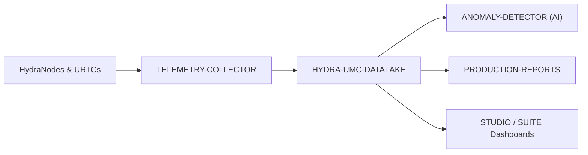

<p align="center">
  
</p>

# 🗄️ HYDRA-UMC-DATALAKE

<p align="center"><a href="README.md">🇺🇸 English</a> | <a href="README_spa.md">🇪🇸 Español</a> | <a href="README_fra.md">🇫🇷 Français</a> | <a href="README_ita.md">🇮🇹 Italiano</a> | <a href="README_deu.md">🇩🇪 Deutsch</a> | <a href="README_zho.md">🇨🇳 简体中文</a> | 🇯🇵 <b>日本語</b></p>

### 📊 産業用ロボットデータのためのスケーラブルな時系列ストレージ

<p align="left">
  
  
  
</p>

---

## 1. 🛠️ 技術概要

**HYDRA-UMC-DATALAKE** は、工場の長期記憶です。モーター電流、関節角度、
センサー読み取り値、AI 推論ログを含む、エコシステムが生成するすべての
時系列データのための、スケーラブルで高性能なリポジトリを提供します。

高度な分析、予測保守、生産最適化の基盤として機能し、工場管理者が数年分
のミリ秒単位で正確なロボットパフォーマンスデータを振り返ることを
可能にします。

### 主な機能：
* 🗄️ **高解像度ストレージ：** InfluxDB/TimescaleDB を使用し、毎秒数百万ポイントに最適化。
* 📊 **統一データスキーマ：** すべての HydraNode と URTC のテレメトリ向けの標準化されたフォーマット。
* 🔍 **高速クエリ：** 生産監査と QA のための履歴データの高速取得。
* 🛡️ **データ整合性：** 重要な産業ログのための冗長ストレージと自動バックアップ。

---

## 2. 🔄 データアーキテクチャ



---

## 3. 🧱 アーキテクチャと設計上の決定

* **本プロジェクトが 3 つの子プロジェクトの統合親プロジェクトであり、対等な関係ではない理由。** HYDRA-UMC-TELEMETRY-COLLECTOR、HYDRA-UMC-ANOMALY-DETECTOR、HYDRA-UMC-PRODUCTION-REPORTS はすべて*同一*の基盤となる時系列ストアを読み書きします——そのストアの所有権を一か所（本リポジトリ）に集約することで、3 つの独立した、互いに食い違う可能性のあるスキーマ決定を避けられます。
* **なぜ今日は sqlite3 であり、まだ InfluxDB/TimescaleDB ではないのか。** どちらもこのプロジェクト自身のバッジ/キーワードに登場しており、本当の長期的な方向性であることに変わりはありません——ただし、それを立ち上げることは実際のインフラ上の決定(デプロイして運用するサービス)であり、これを本番環境で動かす人に委ねられるべきものであって、頼まれてもいないのに勝手に組み込むべきものではありません。`src/hydra_umc_datalake/store.py` の `TimeSeriesStore` は今日、本当に実在し、ACID 準拠で、クエリ可能な時系列ストア(Python 標準ライブラリの `sqlite3`)です——そう装っているだけのプレースホルダーではありません——将来、本物の InfluxDB/TimescaleDB を裏付けとする実装がこれを置き換えられるように、あえて独自のクラスの背後に保持されています。`mejoras_futuras.txt` を参照してください。
* **テレメトリフィールドごとに 1 列ではなく、1 つの狭い「ロング」テーブル(source/kind/field/timestamp/value)である理由。** HYDRA-UMC-TELEMETRY-COLLECTOR 自身の `Sample.Fields` はオープンエンドです(どんなフィールド名でも、どんなソースでも新しいものを報告できます)——狭いスキーマはマイグレーションなしにそれらすべてを受け入れます。実際のコストはサンプルごとに 1 行ではなく、サンプルごと・フィールドごとに 1 行になることです。
* **`aggregate()` が生の `query()` だけでなく、本物の SQL による時間バケット化を行う理由。** 「先週の 1 分ごとの平均モーター温度」を数百万の生の行に対して尋ねるダッシュボードやレポートには、アプリケーションコードで生データを取得して平均するのではなく、データベース自身による本物のダウンサンプリングが必要です——`aggregate()` のバケット境界は決定論的です(クエリ自身の `start` に整列している)。そのため、同じデータに対する同じクエリは常に同じバケット境界を描きます。
* **エコシステムの他の部分との関係。** Data & Analytics ファミリーの統合親プロジェクトです——HYDRA-UMC-TELEMETRY-COLLECTOR が HYDRA-UMC-SERVER からデータを供給し、HYDRA-UMC-ANOMALY-DETECTOR と HYDRA-UMC-PRODUCTION-REPORTS の両方が本プロジェクト自身が保存したテレメトリから読み戻します。

---

## 📂 リポジトリ構成

純粋なソフトウェアサービス（取り込み/分析インテグレーター）——独自の
ハードウェア/ファームウェア/OS を持たず、テンプレートから省略されて
います（エコシステムの慣例は `SONNET/_papelera/` を参照）。

```text
HYDRA-UMC-DATALAKE/
├── src/hydra_umc_datalake/  # ソースコード
│   ├── __init__.py          # パッケージバージョン
│   ├── store.py             # TimeSeriesStore：sqlite3 による実際の取り込み/クエリ/集計
│   ├── api.py                # store を包む単純な JSON/HTTP ハンドラー
│   └── main.py               # エントリポイント：store+API を接続し、HTTP サーバーを起動
├── tests/                   # pytest - store のロジック + 本物の HTTP 往復テスト
├── build/                   # ビルド出力（gitignore 対象）
├── pyproject.toml           # パッケージメタデータ、バージョン、依存関係
├── bump_version.py          # オドメーター式バージョンインクリメント（ビルドが実行）
├── docker-compose.yml       # TELEMETRY-COLLECTOR / ANOMALY-DETECTOR / PRODUCTION-REPORTS を統合
├── build.sh / build.bat     # 実際のビルド：venv + editable インストール + バージョンインクリメント + テスト
├── run.sh / run.bat         # 実際の実行：HTTP API を起動
└── README.md
```

元のテンプレートから省略：`hardware/`、`firmware/`、`os/`、`docs/`、
`images/`、`scripts/` —— これは純粋なソフトウェアサービス(Python
パッケージ)であり、専用のハードウェアやファームウェア、維持すべき
オペレーティングシステムイメージもなく、専用フォルダを正当化する
ほどのドキュメント/メディア/ユーティリティスクリプトの内容もまだ
ありません。

---

## 4. ⚙️ ビルドと実行

Python >= 3.10 が必要です。コンパイルできるだけの骨組みではなく、
HTTP API を備えた本物のクエリ可能な時系列ストアです。

```bash
# Linux/macOS
./build.sh
./run.sh --port 8095

# Windows
build.bat
run.bat --port 8095
```

`build` はローカルの `.venv` を作成/アクティブ化し、パッケージを
(editable、dev 拡張込みで) その中にインストールし、インポートを検証し、
本物のテストスイート(`pytest`)を実行します。`run` は HTTP API を起動し、
すべてのフラグ(`--addr`、`--port`、`--db`)をそのまま渡します。

```bash
# サンプルを取り込む(HYDRA-UMC-TELEMETRY-COLLECTOR 自身の Sample と同じ正規化された形)
curl -X POST localhost:8095/ingest \
  -d '{"sourceId":"robot-1","kind":"motor_temp","timestamp":1700000000000,"fields":{"value":42.5}}'

# それをクエリで取り出す
curl "localhost:8095/query?sourceId=robot-1"

# 実際の時間範囲を 1 分間隔のバケットにダウンサンプリングする
curl "localhost:8095/aggregate?kind=motor_temp&field=value&bucketMs=60000&start=0&end=1800000000000&agg=avg"

curl localhost:8095/stats
```

```bash
python -m pytest tests/ -v   # store.py(挿入/クエリ/集計、手計算で
                              # 検証可能なバケット化の数学を含む)、
                              # および api.py(一時ポート上の本物の
                              # ThreadingHTTPServer に対する本物の
                              # HTTP 往復テスト)
```

本プロジェクトをその 3 つの子プロジェクト（Telemetry-Collector、
Anomaly-Detector、Production-Reports、兄弟ディレクトリとしてチェック
アウト）とともに立ち上げるには：

```bash
docker compose up --build
```

---

## 🚀 ロードマップ
* **フェーズ 1：** 履歴分析のためのデータレイクの高スループット取り込みとインデックス作成。
* **フェーズ 2：** テレメトリコレクターのエッジ圧縮と安全な送信プロトコル。
* **フェーズ 3：** 教師なし学習とモーター振動分析を用いた異常検知。
* **フェーズ 4：** 高度なリアルタイム可視化のための Grafana との統合と生産レポートの自動化。

---

## 🔗 関連プロジェクト

本プロジェクトは、同一著者（JuanenRac / Electro Hobby 3D）による、
ファームウェア、制御ソフトウェア、AI ノード、フリート管理ツールにまたがる、
より大きなロボティクスエコシステムの一部です。ご要望が実際にはこれらの
プロジェクトのいずれかに関するものであり、本リポジトリのものではない
可能性もあるため、知っておく価値があります。

### プロジェクトファミリー

**親プロジェクト：** なし —— 本プロジェクト自体が Data & Analytics ファミリーの統合親プロジェクトです。

**子プロジェクト：**
- **[HYDRA-UMC-TELEMETRY-COLLECTOR](https://github.com/JuanenRac/HYDRA-UMC-TELEMETRY-COLLECTOR)** — 集約された各ロボットのテレメトリを本データレイクに供給します。
- **[HYDRA-UMC-ANOMALY-DETECTOR](https://github.com/JuanenRac/HYDRA-UMC-ANOMALY-DETECTOR)** — 本データレイク自身が保存したテレメトリに対して異常検知を実行します。
- **[HYDRA-UMC-PRODUCTION-REPORTS](https://github.com/JuanenRac/HYDRA-UMC-PRODUCTION-REPORTS)** — 本データレイク自身が保存したテレメトリからシフト/OEE レポートを生成します。

### 直接関連（ファミリー外）

- **[HYDRA-UMC-SERVER](https://github.com/JuanenRac/HYDRA-UMC-SERVER)** — 本プロジェクトが取り込むログ/テレメトリの発生源。

### エコシステムのその他のプロジェクト

**HYDRA-UMC プラットフォーム** — マルチロボット・マイクロファクトリーセル
- **[HYDRA-UMC](https://github.com/JuanenRac/HYDRA-UMC)** — 最大 8 台のロボットアームを統括する CM5 + STM32H745 マザーボード。
- **[HYDRA-UMC-SERVER](https://github.com/JuanenRac/HYDRA-UMC-SERVER)** — すべての制御クライアントが接続する Express/WebSocket バックエンド。
- **[HYDRA-UMC-STUDIO](https://github.com/JuanenRac/HYDRA-UMC-STUDIO)** — Web ベースの制御ダッシュボード、マルチロボット 3D 可視化。
- **[HYDRA-UMC-ANDROID-CONTROL](https://github.com/JuanenRac/HYDRA-UMC-ANDROID-CONTROL)** — Wi-Fi/Bluetooth 経由の Android 制御アプリ。
- **[HYDRA-UMC-IOS-CONTROL](https://github.com/JuanenRac/HYDRA-UMC-IOS-CONTROL)** — Flutter で構築された iOS/iPadOS 制御アプリ。
- **[HYDRA-UMC-SUITE](https://github.com/JuanenRac/HYDRA-UMC-SUITE)** — デスクトップ版群制御コマンドセンター（Python/PySide6）。
- **[HYDRA-UMC-EDITOR-URDF](https://github.com/JuanenRac/HYDRA-UMC-EDITOR-URDF)** — ロボットカタログ向けのデスクトップ版 URDF モデルエディター。
- **[HYDRA-UMC-DSI](https://github.com/JuanenRac/HYDRA-UMC-DSI)** — 機載 DSI タッチスクリーン用のネイティブタッチ UI。

**URTC プラットフォーム** — すべての HYDRA-UMC ロボットアームが搭載するツールヘッドコントローラー
- **[URTC](https://github.com/JuanenRac/URTC)** — CAN バスツールヘッドコントローラー、25 種類のツールプロファイル。
- **[URTC-FLASHER](https://github.com/JuanenRac/URTC-FLASHER)** — デスクトップ版 CAN-OTA + SWD/JTAG フラッシュツール。
- **[URTC-TESTER](https://github.com/JuanenRac/URTC-TESTER)** — デスクトップ版ライブ CAN バス診断ツール。
- **[URTC-WEB-STUDIO](https://github.com/JuanenRac/URTC-WEB-STUDIO)** — Web Serial API によるブラウザベースの代替版。

**🎥 ビジョン AI ノード（Hailo-8）**
- [HYDRA-UMC-VISION-NODE](https://github.com/JuanenRac/HYDRA-UMC-VISION-NODE)
- [HYDRA-UMC-VISION-STREAMER](https://github.com/JuanenRac/HYDRA-UMC-VISION-STREAMER)
- [HYDRA-UMC-DETECTION-HEF](https://github.com/JuanenRac/HYDRA-UMC-DETECTION-HEF)
- [HYDRA-UMC-SAFETY-ZONES](https://github.com/JuanenRac/HYDRA-UMC-SAFETY-ZONES)
- [HYDRA-UMC-VISUAL-SERVOING-API](https://github.com/JuanenRac/HYDRA-UMC-VISUAL-SERVOING-API)

**🧠 認知 AI ノード（Hailo-10）**
- [HYDRA-UMC-COGNITIVE-NODE](https://github.com/JuanenRac/HYDRA-UMC-COGNITIVE-NODE)
- [HYDRA-UMC-VLA-ENGINE](https://github.com/JuanenRac/HYDRA-UMC-VLA-ENGINE)
- [HYDRA-UMC-VOICE-UI](https://github.com/JuanenRac/HYDRA-UMC-VOICE-UI)
- [HYDRA-UMC-SEMANTIC-PLANNER](https://github.com/JuanenRac/HYDRA-UMC-SEMANTIC-PLANNER)
- [HYDRA-UMC-DOCS-QA](https://github.com/JuanenRac/HYDRA-UMC-DOCS-QA)

**🐝 オーケストレーションと群制御**
- [HYDRA-UMC-ORCHESTRATOR](https://github.com/JuanenRac/HYDRA-UMC-ORCHESTRATOR)
- [HYDRA-UMC-SWARM-SYNC](https://github.com/JuanenRac/HYDRA-UMC-SWARM-SYNC)
- [HYDRA-UMC-PATH-PLANNER-3D](https://github.com/JuanenRac/HYDRA-UMC-PATH-PLANNER-3D)
- [HYDRA-UMC-JOB-DISPATCHER](https://github.com/JuanenRac/HYDRA-UMC-JOB-DISPATCHER)
- [HYDRA-UMC-NODE-HEALING](https://github.com/JuanenRac/HYDRA-UMC-NODE-HEALING)

**🎮 デジタルツインとシミュレーション**
- [HYDRA-UMC-TWIN](https://github.com/JuanenRac/HYDRA-UMC-TWIN)
- [HYDRA-UMC-PHYSICS-REPLICA](https://github.com/JuanenRac/HYDRA-UMC-PHYSICS-REPLICA)
- [HYDRA-UMC-HIL-BRIDGE](https://github.com/JuanenRac/HYDRA-UMC-HIL-BRIDGE)
- [HYDRA-UMC-SYNTHETIC-DATA-GEN](https://github.com/JuanenRac/HYDRA-UMC-SYNTHETIC-DATA-GEN)

**🏭 産業用ゲートウェイ**
- [HYDRA-UMC-GATEWAY-INDUSTRIAL](https://github.com/JuanenRac/HYDRA-UMC-GATEWAY-INDUSTRIAL)
- [HYDRA-UMC-OPCUA-SERVER](https://github.com/JuanenRac/HYDRA-UMC-OPCUA-SERVER)
- [HYDRA-UMC-MQTT-BROKER](https://github.com/JuanenRac/HYDRA-UMC-MQTT-BROKER)
- [HYDRA-UMC-MTCONNECT-ADAPTER](https://github.com/JuanenRac/HYDRA-UMC-MTCONNECT-ADAPTER)

**🛠️ 補完ツール**
- [URTC-SMART-RACK](https://github.com/JuanenRac/URTC-SMART-RACK)
- [URTC-VISION-TOOL](https://github.com/JuanenRac/URTC-VISION-TOOL)
- [HYDRA-UMC-WATCH](https://github.com/JuanenRac/HYDRA-UMC-WATCH)
- [HYDRA-UMC-TOOL-CLI](https://github.com/JuanenRac/HYDRA-UMC-TOOL-CLI)
- [HYDRA-UMC-DASHBOARD-AI](https://github.com/JuanenRac/HYDRA-UMC-DASHBOARD-AI)


## 👤 作者
**JuanenRac**（Electro Hobby 3D）
📧 electrohobby3d@gmail.com

## 📜 ライセンス
GPL-3.0 —— 詳細は LICENSE を参照してください。

## 関連プロジェクト

> Canonical public ecosystem relationship map.

**Direct integrations:**
[HYDRA-UMC-OS](https://github.com/JuanenRac/HYDRA-UMC-OS) · [HYDRA-UMC-SDK](https://github.com/JuanenRac/HYDRA-UMC-SDK) · [HYDRA-UMC-SERVER](https://github.com/JuanenRac/HYDRA-UMC-SERVER) · [URTC](https://github.com/JuanenRac/URTC) · [HYDRA-UMC-TELEMETRY-COLLECTOR](https://github.com/JuanenRac/HYDRA-UMC-TELEMETRY-COLLECTOR) · [HYDRA-UMC-ANOMALY-DETECTOR](https://github.com/JuanenRac/HYDRA-UMC-ANOMALY-DETECTOR) · [HYDRA-UMC-PRODUCTION-REPORTS](https://github.com/JuanenRac/HYDRA-UMC-PRODUCTION-REPORTS)

**Platform and contracts:**
[HYDRA-UMC-OS](https://github.com/JuanenRac/HYDRA-UMC-OS) · [HYDRA-UMC-SDK](https://github.com/JuanenRac/HYDRA-UMC-SDK)

**Rest of the ecosystem:**
All remaining public repositories are grouped by the seven ecosystem layers in the [JuanenRac ecosystem dashboard](https://juanenrac.github.io/JuanenRac/).
