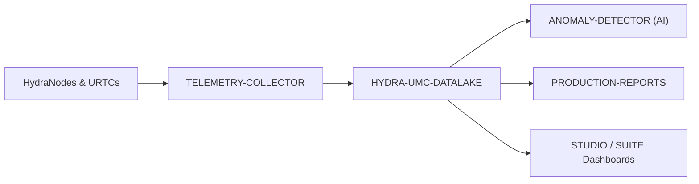

<p align="center">
  
</p>

# 🗄️ HYDRA-UMC-DATALAKE

<p align="center"><a href="README.md">🇺🇸 English</a> | <a href="README_spa.md">🇪🇸 Español</a> | <a href="README_fra.md">🇫🇷 Français</a> | <a href="README_ita.md">🇮🇹 Italiano</a> | <a href="README_deu.md">🇩🇪 Deutsch</a> | <a href="README_zho.md">🇨🇳 简体中文</a> | 🇯🇵 <b>日本語</b></p>

### 📊 産業用ロボットデータのためのスケーラブルな時系列ストレージ

<p align="left">
  
  
  
</p>

---

## 1. 🛠️ 技術概要

**HYDRA-UMC-DATALAKE** は、工場の現在の時系列ストアです。モーター電流、
関節角度、センサー読み取り値、AI 推論ログを含む、エコシステムが生成する
正規化テレメトリのための実際の SQLite ベースのリポジトリを提供します。

分析、予測保守、生産レポートのソフトウェア基盤として機能します。現在の
SQLite 実装はローカルでテスト済みです。外部の InfluxDB/TimescaleDB 配備は、
すでに稼働している機能として主張するものではなく、将来のインフラ判断です。

### 主な機能：
* 🗄️ **SQLite ベースのストレージ：** Python 標準ライブラリの `sqlite3` を使った、実際の ACID 準拠オンディスク時系列ストレージ。*（実装済み）*
* 📊 **統一データスキーマ：** HYDRA-UMC と URTC ソース向けの正規化されたロング形式テレメトリ（`source/kind/field/timestamp/value`）。*（実装済み）*
* 🔍 **決定論的クエリ：** 結果はタイムスタンプと安定したタイブレークで順序付けられ、制限付き読み取りは非正の limit を拒否します。*（実装済み）*
* 🔁 **冪等なリトライ処理：** `(source, kind, field, timestamp)` ポイントの再送は値を置換し（最後の書き込みが勝つ）、リトライによる重複の増加を防ぎます。*（実装済み）*
* 🧬 **可逆的なスキーママイグレーション：** SQLite 自身の `PRAGMA user_version` で追跡される、本物のテスト済み `migrate_up()`/`migrate_down()`——リリース済みのマイグレーションは決して編集せず、新しいものを追加します。*(実装済み)*
* 🕐 **明示的な UTC タイムスタンプ：** `GET /stats/range` は、実際の最古/最新データを生のミリ秒値と明示的な UTC ISO 8601 文字列の両方で報告します。*(実装済み)*
* 🗑️ **検証済みの保持ポリシー：** シリーズごとにオプトインできる保持期間（`GET`/`POST /retention`、`POST /retention/apply`）——非正の期間は即座に拒否されます。*(実装済み)*

---

## 2. 🔄 データアーキテクチャ



---

## 3. 🧱 アーキテクチャと設計上の決定

* **本プロジェクトが 3 つの子プロジェクトの統合親プロジェクトであり、対等な関係ではない理由。** HYDRA-UMC-TELEMETRY-COLLECTOR、HYDRA-UMC-ANOMALY-DETECTOR、HYDRA-UMC-PRODUCTION-REPORTS はすべて*同一*の基盤となる時系列ストアを読み書きします——そのストアの所有権を一か所（本リポジトリ）に集約することで、3 つの独立した、互いに食い違う可能性のあるスキーマ決定を避けられます。
* **なぜ今日は sqlite3 であり、まだ InfluxDB/TimescaleDB ではないのか。** 外部データベースは長期的なデプロイ選択肢として残りますが、その運用は実際のインフラ作業であり、依頼なしに主張または追加すべきものではありません。`src/hydra_umc_datalake/store.py` の `TimeSeriesStore` は今日、本当に実在し、ACID 準拠でクエリ可能な時系列ストア（Python 標準ライブラリの `sqlite3`）であり、プレースホルダーではありません。将来のバックエンドが HTTP 契約を書き直さずに置き換えられるよう、独自クラスの背後に保持されています。
* **テレメトリフィールドごとに 1 列ではなく、1 つの狭い「ロング」テーブル(source/kind/field/timestamp/value)である理由。** HYDRA-UMC-TELEMETRY-COLLECTOR 自身の `Sample.Fields` はオープンエンドです(どんなフィールド名でも、どんなソースでも新しいものを報告できます)——狭いスキーマはマイグレーションなしにそれらすべてを受け入れます。実際のコストはサンプルごとに 1 行ではなく、サンプルごと・フィールドごとに 1 行になることです。
* **`aggregate()` が生の `query()` だけでなく、本物の SQL による時間バケット化を行う理由。** 「先週の 1 分ごとの平均モーター温度」を数百万の生の行に対して尋ねるダッシュボードやレポートには、アプリケーションコードで生データを取得して平均するのではなく、データベース自身による本物のダウンサンプリングが必要です——`aggregate()` のバケット境界は決定論的です(クエリ自身の `start` に整列している)。そのため、同じデータに対する同じクエリは常に同じバケット境界を描きます。
* **エコシステムの他の部分との関係。** データと分析 ファミリーの統合親プロジェクトです——HYDRA-UMC-TELEMETRY-COLLECTOR が HYDRA-UMC-SERVER からデータを供給し、HYDRA-UMC-ANOMALY-DETECTOR と HYDRA-UMC-PRODUCTION-REPORTS の両方が本プロジェクト自身が保存したテレメトリから読み戻します。
* **なぜスキーマのバージョン管理に、独自のテーブルではなく SQLite 自身の `PRAGMA user_version` を使うのか。** SQLite はすでにまさにこの本物の仕組み（ファイルヘッダー内の整数）を提供しています——並行する記帳用テーブルは、同じ事実に対する第二の、食い違う可能性のある真実の源になるだけです。
* **なぜ保持ポリシーはグローバルなデフォルトではなく、`(kind, field)` ごとのオプトインなのか。** 数十の本物のテレメトリシリーズを持つストアでは、ある運用者の保持ポリシーの前提を、すべてのシリーズに黙って適用すべきではありません——`apply_retention()` は、`set_retention_policy()`/`POST /retention` を通じて明示的にポリシーが設定されたシリーズにのみ作用します。
* **なぜリトライ識別子が `(source, kind, field, timestamp)` なのか。** 正規化テレメトリ契約にはシーケンス/イベント ID がないため、完全に同一のポイントは不確実なネットワークリトライとして扱われ、決定論的な最後の書き込み優先で統合されます。これは履歴データをグローバルに破壊的に整理せず、重複行がカウントや集計を歪めることを防ぎます。
* **なぜ `/stats/range` は `/stats` を拡張するのではなく、新しいエンドポイントなのか。** `/stats` の既存の `{"sampleCount": <int>}` 形式はすでに本物でテスト済みです——理由もなくフィールドを追加することは本物の破壊的変更になりますが、付加的な第二のエンドポイントを設けるコストはゼロです。

---

## 📂 リポジトリ構成

純粋なソフトウェアサービス（取り込み/分析インテグレーター）であり、独自の
ハードウェア、ファームウェア、OS はありません。これらのディレクトリは
リポジトリ構造ポリシーに従って省略されています。

```text
HYDRA-UMC-DATALAKE/
├── src/hydra_umc_datalake/  # ソースコード
│   ├── __init__.py          # パッケージバージョン
│   ├── store.py             # TimeSeriesStore：sqlite3 による実際の取り込み/クエリ/集計
│   ├── api.py                # store を包み上限を設けた JSON/HTTP ハンドラー
│   └── main.py               # エントリポイント：store+API を接続し、HTTP サーバーを起動
├── tests/                   # pytest - store のロジック、本物のマイグレーション、本物の HTTP 往復テスト
├── docs/
│   └── API.md               # 本物の HTTP エンドポイントリファレンス（リクエスト、レスポンス、ステータスコード）
├── images/                  # メディアと図版
├── systemd/
│   └── hydra-umc-datalake.service # CM5 上のローカル取り込み/分析 API 用 systemd ユニット
├── tools/
│   ├── build_test.py        # バージョンを更新しないビルド/コンパイル確認
│   └── ci_validate.py       # CI が使用する manifest/CHANGELOG/docs の検証
├── build/                   # ビルド出力（gitignore 対象）
├── pyproject.toml           # パッケージメタデータ、バージョン、依存関係
├── bump_version.py          # オドメーター式バージョンインクリメント（ビルドが実行）
├── bump_manifest_version.py # hydra-umc.project.json のバージョンをネイティブ側と同期（--sync）
├── docker-compose.yml       # TELEMETRY-COLLECTOR / ANOMALY-DETECTOR / PRODUCTION-REPORTS を統合
├── build.sh / build.bat     # 実際のビルド：venv + editable インストール + バージョンインクリメント + テスト
├── run.sh / run.bat         # 実際の実行：HTTP API を起動
└── README.md
```

元のテンプレートから省略：`hardware/`、`firmware/`、`os/` —— これは
純粋なソフトウェアサービス(Python パッケージ)であり、専用のハードウェアや
ファームウェア、維持すべきオペレーティングシステムイメージもありません。
完全な HTTP エンドポイントリファレンスは [`docs/API.md`](docs/API.md) を参照。

---

## 4. ⚙️ ビルドと実行

Python >= 3.10 が必要です。コンパイルできるだけの骨組みではなく、
HTTP API を備えた本物のクエリ可能な時系列ストアです。

```bash
# Linux/macOS
./build.sh
./run.sh --port 8095

# Windows
build.bat
run.bat --port 8095
```

`build` はローカルの `.venv` を作成/アクティブ化し、パッケージを
(editable、dev 拡張込みで) その中にインストールし、インポートを検証し、
本物のテストスイート(`pytest`)を実行します。`run` は HTTP API を起動し、
すべてのフラグ(`--addr`、`--port`、`--db`)をそのまま渡します。

```bash
# サンプルを取り込む(HYDRA-UMC-TELEMETRY-COLLECTOR 自身の Sample と同じ正規化された形)
curl -X POST localhost:8095/ingest \
  -d '{"sourceId":"robot-1","kind":"motor_temp","timestamp":1700000000000,"fields":{"value":42.5}}'

# それをクエリで取り出す
curl "localhost:8095/query?sourceId=robot-1"

# 実際の時間範囲を 1 分間隔のバケットにダウンサンプリングする
curl "localhost:8095/aggregate?kind=motor_temp&field=value&bucketMs=60000&start=0&end=1800000000000&agg=avg"

curl localhost:8095/stats
```

```bash
python -m pytest tests/ -v   # store.py(挿入/クエリ/集計、手計算で
                              # 検証可能なバケット化の数学を含む)、
                              # および api.py(一時ポート上の本物の
                              # ThreadingHTTPServer に対する本物の
                              # HTTP 往復テスト)
```

本プロジェクトをその 3 つの子プロジェクト（Telemetry-Collector、
Anomaly-Detector、Production-Reports、兄弟ディレクトリとしてチェック
アウト）とともに立ち上げるには：

```bash
docker compose up --build
```

---

## 🚀 ロードマップ
* **フェーズ 1：** 履歴分析のためのデータレイクの高スループット取り込みとインデックス作成。
* **フェーズ 2：** テレメトリコレクターのエッジ圧縮と安全な送信プロトコル。
* **フェーズ 3：** 教師なし学習とモーター振動分析を用いた異常検知。
* **フェーズ 4：** 高度なリアルタイム可視化のための Grafana との統合と生産レポートの自動化。

---

## 🔗 関連プロジェクト

本プロジェクトは、同じ作者(JuanenRac / Electro Hobby 3D)による HYDRA-UMC ロボティクスエコシステムの一部です。リクエストが実はこの中のどれかについてのものである可能性があるため、知っておく価値があります。

**子プロジェクト** —— いずれも、本データレイク自身のストアに書き込むか、そこから読み取ります
- **[HYDRA-UMC-TELEMETRY-COLLECTOR](https://github.com/JuanenRac/HYDRA-UMC-TELEMETRY-COLLECTOR)** — シーケンス重複排除機能を備えた、DATALAKE への実際の CAN/WebSocket 取り込みパイプライン。
- **[HYDRA-UMC-ANOMALY-DETECTOR](https://github.com/JuanenRac/HYDRA-UMC-ANOMALY-DETECTOR)** — ドリフト監視を備えた、実際の FFT + 統計ベースラインによる異常検知器。
- **[HYDRA-UMC-PRODUCTION-REPORTS](https://github.com/JuanenRac/HYDRA-UMC-PRODUCTION-REPORTS)** — DATALAKE の履歴に対する実際の OEE/稼働率計算、再現可能な CSV エクスポート付き。

**直接関連**
- **[HYDRA-UMC-SERVER](https://github.com/JuanenRac/HYDRA-UMC-SERVER)** — すべての制御クライアントが実際に通信する、本物のヘッドレスバックエンド(REST/WebSocket)。本プロジェクトが取り込むログ/テレメトリの出所。
- **[HYDRA-UMC-DASHBOARD-AI](https://github.com/JuanenRac/HYDRA-UMC-DASHBOARD-AI)** — 誠実な統計フォールバックを備えた、DATALAKE/ANOMALY-DETECTOR 上のスマートサマリーと異常ハイライトパネル。本データレイク自身のクエリ/集計履歴から直接スマートサマリーを計算する。

**エコシステムの他のプロジェクト**

*コアハードウェア&プラットフォーム*
- **[HYDRA-UMC](https://github.com/JuanenRac/HYDRA-UMC)** — 実際のロボットアームのマザーボード——CM5 ホスト + デュアルコア STM32H745、CAN-OTA/SPI-OTA 経由で最大 8 本のツールアームを統括。
- **[HYDRA-UMC-OS](https://github.com/JuanenRac/HYDRA-UMC-OS)** — CM5 向けの再現可能な Raspberry Pi OS プロダクト層——読み取り専用エージェント、検証済み設定/プロファイル、WiFi 初回接続プロビジョニング。
- **[HYDRA-UMC-SDK](https://github.com/JuanenRac/HYDRA-UMC-SDK)** — すべてのブリッジが自身のコマンドを検証する共有 JSON-Schema 契約と安全ゲートの境界。

*コアバックエンド&クライアント*
- **[HYDRA-UMC-STUDIO](https://github.com/JuanenRac/HYDRA-UMC-STUDIO)** — リアルタイムのマルチロボット 3D 可視化を備えたウェブ制御ダッシュボード。
- **[HYDRA-UMC-SUITE](https://github.com/JuanenRac/HYDRA-UMC-SUITE)** — 複数のサーバーを同時に扱えるデスクトップ(PySide6)スウォームコマンドセンター、スタンドアロン実行ファイルとしてパッケージ化。
- **[HYDRA-UMC-ANDROID-CONTROL](https://github.com/JuanenRac/HYDRA-UMC-ANDROID-CONTROL)** — 生体認証ログインとペアリングされた Wear OS コンパニオンを備えたネイティブ Android 制御アプリ。
- **[HYDRA-UMC-IOS-CONTROL](https://github.com/JuanenRac/HYDRA-UMC-IOS-CONTROL)** — リアルタイム WebSocket 同期を備えた iOS/iPadOS 制御アプリ(Flutter)。
- **[HYDRA-UMC-DSI](https://github.com/JuanenRac/HYDRA-UMC-DSI)** — 本体搭載の 7 インチ DSI タッチスクリーン向けネイティブタッチ UI、CM5 自体に組み込み。
- **[HYDRA-UMC-EDITOR-URDF](https://github.com/JuanenRac/HYDRA-UMC-EDITOR-URDF)** — 完成したモデルを STUDIO 自身のカタログへ送信するデスクトップ用グラフィカル URDF 作成/編集ツール。
- **[HYDRA-UMC-BRIDGE-AMR](https://github.com/JuanenRac/HYDRA-UMC-BRIDGE-AMR)** — 実際の VDA 5050 MQTT パブリッシャーによる AGV/AMR フリートの調整境界。
- **[HYDRA-UMC-BRIDGE-CNC](https://github.com/JuanenRac/HYDRA-UMC-BRIDGE-CNC)** — 実際の GRBL ステータス/制御バイトへのアクセスを持つ、CNC セルの高レベルコーディネーター。
- **[HYDRA-UMC-BRIDGE-DROIDS](https://github.com/JuanenRac/HYDRA-UMC-BRIDGE-DROIDS)** — 実際の Boston Dynamics Spot コマンド送信機能を持つ、脚型/ヒューマノイドドロイドの調整境界。
- **[HYDRA-UMC-BRIDGE-LASER](https://github.com/JuanenRac/HYDRA-UMC-BRIDGE-LASER)** — 実際のキー/筐体/インターロック GPIO セーフガード 3 系統を読み取る、レーザーセルの安全コーディネーター。
- **[HYDRA-UMC-BRIDGE-OPENPNP](https://github.com/JuanenRac/HYDRA-UMC-BRIDGE-OPENPNP)** — OpenPnP ピックアンドプレースの基板フローを安全に統括する高レベルコーディネーター。
- **[HYDRA-UMC-BRIDGE-PRINTER3D](https://github.com/JuanenRac/HYDRA-UMC-BRIDGE-PRINTER3D)** — 実際にゲート制御されたジョブコマンドを持つ、Moonraker/Klipper 3D プリンター向けの安全な調整境界。
- **[HYDRA-UMC-BRIDGE-ROS2](https://github.com/JuanenRac/HYDRA-UMC-BRIDGE-ROS2)** — 実際の遅延インポート rclpy ROS 2 トランスポートを持つ安全コーディネーター。
- **[HYDRA-UMC-BRIDGE-UAV](https://github.com/JuanenRac/HYDRA-UMC-BRIDGE-UAV)** — 実際の MAVLink コマンド送信機能を持つ、カメラ搭載 UAV の調整境界。

*URTC ツールプラットフォーム*
- **[URTC](https://github.com/JuanenRac/URTC)** — 物理的な Universal Robot Tool Controller 基板向けファームウェア、CAN バス経由の 25 以上のツールプロファイル。
- **[URTC-FLASHER](https://github.com/JuanenRac/URTC-FLASHER)** — URTC 基板用のデスクトップ GUI 書き込みツール、CAN-OTA およびフルチップ SWD/JTAG。
- **[URTC-TESTER](https://github.com/JuanenRac/URTC-TESTER)** — URTC 基板向けのデスクトップ CAN バスライブ診断ツール、ツールプロファイルごとに 1 パネル。
- **[URTC-WEB-STUDIO](https://github.com/JuanenRac/URTC-WEB-STUDIO)** — Web Serial API を使ったブラウザベースの URTC-TESTER の代替、ローカルインストール不要。

*ビジョン AI ノード(Hailo-8)*
- **[HYDRA-UMC-VISION-NODE](https://github.com/JuanenRac/HYDRA-UMC-VISION-NODE)** — Hailo-8 ビジョンパイプラインの統合ハブ、段階ごとの実際のハードウェア準備状況チェック付き。
- **[HYDRA-UMC-DETECTION-HEF](https://github.com/JuanenRac/HYDRA-UMC-DETECTION-HEF)** — Hailo アーキテクチャ/チェックサムによる安全読み込み検証を備えた、実際のコンパイル済みモデルレジストリ。
- **[HYDRA-UMC-VISION-STREAMER](https://github.com/JuanenRac/HYDRA-UMC-VISION-STREAMER)** — 実際の HailoRT 統合境界を持つ、実際の GStreamer パイプライン + MediaMTX 設定生成器。
- **[HYDRA-UMC-VISUAL-SERVOING-API](https://github.com/JuanenRac/HYDRA-UMC-VISUAL-SERVOING-API)** — 上流のゾーン状態に応じて安全ゲート制御される、実際の Position-Based Visual Servoing 補正則。
- **[HYDRA-UMC-SAFETY-ZONES](https://github.com/JuanenRac/HYDRA-UMC-SAFETY-ZONES)** — キャリブレーションの鮮度を強制する、実際のゾーン侵入チェックと E-STOP 要求。

*コグニティブ AI ノード(Hailo-10)*
- **[HYDRA-UMC-COGNITIVE-NODE](https://github.com/JuanenRac/HYDRA-UMC-COGNITIVE-NODE)** — Hailo-10 コグニティブパイプライン(LLM/VLA/音声オーケストレーション)の統合ハブ。
- **[HYDRA-UMC-VLA-ENGINE](https://github.com/JuanenRac/HYDRA-UMC-VLA-ENGINE)** — Vision-Language-Action モデル向けの、実際のアクショントークンのエンコード/デコードと軌道生成。
- **[HYDRA-UMC-VOICE-UI](https://github.com/JuanenRac/HYDRA-UMC-VOICE-UI)** — 確認ゲート付きの限定的な Watch リレーを備えた、実際の音声フロントエンド(VAD + 意図解析)。
- **[HYDRA-UMC-SEMANTIC-PLANNER](https://github.com/JuanenRac/HYDRA-UMC-SEMANTIC-PLANNER)** — MCU エラーコードに対する、実際のルールベースのタスク分解と意味的エラー復旧。
- **[HYDRA-UMC-DOCS-QA](https://github.com/JuanenRac/HYDRA-UMC-DOCS-QA)** — このエコシステム自身の Markdown ドキュメントに対する、標準ライブラリのみの実際の TF-IDF 文書検索。

*オーケストレーション&スウォーム*
- **[HYDRA-UMC-ORCHESTRATOR](https://github.com/JuanenRac/HYDRA-UMC-ORCHESTRATOR)** — 実際の gRPC/Protobuf ヘルスレポート契約とミッションステートマシンを持つ統合ハブ。
- **[HYDRA-UMC-JOB-DISPATCHER](https://github.com/JuanenRac/HYDRA-UMC-JOB-DISPATCHER)** — 実際の HTTP API 上に構築された、優先度ベースの実際のジョブキュー(重複排除付き)。
- **[HYDRA-UMC-NODE-HEALING](https://github.com/JuanenRac/HYDRA-UMC-NODE-HEALING)** — リトライ/バックオフとアイデンティティ不一致検出を備えた、実際の gRPC ベースのフリートヘルスウォッチドッグ。
- **[HYDRA-UMC-PATH-PLANNER-3D](https://github.com/JuanenRac/HYDRA-UMC-PATH-PLANNER-3D)** — 実際の障害物/ワークスペース衝突検証を備えた、実際の RRT ベースの 3D 経路プランナー。
- **[HYDRA-UMC-SWARM-SYNC](https://github.com/JuanenRac/HYDRA-UMC-SWARM-SYNC)** — 複数セルの収束についてプロパティテストされた、実際の CRDT LWW-Element-Map 状態同期。

*デジタルツイン&シミュレーション*
- **[HYDRA-UMC-TWIN](https://github.com/JuanenRac/HYDRA-UMC-TWIN)** — 実際のバージョン互換性同期契約を持つ、デジタルツインエンジンの統合ハブ。
- **[HYDRA-UMC-HIL-BRIDGE](https://github.com/JuanenRac/HYDRA-UMC-HIL-BRIDGE)** — シミュレーションと実際のハードウェアの間でコマンドをルーティングする、実際のハードウェア・イン・ザ・ループ安全インターロック。
- **[HYDRA-UMC-PHYSICS-REPLICA](https://github.com/JuanenRac/HYDRA-UMC-PHYSICS-REPLICA)** — 実際の URDF サブセットに対する、実際の順運動学と関節限界検証。
- **[HYDRA-UMC-SYNTHETIC-DATA-GEN](https://github.com/JuanenRac/HYDRA-UMC-SYNTHETIC-DATA-GEN)** — YOLO/COCO アノテーションのエクスポート機能を持つ、実際のプロシージャル 2D シーンジェネレーター。

*産業用ゲートウェイ*
- **[HYDRA-UMC-GATEWAY-INDUSTRIAL](https://github.com/JuanenRac/HYDRA-UMC-GATEWAY-INDUSTRIAL)** — 実際のコマンド許可リスト/バックプレッシャー層を持つ、産業用プロトコルへ中継する統合ハブ。
- **[HYDRA-UMC-OPCUA-SERVER](https://github.com/JuanenRac/HYDRA-UMC-OPCUA-SERVER)** — 実際のバイナリプロトコルクライアントセッションで検証された、実際の OPC-UA アドレス空間。
- **[HYDRA-UMC-MQTT-BROKER](https://github.com/JuanenRac/HYDRA-UMC-MQTT-BROKER)** — クライアント単位のオプション認証とトピック ACL を備えた、実際の MQTT ブローカー。
- **[HYDRA-UMC-MTCONNECT-ADAPTER](https://github.com/JuanenRac/HYDRA-UMC-MTCONNECT-ADAPTER)** — 縮退モード出力を備えた、実際の MTConnect `/probe` および `/current` XML エンドポイント。

*補完ツール&エコシステム運用*
- **[HYDRA-UMC-TOOL-CLI](https://github.com/JuanenRac/HYDRA-UMC-TOOL-CLI)** — 実際の安定した終了コード契約を持つフリート CLI、HYDRA-UMC-SERVER 自身の API の本物のライブクライアント。
- **[HYDRA-UMC-WATCH](https://github.com/JuanenRac/HYDRA-UMC-WATCH)** — 実際の触覚アラートとペアリングされたスマートフォンへの音声リレーを備えた WearOS コンパニオンアプリ。
- **[URTC-SMART-RACK](https://github.com/JuanenRac/URTC-SMART-RACK)** — 実際の工具 ID デコードと Smart Idle 予熱ロジックを備えた、基板搭載ラック用ファームウェア。
- **[URTC-VISION-TOOL](https://github.com/JuanenRac/URTC-VISION-TOOL)** — サーマル/RGB 検査ツールヘッド向けの、ファームウェアと実際の Python ビジョンコンパニオン。
- **[HYDRA-UMC-UPDATER](https://github.com/JuanenRac/HYDRA-UMC-UPDATER)** — このエコシステム内のすべてのリポジトリを検出・クローン・更新する、管理用デスクトップツール。
- **[HYDRA-UMC-OS-REBUILDER](https://github.com/JuanenRac/HYDRA-UMC-OS-REBUILDER)** — エコシステムの最新バージョンをプリロードした、書き込み可能なCM5イメージを構築するWindows/Linuxデスクトップツール。Raspberry Pi Imager方式の初回起動Wi-Fi/ユーザー/SSH設定を備える。


---

## 📚 ドキュメント & コミュニティ

- **[CONTRIBUTING.md](CONTRIBUTING.md)** —— プルリクエストのための技術スタックとコーディング指針。
- **[CODE_OF_CONDUCT.md](CODE_OF_CONDUCT.md)** —— このコミュニティで期待される行動規範。
- **[SECURITY.md](SECURITY.md)** —— 脆弱性の報告方法と、このプロジェクトの実際のセキュリティ重点領域。
- **[SUPPORT.md](SUPPORT.md)** —— 質問の投稿先とバグの報告先。
- **[LICENSE.md](LICENSE.md)** —— このプロジェクト自身のライセンス。

## 👤 作者
**JuanenRac** (Electro Hobby 3D)
📧 electrohobby3d@gmail.com
📺 [youtube.com/@electrohobby3d](https://youtube.com/@electrohobby3d)

## 📜 ライセンス
GPL-3.0 —— 詳細は LICENSE を参照してください。
