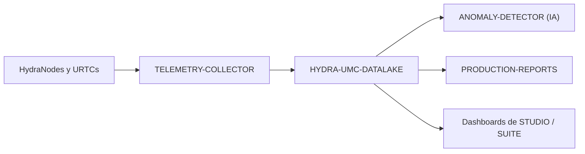

<p align="center">
  
</p>

# 🗄️ HYDRA-UMC-DATALAKE

<p align="center"><a href="README.md">🇺🇸 English</a> | 🇪🇸 <b>Español</b> | <a href="README_fra.md">🇫🇷 Français</a> | <a href="README_ita.md">🇮🇹 Italiano</a> | <a href="README_deu.md">🇩🇪 Deutsch</a> | <a href="README_zho.md">🇨🇳 简体中文</a> | <a href="README_jpn.md">🇯🇵 日本語</a></p>

### 📊 Almacenamiento de Series Temporales Escalable para Datos Robóticos Industriales

<p align="left">
  
  
  
</p>

---

## 1. 🛠️ VISIÓN GENERAL TÉCNICA

**HYDRA-UMC-DATALAKE** es el almacén actual de series temporales de la fábrica. Proporciona un repositorio real respaldado por SQLite para la telemetría normalizada generada por el ecosistema, incluyendo corrientes de motores, ángulos de articulación, lecturas de sensores y logs de inferencia de IA.

Es la base de software para analítica, mantenimiento predictivo e informes de producción. Su implementación SQLite actual está probada localmente; un despliegue externo con InfluxDB/TimescaleDB sigue siendo una decisión futura de infraestructura, no una función que se afirme ya operativa.

### Características Clave:
* 🗄️ **Almacenamiento con SQLite:** Almacenamiento real, ACID y en disco mediante `sqlite3` de la biblioteca estándar de Python. *(implementado)*
* 📊 **Esquema de Datos Unificado:** Telemetría normalizada de formato largo (`source/kind/field/timestamp/value`) para fuentes HYDRA-UMC y URTC. *(implementado)*
* 🔍 **Consultas Deterministas:** Los resultados se ordenan por timestamp y desempates estables; las lecturas acotadas rechazan límites no positivos. *(implementado)*
* 🔁 **Reintentos Idempotentes:** Reentregar un punto `(source, kind, field, timestamp)` reemplaza su valor (la última escritura gana), evitando que un reintento infle duplicados. *(implementado)*
* 🧬 **Migraciones de Esquema Reversibles:** `migrate_up()`/`migrate_down()` reales y probadas, rastreadas vía el propio `PRAGMA user_version` de SQLite - nunca editar una migración ya publicada, añadir una nueva. *(implementado)*
* 🕐 **Timestamps UTC Explícitos:** `GET /stats/range` reporta los datos reales más antiguos/recientes tanto en ms crudos como en cadenas ISO 8601 UTC explícitas. *(implementado)*
* 🗑️ **Retención Validada:** Ventanas de retención por serie, opt-in (`GET`/`POST /retention`, `POST /retention/apply`) - una ventana no positiva se rechaza de plano. *(implementado)*

---

## 2. 🔄 ARQUITECTURA DE DATOS



---

## 3. 🧱 ARQUITECTURA Y DECISIONES DE DISEÑO

* **Por qué es el padre de integración, no un par, de sus 3 hijos.** HYDRA-UMC-TELEMETRY-COLLECTOR, HYDRA-UMC-ANOMALY-DETECTOR y HYDRA-UMC-PRODUCTION-REPORTS leen/escriben el MISMO almacén de series temporales subyacente - poseer ese almacén en un solo sitio (este repo) evita 3 decisiones de esquema independientes y potencialmente divergentes.
* **Por qué sqlite3 hoy, no InfluxDB/TimescaleDB todavía.** Una base externa sigue siendo una posible decisión de despliegue a largo plazo, pero levantarla es infraestructura real (un servicio que desplegar y operar), no algo que afirmar o añadir sin pedirlo. El `TimeSeriesStore` de `src/hydra_umc_datalake/store.py` es hoy un almacén de series temporales real, ACID y consultable (`sqlite3` de la biblioteca estándar de Python), no un placeholder, y queda tras su propia clase para que un backend futuro pueda sustituirlo sin reescribir el contrato HTTP.
* **Por qué una única tabla "larga" y estrecha (source/kind/field/timestamp/value), no una columna por campo de telemetría.** El propio `Sample.Fields` de HYDRA-UMC-TELEMETRY-COLLECTOR es abierto (cualquier nombre de campo, cualquier fuente puede reportar campos nuevos) - un esquema estrecho acepta cualquiera de ellos sin una migración, al coste real de una fila por campo por muestra en vez de una fila por muestra.
* **Por qué `aggregate()` hace un bucketing SQL real por tiempo, no solo `query()` en crudo.** Un panel o informe que pregunte "temperatura media del motor por minuto en la última semana" sobre millones de filas crudas necesita un submuestreo real hecho por la base de datos, no traído en crudo y promediado en el código de la aplicación - los límites de los buckets de `aggregate()` son deterministas (alineados al propio `start` de la consulta), asi que la misma consulta contra los mismos datos siempre traza las mismas fronteras de bucket.
* **Cómo encaja en el resto del ecosistema.** El padre de integración de la familia Datos y Analítica - HYDRA-UMC-TELEMETRY-COLLECTOR lo alimenta desde HYDRA-UMC-SERVER, HYDRA-UMC-ANOMALY-DETECTOR y HYDRA-UMC-PRODUCTION-REPORTS leen de vuelta de su propia telemetría almacenada.
* **Por qué el versionado de esquema usa el propio `PRAGMA user_version` de SQLite, no una tabla hecha a mano.** SQLite ya provee exactamente este mecanismo real (un entero en la cabecera del archivo) - una tabla de contabilidad paralela solo sería una segunda fuente de verdad, potencialmente divergente, para el mismo hecho.
* **Por qué la retención es opt-in por `(kind, field)`, no un valor por defecto global.** Un almacén con docenas de series de telemetría reales no debería tener la suposición de retención de un operador aplicada silenciosamente a todas las series - `apply_retention()` solo toca una serie que recibió explícitamente una política vía `set_retention_policy()`/`POST /retention`.
* **Por qué la identidad de reintento es `(source, kind, field, timestamp)`.** El contrato de telemetría normalizado no tiene identificador de secuencia/evento, por lo que un punto exactamente repetido se trata como un reintento de red incierto y se compacta con una regla determinista de última escritura. Esto evita que filas duplicadas distorsionen recuentos y agregados sin ejecutar una limpieza destructiva sobre datos históricos.
* **Por qué `/stats/range` es un endpoint nuevo en vez de extender `/stats`.** La forma existente de `/stats`, `{"sampleCount": <int>}`, ya es real y está probada - añadirle campos sería un cambio real y disruptivo sin motivo, cuando un segundo endpoint aditivo no cuesta nada.

---

## 📂 ESTRUCTURA DE DIRECTORIOS

Servicio de software puro (integrador de ingesta/analítica) - sin hardware, firmware ni sistema operativo propios; esas carpetas se omiten por política de estructura del repositorio.

```text
HYDRA-UMC-DATALAKE/
├── src/hydra_umc_datalake/  # Código fuente
│   ├── __init__.py          # Versión del paquete
│   ├── store.py             # TimeSeriesStore: ingesta/consulta/agregación real vía sqlite3
│   ├── api.py                # Handlers JSON/HTTP con límites que envuelven el store
│   └── main.py               # Punto de entrada: conecta store+API, arranca el servidor HTTP
├── tests/                   # pytest - lógica del store, migraciones reales, round-trips HTTP reales
├── docs/
│   └── API.md               # Referencia real de endpoints HTTP (peticiones, respuestas, códigos de estado)
├── images/                  # Medios y diagramas
├── systemd/
│   └── hydra-umc-datalake.service # Unidad systemd de la API de ingesta/analítica en la CM5 local
├── tools/
│   ├── build_test.py        # Comprobación de build/compilación sin subir versión
│   └── ci_validate.py       # Validación de manifest/CHANGELOG/docs usada por la CI
├── build/                   # Salida de build (ignorada por git)
├── pyproject.toml           # Metadatos del paquete, versión, dependencias
├── bump_version.py          # Incremento de versión tipo cuentakilómetros (lo ejecuta el build)
├── bump_manifest_version.py # Sincroniza la versión de hydra-umc.project.json con la nativa (--sync)
├── docker-compose.yml       # Integra TELEMETRY-COLLECTOR / ANOMALY-DETECTOR / PRODUCTION-REPORTS
├── build.sh / build.bat     # Build real: venv + instalación editable + bump + tests
├── run.sh / run.bat         # Ejecución real: arranca la API HTTP
└── README.md
```

Podado de la plantilla original: `hardware/`, `firmware/` y `os/` — es un
servicio de software puro (paquete Python) sin hardware ni firmware
propios y sin imagen de sistema operativo que mantener. Ver
[`docs/API.md`](docs/API.md) para la referencia completa de endpoints HTTP.

---

## 4. ⚙️ BUILD Y EJECUCIÓN

Requiere Python >= 3.10. Un almacén de series temporales real y consultable
con API HTTP, no solo un esqueleto que importa.

```bash
# Linux/macOS
./build.sh
./run.sh --port 8095

# Windows
build.bat
run.bat --port 8095
```

`build` crea/activa un `.venv` local, instala el paquete (editable, con
extras de dev) en el, verifica la importación, y corre la suite de tests
real (`pytest`). `run` arranca la API HTTP y reenvía cualquier flag
(`--addr`, `--port`, `--db`).

```bash
# Ingerir una muestra (misma forma normalizada que el Sample de HYDRA-UMC-TELEMETRY-COLLECTOR)
curl -X POST localhost:8095/ingest \
  -d '{"sourceId":"robot-1","kind":"motor_temp","timestamp":1700000000000,"fields":{"value":42.5}}'

# Consultarla de vuelta
curl "localhost:8095/query?sourceId=robot-1"

# Submuestrear a buckets de 1 minuto sobre un rango de tiempo real
curl "localhost:8095/aggregate?kind=motor_temp&field=value&bucketMs=60000&start=0&end=1800000000000&agg=avg"

curl localhost:8095/stats
```

```bash
python -m pytest tests/ -v   # store.py (insert/query/aggregate, incluyendo
                              # matemática de bucketing verificable a mano)
                              # y api.py (round-trips HTTP reales contra un
                              # ThreadingHTTPServer real en un puerto efímero)
```

Para levantar este proyecto junto con sus tres hijos (Telemetry-Collector, Anomaly-Detector, Production-Reports) como directorios hermanos:

```bash
docker compose up --build
```

---

## 🚀 HOJA DE RUTA
* **Fase 1:** Ingesta de alto rendimiento e indexación del Datalake para análisis histórico.
* **Fase 2:** Compresión en el borde del colector de telemetría y protocolos de transmisión seguros.
* **Fase 3:** Detección de anomalías mediante aprendizaje no supervisado y análisis de vibración de motores.
* **Fase 4:** Integración con Grafana para visualización avanzada en tiempo real y automatización de informes de producción.

---

## 🔗 Proyectos Relacionados

Este proyecto es parte del ecosistema de robótica HYDRA-UMC del mismo autor (JuanenRac / Electro Hobby 3D). Vale la pena conocerlo, ya que una petición podría en realidad ser sobre alguno de estos en vez de sobre este repositorio.

**Proyectos Hijos** — cada uno escribe en o lee del propio almacén de este data lake
- **[HYDRA-UMC-TELEMETRY-COLLECTOR](https://github.com/JuanenRac/HYDRA-UMC-TELEMETRY-COLLECTOR)** — pipeline real de ingesta CAN/WebSocket hacia DATALAKE, con deduplicación por secuencia.
- **[HYDRA-UMC-ANOMALY-DETECTOR](https://github.com/JuanenRac/HYDRA-UMC-ANOMALY-DETECTOR)** — detector de anomalías real basado en FFT + línea base estadística, con monitorización de deriva.
- **[HYDRA-UMC-PRODUCTION-REPORTS](https://github.com/JuanenRac/HYDRA-UMC-PRODUCTION-REPORTS)** — cálculo real de OEE/disponibilidad sobre el histórico de DATALAKE, con exportación CSV reproducible.

**Directamente Relacionados**
- **[HYDRA-UMC-SERVER](https://github.com/JuanenRac/HYDRA-UMC-SERVER)** — el backend headless real (REST/WebSocket) con el que habla de verdad cada cliente de control; la fuente de los logs/telemetría que ingiere este proyecto.
- **[HYDRA-UMC-DASHBOARD-AI](https://github.com/JuanenRac/HYDRA-UMC-DASHBOARD-AI)** — paneles de Resúmenes Inteligentes y Resaltado de Anomalías sobre DATALAKE/ANOMALY-DETECTOR, con un respaldo estadístico honesto; calcula sus Resúmenes Inteligentes directamente a partir del propio historial de consultas/agregados de este data lake.

**También Forma Parte del Ecosistema**

*Hardware y Plataforma Base*
- **[HYDRA-UMC](https://github.com/JuanenRac/HYDRA-UMC)** — la placa madre física del brazo robótico: host CM5 + coprocesador STM32H745 de doble núcleo, coordinando hasta 8 brazos herramienta por CAN-OTA/SPI-OTA.
- **[HYDRA-UMC-OS](https://github.com/JuanenRac/HYDRA-UMC-OS)** — capa de producto reproducible sobre Raspberry Pi OS para el CM5: agente de solo lectura, config/perfiles validados, aprovisionamiento WiFi de primer contacto.
- **[HYDRA-UMC-SDK](https://github.com/JuanenRac/HYDRA-UMC-SDK)** — el contrato JSON-Schema compartido y la barrera de seguridad contra la que cada bridge valida sus comandos.

*Backend Central y Clientes*
- **[HYDRA-UMC-STUDIO](https://github.com/JuanenRac/HYDRA-UMC-STUDIO)** — panel de control web con visualización 3D multi-robot en tiempo real.
- **[HYDRA-UMC-SUITE](https://github.com/JuanenRac/HYDRA-UMC-SUITE)** — centro de mando de enjambre de escritorio (PySide6) para varios servidores a la vez, empaquetado como ejecutable independiente.
- **[HYDRA-UMC-ANDROID-CONTROL](https://github.com/JuanenRac/HYDRA-UMC-ANDROID-CONTROL)** — app nativa de control para Android con inicio de sesión biométrico y un compañero Wear OS emparejado.
- **[HYDRA-UMC-IOS-CONTROL](https://github.com/JuanenRac/HYDRA-UMC-IOS-CONTROL)** — app de control para iOS/iPadOS (Flutter) con sincronización en tiempo real por WebSocket.
- **[HYDRA-UMC-DSI](https://github.com/JuanenRac/HYDRA-UMC-DSI)** — interfaz táctil nativa para la pantalla táctil DSI de 7" a bordo, embebida en el propio CM5.
- **[HYDRA-UMC-EDITOR-URDF](https://github.com/JuanenRac/HYDRA-UMC-EDITOR-URDF)** — creador/editor gráfico de URDF de escritorio que envía los modelos terminados al propio catálogo de STUDIO.
- **[HYDRA-UMC-BRIDGE-AMR](https://github.com/JuanenRac/HYDRA-UMC-BRIDGE-AMR)** — barrera de coordinación para flotas AGV/AMR mediante un publicador MQTT VDA 5050 real.
- **[HYDRA-UMC-BRIDGE-CNC](https://github.com/JuanenRac/HYDRA-UMC-BRIDGE-CNC)** — coordinador de alto nivel para celdas CNC con acceso real a estado/bytes de control GRBL.
- **[HYDRA-UMC-BRIDGE-DROIDS](https://github.com/JuanenRac/HYDRA-UMC-BRIDGE-DROIDS)** — barrera de coordinación para droides con patas/humanoides, con un emisor de comandos real para Boston Dynamics Spot.
- **[HYDRA-UMC-BRIDGE-LASER](https://github.com/JuanenRac/HYDRA-UMC-BRIDGE-LASER)** — coordinador de seguridad para celdas láser que lee 3 salvaguardas GPIO reales de llave/carcasa/enclavamiento.
- **[HYDRA-UMC-BRIDGE-OPENPNP](https://github.com/JuanenRac/HYDRA-UMC-BRIDGE-OPENPNP)** — coordinador de alto nivel seguro para el flujo de placas de pick-and-place OpenPnP.
- **[HYDRA-UMC-BRIDGE-PRINTER3D](https://github.com/JuanenRac/HYDRA-UMC-BRIDGE-PRINTER3D)** — barrera de coordinación segura para impresoras 3D Moonraker/Klipper, con comandos de trabajo reales y controlados.
- **[HYDRA-UMC-BRIDGE-ROS2](https://github.com/JuanenRac/HYDRA-UMC-BRIDGE-ROS2)** — coordinador de seguridad con un transporte ROS 2 rclpy real, importado de forma perezosa.
- **[HYDRA-UMC-BRIDGE-UAV](https://github.com/JuanenRac/HYDRA-UMC-BRIDGE-UAV)** — barrera de coordinación para UAV equipados con cámara, con un emisor de comandos MAVLink real.

*Plataforma de Herramientas URTC*
- **[URTC](https://github.com/JuanenRac/URTC)** — firmware para la placa física del Universal Robot Tool Controller, más de 25 perfiles de herramienta por bus CAN.
- **[URTC-FLASHER](https://github.com/JuanenRac/URTC-FLASHER)** — herramienta de escritorio con GUI para flashear placas URTC, CAN-OTA más SWD/JTAG de chip completo.
- **[URTC-TESTER](https://github.com/JuanenRac/URTC-TESTER)** — herramienta de escritorio de diagnóstico CAN-bus en vivo para placas URTC, un panel por perfil de herramienta.
- **[URTC-WEB-STUDIO](https://github.com/JuanenRac/URTC-WEB-STUDIO)** — alternativa basada en navegador a URTC-TESTER mediante la Web Serial API, sin instalación local.

*Nodo IA de Visión (Hailo-8)*
- **[HYDRA-UMC-VISION-NODE](https://github.com/JuanenRac/HYDRA-UMC-VISION-NODE)** — nodo de integración para el pipeline de visión Hailo-8, con una comprobación real de disponibilidad de hardware por etapa.
- **[HYDRA-UMC-DETECTION-HEF](https://github.com/JuanenRac/HYDRA-UMC-DETECTION-HEF)** — registro real de modelos compilados con verificación de carga segura por arquitectura Hailo/checksum.
- **[HYDRA-UMC-VISION-STREAMER](https://github.com/JuanenRac/HYDRA-UMC-VISION-STREAMER)** — generador real de pipeline GStreamer + config MediaMTX, con una frontera de integración HailoRT real.
- **[HYDRA-UMC-VISUAL-SERVOING-API](https://github.com/JuanenRac/HYDRA-UMC-VISUAL-SERVOING-API)** — ley de corrección real de Position-Based Visual Servoing, con puerta de seguridad según el estado de zona previo.
- **[HYDRA-UMC-SAFETY-ZONES](https://github.com/JuanenRac/HYDRA-UMC-SAFETY-ZONES)** — comprobación real de invasión de zona y solicitud de E-STOP, con exigencia de vigencia de calibración.

*Nodo IA Cognitivo (Hailo-10)*
- **[HYDRA-UMC-COGNITIVE-NODE](https://github.com/JuanenRac/HYDRA-UMC-COGNITIVE-NODE)** — nodo de integración para el pipeline cognitivo Hailo-10 (orquestación de LLM/VLA/voz).
- **[HYDRA-UMC-VLA-ENGINE](https://github.com/JuanenRac/HYDRA-UMC-VLA-ENGINE)** — codificación/decodificación real de tokens de acción y generación de trayectoria para un modelo Vision-Language-Action.
- **[HYDRA-UMC-VOICE-UI](https://github.com/JuanenRac/HYDRA-UMC-VOICE-UI)** — front-end de voz real (VAD + analizador de intención) con un relé a Watch acotado y con confirmación.
- **[HYDRA-UMC-SEMANTIC-PLANNER](https://github.com/JuanenRac/HYDRA-UMC-SEMANTIC-PLANNER)** — descomposición real de tareas basada en reglas y recuperación semántica de errores sobre códigos de error del MCU.
- **[HYDRA-UMC-DOCS-QA](https://github.com/JuanenRac/HYDRA-UMC-DOCS-QA)** — búsqueda real de documentos TF-IDF (solo librería estándar) sobre los propios documentos Markdown de este ecosistema.

*Orquestación y Enjambre*
- **[HYDRA-UMC-ORCHESTRATOR](https://github.com/JuanenRac/HYDRA-UMC-ORCHESTRATOR)** — nodo de integración con un contrato real de informe de salud gRPC/Protobuf y una máquina de estados de misión.
- **[HYDRA-UMC-JOB-DISPATCHER](https://github.com/JuanenRac/HYDRA-UMC-JOB-DISPATCHER)** — cola de trabajos real basada en prioridad con deduplicación, sobre una API HTTP real.
- **[HYDRA-UMC-NODE-HEALING](https://github.com/JuanenRac/HYDRA-UMC-NODE-HEALING)** — watchdog de salud de flota real basado en gRPC, con reintento/backoff y detección de discrepancia de identidad.
- **[HYDRA-UMC-PATH-PLANNER-3D](https://github.com/JuanenRac/HYDRA-UMC-PATH-PLANNER-3D)** — planificador de rutas 3D real basado en RRT, con validación real de colisión de obstáculos/espacio de trabajo.
- **[HYDRA-UMC-SWARM-SYNC](https://github.com/JuanenRac/HYDRA-UMC-SWARM-SYNC)** — sincronización de estado real mediante CRDT LWW-Element-Map, con pruebas de propiedades para convergencia multi-celda.

*Gemelo Digital y Simulación*
- **[HYDRA-UMC-TWIN](https://github.com/JuanenRac/HYDRA-UMC-TWIN)** — nodo de integración para el motor de gemelo digital, con un contrato real de sincronización por compatibilidad de versión.
- **[HYDRA-UMC-HIL-BRIDGE](https://github.com/JuanenRac/HYDRA-UMC-HIL-BRIDGE)** — enclavamiento de seguridad real hardware-in-the-loop que enruta comandos entre simulación y hardware real.
- **[HYDRA-UMC-PHYSICS-REPLICA](https://github.com/JuanenRac/HYDRA-UMC-PHYSICS-REPLICA)** — cinemática directa real y validación de límites articulares sobre un subconjunto real de URDF.
- **[HYDRA-UMC-SYNTHETIC-DATA-GEN](https://github.com/JuanenRac/HYDRA-UMC-SYNTHETIC-DATA-GEN)** — generador real de escenas 2D procedurales con exportación de anotaciones YOLO/COCO.

*Pasarela Industrial*
- **[HYDRA-UMC-GATEWAY-INDUSTRIAL](https://github.com/JuanenRac/HYDRA-UMC-GATEWAY-INDUSTRIAL)** — nodo de integración que retransmite a protocolos industriales, con una capa real de lista blanca de comandos/contrapresión.
- **[HYDRA-UMC-OPCUA-SERVER](https://github.com/JuanenRac/HYDRA-UMC-OPCUA-SERVER)** — espacio de direcciones OPC-UA real, verificado con una sesión de cliente real del protocolo binario.
- **[HYDRA-UMC-MQTT-BROKER](https://github.com/JuanenRac/HYDRA-UMC-MQTT-BROKER)** — broker MQTT real con autenticación por cliente opcional y ACL de tópicos.
- **[HYDRA-UMC-MTCONNECT-ADAPTER](https://github.com/JuanenRac/HYDRA-UMC-MTCONNECT-ADAPTER)** — endpoints XML reales `/probe` y `/current` de MTConnect, con salida en modo degradado.

*Herramientas Complementarias y Operaciones del Ecosistema*
- **[HYDRA-UMC-TOOL-CLI](https://github.com/JuanenRac/HYDRA-UMC-TOOL-CLI)** — CLI de flota con un contrato real y estable de códigos de salida, cliente real y en vivo de la propia API de HYDRA-UMC-SERVER.
- **[HYDRA-UMC-WATCH](https://github.com/JuanenRac/HYDRA-UMC-WATCH)** — app compañera de WearOS con alertas hápticas reales y un relé de voz al teléfono emparejado.
- **[URTC-SMART-RACK](https://github.com/JuanenRac/URTC-SMART-RACK)** — firmware para un rack de montaje de placas con decodificación real de ID de herramienta y lógica de precalentamiento Smart Idle.
- **[URTC-VISION-TOOL](https://github.com/JuanenRac/URTC-VISION-TOOL)** — firmware más un compañero de visión real en Python para un cabezal de inspección térmica/RGB.
- **[HYDRA-UMC-UPDATER](https://github.com/JuanenRac/HYDRA-UMC-UPDATER)** — herramienta administrativa de escritorio que descubre, clona y actualiza cada repositorio de este ecosistema.


---

## 📚 Documentación y Comunidad

- **[CONTRIBUTING.md](CONTRIBUTING.md)** — stack tecnológico y pautas de codificación para un pull request.
- **[CODE_OF_CONDUCT.md](CODE_OF_CONDUCT.md)** — los estándares de comportamiento esperados en esta comunidad.
- **[SECURITY.md](SECURITY.md)** — cómo reportar una vulnerabilidad, y las áreas reales de enfoque en seguridad de este proyecto.
- **[SUPPORT.md](SUPPORT.md)** — dónde hacer preguntas y reportar errores.
- **[LICENSE.md](LICENSE.md)** — la licencia propia de este proyecto.

## 👤 AUTOR
**JuanenRac** (Electro Hobby 3D)
📧 electrohobby3d@gmail.com
📺 [youtube.com/@electrohobby3d](https://youtube.com/@electrohobby3d)

## 📜 LICENCIA
GPL-3.0 - Ver archivo LICENSE para más detalles.
