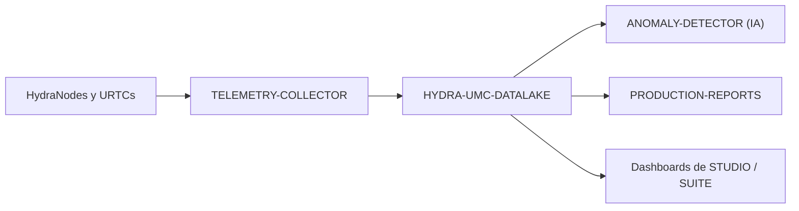

<p align="center">
  
</p>

# 🗄️ HYDRA-UMC-DATALAKE

<p align="center"><a href="README.md">🇺🇸 English</a> | 🇪🇸 <b>Español</b> | <a href="README_fra.md">🇫🇷 Français</a> | <a href="README_ita.md">🇮🇹 Italiano</a> | <a href="README_deu.md">🇩🇪 Deutsch</a> | <a href="README_zho.md">🇨🇳 简体中文</a> | <a href="README_jpn.md">🇯🇵 日本語</a></p>

### 📊 Almacenamiento de Series Temporales Escalable para Datos Robóticos Industriales

<p align="left">
  
  
  
</p>

---

## 1. 🛠️ VISIÓN GENERAL TÉCNICA

**HYDRA-UMC-DATALAKE** es el almacén actual de series temporales de la fábrica. Proporciona un repositorio real respaldado por SQLite para la telemetría normalizada generada por el ecosistema, incluyendo corrientes de motores, ángulos de articulación, lecturas de sensores y logs de inferencia de IA.

Es la base de software para analítica, mantenimiento predictivo e informes de producción. Su implementación SQLite actual está probada localmente; un despliegue externo con InfluxDB/TimescaleDB sigue siendo una decisión futura de infraestructura, no una función que se afirme ya operativa.

### Características Clave:
* 🗄️ **Almacenamiento con SQLite:** Almacenamiento real, ACID y en disco mediante `sqlite3` de la biblioteca estándar de Python. *(implementado)*
* 📊 **Esquema de Datos Unificado:** Telemetría normalizada de formato largo (`source/kind/field/timestamp/value`) para fuentes HYDRA-UMC y URTC. *(implementado)*
* 🔍 **Consultas Deterministas:** Los resultados se ordenan por timestamp y desempates estables; las lecturas acotadas rechazan límites no positivos. *(implementado)*
* 🔁 **Reintentos Idempotentes:** Reentregar un punto `(source, kind, field, timestamp)` reemplaza su valor (la última escritura gana), evitando que un reintento infle duplicados. *(implementado)*
* 🧬 **Migraciones de Esquema Reversibles:** `migrate_up()`/`migrate_down()` reales y probadas, rastreadas via el propio `PRAGMA user_version` de SQLite - nunca editar una migración ya publicada, añadir una nueva. *(implementado)*
* 🕐 **Timestamps UTC Explícitos:** `GET /stats/range` reporta los datos reales más antiguos/recientes tanto en ms crudos como en cadenas ISO 8601 UTC explícitas. *(implementado)*
* 🗑️ **Retención Validada:** Ventanas de retención por serie, opt-in (`GET`/`POST /retention`, `POST /retention/apply`) - una ventana no positiva se rechaza de plano. *(implementado)*

---

## 2. 🔄 ARQUITECTURA DE DATOS



---

## 3. 🧱 ARQUITECTURA Y DECISIONES DE DISEÑO

* **Por qué es el padre de integración, no un par, de sus 3 hijos.** HYDRA-UMC-TELEMETRY-COLLECTOR, HYDRA-UMC-ANOMALY-DETECTOR y HYDRA-UMC-PRODUCTION-REPORTS leen/escriben el MISMO almacén de series temporales subyacente - poseer ese almacén en un solo sitio (este repo) evita 3 decisiones de esquema independientes y potencialmente divergentes.
* **Por qué sqlite3 hoy, no InfluxDB/TimescaleDB todavía.** Una base externa sigue siendo una posible decisión de despliegue a largo plazo, pero levantarla es infraestructura real (un servicio que desplegar y operar), no algo que afirmar o añadir sin pedirlo. El `TimeSeriesStore` de `src/hydra_umc_datalake/store.py` es hoy un almacén de series temporales real, ACID y consultable (`sqlite3` de la biblioteca estándar de Python), no un placeholder, y queda tras su propia clase para que un backend futuro pueda sustituirlo sin reescribir el contrato HTTP.
* **Por qué una única tabla "larga" y estrecha (source/kind/field/timestamp/value), no una columna por campo de telemetría.** El propio `Sample.Fields` de HYDRA-UMC-TELEMETRY-COLLECTOR es abierto (cualquier nombre de campo, cualquier fuente puede reportar campos nuevos) - un esquema estrecho acepta cualquiera de ellos sin una migración, al coste real de una fila por campo por muestra en vez de una fila por muestra.
* **Por qué `aggregate()` hace un bucketing SQL real por tiempo, no solo `query()` en crudo.** Un panel o informe que pregunte "temperatura media del motor por minuto en la última semana" sobre millones de filas crudas necesita un submuestreo real hecho por la base de datos, no traído en crudo y promediado en el código de la aplicación - los límites de los buckets de `aggregate()` son deterministas (alineados al propio `start` de la consulta), asi que la misma consulta contra los mismos datos siempre traza las mismas fronteras de bucket.
* **Cómo encaja en el resto del ecosistema.** El padre de integración de la familia Datos y Analítica - HYDRA-UMC-TELEMETRY-COLLECTOR lo alimenta desde HYDRA-UMC-SERVER, HYDRA-UMC-ANOMALY-DETECTOR y HYDRA-UMC-PRODUCTION-REPORTS leen de vuelta de su propia telemetría almacenada.
* **Por qué el versionado de esquema usa el propio `PRAGMA user_version` de SQLite, no una tabla hecha a mano.** SQLite ya provee exactamente este mecanismo real (un entero en la cabecera del archivo) - una tabla de contabilidad paralela solo sería una segunda fuente de verdad, potencialmente divergente, para el mismo hecho.
* **Por qué la retención es opt-in por `(kind, field)`, no un valor por defecto global.** Un almacén con docenas de series de telemetría reales no debería tener la suposición de retención de un operador aplicada silenciosamente a todas las series - `apply_retention()` solo toca una serie que recibió explícitamente una política via `set_retention_policy()`/`POST /retention`.
* **Por qué la identidad de reintento es `(source, kind, field, timestamp)`.** El contrato de telemetría normalizado no tiene identificador de secuencia/evento, por lo que un punto exactamente repetido se trata como un reintento de red incierto y se compacta con una regla determinista de última escritura. Esto evita que filas duplicadas distorsionen recuentos y agregados sin ejecutar una limpieza destructiva sobre datos históricos.
* **Por qué `/stats/range` es un endpoint nuevo en vez de extender `/stats`.** La forma existente de `/stats`, `{"sampleCount": <int>}`, ya es real y está probada - añadirle campos sería un cambio real y disruptivo sin motivo, cuando un segundo endpoint aditivo no cuesta nada.

---

## 📂 ESTRUCTURA DE DIRECTORIOS

Servicio de software puro (integrador de ingesta/analítica) - sin hardware, firmware ni sistema operativo propios; esas carpetas se omiten por política de estructura del repositorio.

```text
HYDRA-UMC-DATALAKE/
├── src/hydra_umc_datalake/  # Código fuente
│   ├── __init__.py          # Versión del paquete
│   ├── store.py             # TimeSeriesStore: ingesta/consulta/agregacion real via sqlite3
│   ├── api.py                # Handlers JSON/HTTP con limites que envuelven el store
│   └── main.py               # Punto de entrada: conecta store+API, arranca el servidor HTTP
├── tests/                   # pytest - logica del store, migraciones reales, round-trips HTTP reales
├── docs/
│   └── API.md               # Referencia real de endpoints HTTP (peticiones, respuestas, codigos de estado)
├── build/                   # Salida de build (ignorada por git)
├── pyproject.toml           # Metadatos del paquete, version, dependencias
├── bump_version.py          # Incremento de versión tipo cuentakilómetros (lo ejecuta el build)
├── docker-compose.yml       # Integra TELEMETRY-COLLECTOR / ANOMALY-DETECTOR / PRODUCTION-REPORTS
├── build.sh / build.bat     # Build real: venv + instalación editable + bump + tests
├── run.sh / run.bat         # Ejecución real: arranca la API HTTP
└── README.md
```

Podado de la plantilla original: `hardware/`, `firmware/`, `os/`,
`images/` y `scripts/` — es un servicio de software puro (paquete Python)
sin hardware ni firmware propios, sin imagen de sistema operativo que
mantener, y sin contenido de medios/scripts de utilidad todavía suficiente
para justificar sus propias carpetas. Ver [`docs/API.md`](docs/API.md)
para la referencia completa de endpoints HTTP.

---

## 4. ⚙️ BUILD Y EJECUCIÓN

Requiere Python >= 3.10. Un almacén de series temporales real y consultable
con API HTTP, no solo un esqueleto que importa.

```bash
# Linux/macOS
./build.sh
./run.sh --port 8095

# Windows
build.bat
run.bat --port 8095
```

`build` crea/activa un `.venv` local, instala el paquete (editable, con
extras de dev) en el, verifica la importación, y corre la suite de tests
real (`pytest`). `run` arranca la API HTTP y reenvia cualquier flag
(`--addr`, `--port`, `--db`).

```bash
# Ingerir una muestra (misma forma normalizada que el Sample de HYDRA-UMC-TELEMETRY-COLLECTOR)
curl -X POST localhost:8095/ingest \
  -d '{"sourceId":"robot-1","kind":"motor_temp","timestamp":1700000000000,"fields":{"value":42.5}}'

# Consultarla de vuelta
curl "localhost:8095/query?sourceId=robot-1"

# Submuestrear a buckets de 1 minuto sobre un rango de tiempo real
curl "localhost:8095/aggregate?kind=motor_temp&field=value&bucketMs=60000&start=0&end=1800000000000&agg=avg"

curl localhost:8095/stats
```

```bash
python -m pytest tests/ -v   # store.py (insert/query/aggregate, incluyendo
                              # matematica de bucketing verificable a mano)
                              # y api.py (round-trips HTTP reales contra un
                              # ThreadingHTTPServer real en un puerto efimero)
```

Para levantar este proyecto junto con sus tres hijos (Telemetry-Collector, Anomaly-Detector, Production-Reports) como directorios hermanos:

```bash
docker compose up --build
```

---

## 🚀 HOJA DE RUTA
* **Fase 1:** Ingesta de alto rendimiento e indexación del Datalake para análisis histórico.
* **Fase 2:** Compresión en el borde del colector de telemetría y protocolos de transmisión seguros.
* **Fase 3:** Detección de anomalías mediante aprendizaje no supervisado y análisis de vibración de motores.
* **Fase 4:** Integración con Grafana para visualización avanzada en tiempo real y automatización de informes de producción.

---

## 🔗 Proyectos Relacionados

Este proyecto forma parte de un ecosistema de robótica más amplio del mismo autor (JuanenRac / Electro Hobby 3D), que abarca firmware, software de control, nodos de IA y herramientas de flota. Vale la pena conocerlo, ya que una petición podría en realidad ser sobre uno de estos proyectos en vez de sobre este repositorio.

### Familia

**Padre:** ninguno — este proyecto es en sí mismo el padre de integración de la familia Datos y Analítica.

**Hijos:**
- **[HYDRA-UMC-TELEMETRY-COLLECTOR](https://github.com/JuanenRac/HYDRA-UMC-TELEMETRY-COLLECTOR)** — alimenta este data lake con telemetría agregada por robot.
- **[HYDRA-UMC-ANOMALY-DETECTOR](https://github.com/JuanenRac/HYDRA-UMC-ANOMALY-DETECTOR)** — ejecuta detección de anomalías sobre la telemetría almacenada en este data lake.
- **[HYDRA-UMC-PRODUCTION-REPORTS](https://github.com/JuanenRac/HYDRA-UMC-PRODUCTION-REPORTS)** — genera informes de turno/OEE a partir de la telemetría almacenada en este data lake.

### Relación Directa (fuera de la familia)

- **[HYDRA-UMC-SERVER](https://github.com/JuanenRac/HYDRA-UMC-SERVER)** — la fuente de los logs/telemetría que ingiere este proyecto.
- **[HYDRA-UMC-DASHBOARD-AI](https://github.com/JuanenRac/HYDRA-UMC-DASHBOARD-AI)** — calcula sus Resúmenes Inteligentes directamente a partir del historial real de consultas/agregados de este data lake.

### Resto del Ecosistema

**Plataforma HYDRA-UMC** — la célula de micro-fábrica multi-robot
- **[HYDRA-UMC](https://github.com/JuanenRac/HYDRA-UMC)** — la placa base CM5 + STM32H745 que orquesta hasta 8 brazos robóticos.
- **[HYDRA-UMC-SERVER](https://github.com/JuanenRac/HYDRA-UMC-SERVER)** — el backend Express/WebSocket con el que habla cada cliente de control.
- **[HYDRA-UMC-STUDIO](https://github.com/JuanenRac/HYDRA-UMC-STUDIO)** — panel de control web, visualización 3D multi-robot.
- **[HYDRA-UMC-ANDROID-CONTROL](https://github.com/JuanenRac/HYDRA-UMC-ANDROID-CONTROL)** — app de control Android por Wi-Fi/Bluetooth.
- **[HYDRA-UMC-IOS-CONTROL](https://github.com/JuanenRac/HYDRA-UMC-IOS-CONTROL)** — app de control iOS/iPadOS construida en Flutter.
- **[HYDRA-UMC-SUITE](https://github.com/JuanenRac/HYDRA-UMC-SUITE)** — centro de mando de enjambre de escritorio (Python/PySide6).
- **[HYDRA-UMC-EDITOR-URDF](https://github.com/JuanenRac/HYDRA-UMC-EDITOR-URDF)** — editor de modelos URDF de escritorio para el catálogo de robots.
- **[HYDRA-UMC-DSI](https://github.com/JuanenRac/HYDRA-UMC-DSI)** — interfaz táctil nativa para la pantalla DSI integrada.

**Plataforma URTC** — el controlador de cabezal de herramienta que lleva cada brazo HYDRA-UMC
- **[URTC](https://github.com/JuanenRac/URTC)** — controlador de cabezal de herramienta CAN, 25 perfiles de herramienta.
- **[URTC-FLASHER](https://github.com/JuanenRac/URTC-FLASHER)** — herramienta de escritorio de flasheo CAN-OTA + SWD/JTAG.
- **[URTC-TESTER](https://github.com/JuanenRac/URTC-TESTER)** — herramienta de escritorio de diagnóstico CAN en vivo.
- **[URTC-WEB-STUDIO](https://github.com/JuanenRac/URTC-WEB-STUDIO)** — alternativa basada en navegador vía Web Serial API.

**🎥 Nodo de IA de Visión (Hailo-8)**
- [HYDRA-UMC-VISION-NODE](https://github.com/JuanenRac/HYDRA-UMC-VISION-NODE)
- [HYDRA-UMC-VISION-STREAMER](https://github.com/JuanenRac/HYDRA-UMC-VISION-STREAMER)
- [HYDRA-UMC-DETECTION-HEF](https://github.com/JuanenRac/HYDRA-UMC-DETECTION-HEF)
- [HYDRA-UMC-SAFETY-ZONES](https://github.com/JuanenRac/HYDRA-UMC-SAFETY-ZONES)
- [HYDRA-UMC-VISUAL-SERVOING-API](https://github.com/JuanenRac/HYDRA-UMC-VISUAL-SERVOING-API)

**🧠 Nodo de IA Cognitiva (Hailo-10)**
- [HYDRA-UMC-COGNITIVE-NODE](https://github.com/JuanenRac/HYDRA-UMC-COGNITIVE-NODE)
- [HYDRA-UMC-VLA-ENGINE](https://github.com/JuanenRac/HYDRA-UMC-VLA-ENGINE)
- [HYDRA-UMC-VOICE-UI](https://github.com/JuanenRac/HYDRA-UMC-VOICE-UI)
- [HYDRA-UMC-SEMANTIC-PLANNER](https://github.com/JuanenRac/HYDRA-UMC-SEMANTIC-PLANNER)
- [HYDRA-UMC-DOCS-QA](https://github.com/JuanenRac/HYDRA-UMC-DOCS-QA)

**🐝 Orquestación y Enjambre**
- [HYDRA-UMC-ORCHESTRATOR](https://github.com/JuanenRac/HYDRA-UMC-ORCHESTRATOR)
- [HYDRA-UMC-SWARM-SYNC](https://github.com/JuanenRac/HYDRA-UMC-SWARM-SYNC)
- [HYDRA-UMC-PATH-PLANNER-3D](https://github.com/JuanenRac/HYDRA-UMC-PATH-PLANNER-3D)
- [HYDRA-UMC-JOB-DISPATCHER](https://github.com/JuanenRac/HYDRA-UMC-JOB-DISPATCHER)
- [HYDRA-UMC-NODE-HEALING](https://github.com/JuanenRac/HYDRA-UMC-NODE-HEALING)

**🎮 Gemelo Digital y Simulación**
- [HYDRA-UMC-TWIN](https://github.com/JuanenRac/HYDRA-UMC-TWIN)
- [HYDRA-UMC-PHYSICS-REPLICA](https://github.com/JuanenRac/HYDRA-UMC-PHYSICS-REPLICA)
- [HYDRA-UMC-HIL-BRIDGE](https://github.com/JuanenRac/HYDRA-UMC-HIL-BRIDGE)
- [HYDRA-UMC-SYNTHETIC-DATA-GEN](https://github.com/JuanenRac/HYDRA-UMC-SYNTHETIC-DATA-GEN)

**🏭 Pasarela Industrial**
- [HYDRA-UMC-GATEWAY-INDUSTRIAL](https://github.com/JuanenRac/HYDRA-UMC-GATEWAY-INDUSTRIAL)
- [HYDRA-UMC-OPCUA-SERVER](https://github.com/JuanenRac/HYDRA-UMC-OPCUA-SERVER)
- [HYDRA-UMC-MQTT-BROKER](https://github.com/JuanenRac/HYDRA-UMC-MQTT-BROKER)
- [HYDRA-UMC-MTCONNECT-ADAPTER](https://github.com/JuanenRac/HYDRA-UMC-MTCONNECT-ADAPTER)

**🛠️ Herramientas Complementarias**
- [URTC-SMART-RACK](https://github.com/JuanenRac/URTC-SMART-RACK)
- [URTC-VISION-TOOL](https://github.com/JuanenRac/URTC-VISION-TOOL)
- [HYDRA-UMC-WATCH](https://github.com/JuanenRac/HYDRA-UMC-WATCH)
- [HYDRA-UMC-TOOL-CLI](https://github.com/JuanenRac/HYDRA-UMC-TOOL-CLI)
- [HYDRA-UMC-DASHBOARD-AI](https://github.com/JuanenRac/HYDRA-UMC-DASHBOARD-AI)


## 👤 AUTOR
**JuanenRac** (Electro Hobby 3D)
📧 electrohobby3d@gmail.com
📺 [youtube.com/@electrohobby3d](https://youtube.com/@electrohobby3d)

## 📜 LICENCIA
GPL-3.0 - Ver archivo LICENSE para más detalles.
