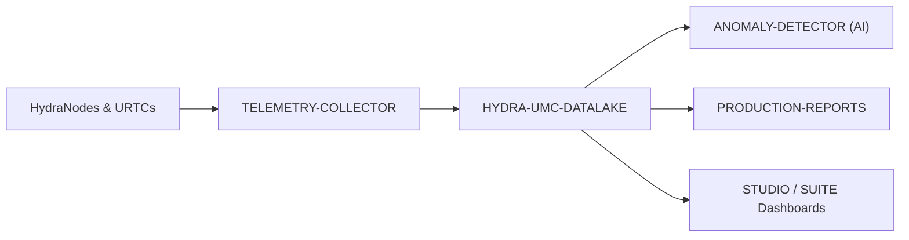

<p align="center">
  
</p>

# 🗄️ HYDRA-UMC-DATALAKE

<p align="center"><a href="README.md">🇺🇸 English</a> | <a href="README_spa.md">🇪🇸 Español</a> | <a href="README_fra.md">🇫🇷 Français</a> | <a href="README_ita.md">🇮🇹 Italiano</a> | <a href="README_deu.md">🇩🇪 Deutsch</a> | 🇨🇳 <b>简体中文</b> | <a href="README_jpn.md">🇯🇵 日本語</a></p>

### 📊 面向工业机器人数据的可扩展时序存储系统

<p align="left">
  
  
  
</p>

---

## 1. 🛠️ 技术概述

**HYDRA-UMC-DATALAKE** 是工厂的长期记忆。它为生态系统产生的所有时序
数据提供一个可扩展的高性能存储仓库，包括电机电流、关节角度、传感器
读数和 AI 推理日志。

它作为高级分析、预测性维护和生产优化的基础，使工厂管理者能够回顾数年
以来毫秒级精确的机器人性能数据。

### 关键特性：
* 🗄️ **高分辨率存储：** 使用 InfluxDB/TimescaleDB 针对每秒数百万个数据点进行优化。
* 📊 **统一数据模式：** 所有 HydraNode 和 URTC 遥测数据的标准化格式。
* 🔍 **快速查询：** 快速检索历史数据，用于生产审计和质量保证。
* 🛡️ **数据完整性：** 针对关键工业日志的冗余存储和自动备份。
* 🧬 **可逆的模式迁移：** 真实的、经过测试的 `migrate_up()`/`migrate_down()`，通过 SQLite 自身的 `PRAGMA user_version` 进行跟踪——切勿修改已发布的迁移，而是新增一个。*(已实现)*
* 🕐 **显式 UTC 时间戳：** `GET /stats/range` 以原始毫秒数和显式的 UTC ISO 8601 字符串两种形式，报告真实的最早/最新数据。*(已实现)*
* 🗑️ **经过验证的保留策略：** 按序列、可选启用的保留窗口（`GET`/`POST /retention`、`POST /retention/apply`）——非正数窗口会被直接拒绝。*(已实现)*

---

## 2. 🔄 数据架构



---

## 3. 🧱 架构与设计决策

* **为何本项目是其 3 个子项目的集成父项目，而非平级项目。** HYDRA-UMC-TELEMETRY-COLLECTOR、HYDRA-UMC-ANOMALY-DETECTOR 和 HYDRA-UMC-PRODUCTION-REPORTS 都读写*同一个*底层时序存储——将该存储的所有权集中于一处（本仓库），可避免出现 3 个独立的、可能相互分歧的模式决策。
* **为何目前是 sqlite3，而不是 InfluxDB/TimescaleDB。** 这两者都出现在本项目自己的徽章/关键词中，并且仍然是真正的长期方向——但搭建其中之一是一个真实的基础设施决策（一个需要部署和运维的服务），这应由把这个项目投入生产的人来决定，而不是在没人要求的情况下就塞进来。`src/hydra_umc_datalake/store.py` 的 `TimeSeriesStore` 今天是一个真正真实、符合 ACID、可查询的时序存储（Python 标准库的 `sqlite3`）——而不是一个假装如此的占位符——特意保持在自己的类之后，正是为了让未来一个真正基于 InfluxDB/TimescaleDB 的实现可以替换它。见 `mejoras_futuras.txt`。
* **为何是一张窄的“长”表（source/kind/field/timestamp/value），而非每个遥测字段一列。** HYDRA-UMC-TELEMETRY-COLLECTOR 自己的 `Sample.Fields` 是开放式的（任何字段名，任何来源都可以上报新字段）——窄表结构可以接受任何字段而无需迁移，其真实代价是每个样本的每个字段占一行，而不是每个样本一行。
* **为何 `aggregate()` 做的是真正的 SQL 按时间分桶，而不只是原始的 `query()`。** 一个仪表盘或报表询问“过去一周每分钟的平均电机温度”，需要在数百万条原始行上由数据库完成真正的降采样，而不是取出原始数据再在应用代码中求平均——`aggregate()` 的桶边界是确定性的（与查询本身的 `start` 对齐），因此同一查询针对同一数据总是画出相同的桶边界。
* **这如何融入生态系统的其余部分。** 作为 Data & Analytics 系列的集成父项目——HYDRA-UMC-TELEMETRY-COLLECTOR 从 HYDRA-UMC-SERVER 向其输入数据，HYDRA-UMC-ANOMALY-DETECTOR 和 HYDRA-UMC-PRODUCTION-REPORTS 都从其自身存储的遥测数据中回读。
* **为何模式版本控制使用 SQLite 自身的 `PRAGMA user_version`，而非手写的表。** SQLite 已经提供了正是这种真实机制（文件头中的一个整数）——一张并行的记账表只会成为同一事实的第二个、可能相互分歧的真相来源。
* **为何保留策略是按 `(kind, field)` 可选启用，而非全局默认值。** 一个拥有数十个真实遥测序列的存储，不应让某个操作员的保留假设悄悄地套用到每一个序列上——`apply_retention()` 只会处理通过 `set_retention_policy()`/`POST /retention` 明确设置了策略的序列。
* **为何 `/stats/range` 是一个新端点，而不是扩展 `/stats`。** `/stats` 现有的 `{"sampleCount": <int>}` 结构已经是真实且经过测试的——毫无理由地为其添加字段将是一次真实的破坏性变更，而增加一个附加的第二端点则不需要任何代价。

---

## 📂 目录结构

纯软件服务（摄取/分析集成器）——没有自己的硬件、固件或操作系统；这些目录
按照仓库结构策略予以省略。

```text
HYDRA-UMC-DATALAKE/
├── src/hydra_umc_datalake/  # 源代码
│   ├── __init__.py          # 包版本
│   ├── store.py             # TimeSeriesStore：通过 sqlite3 实现的真实摄取/查询/聚合
│   ├── api.py                # 封装 store 的简单 JSON/HTTP 处理器
│   └── main.py               # 入口点：连接 store+API，启动 HTTP 服务器
├── tests/                   # pytest——store 逻辑、真实迁移、真实 HTTP 往返测试
├── docs/
│   └── API.md               # 真实的 HTTP 端点参考（请求、响应、状态码）
├── build/                   # 构建输出（已被 gitignore）
├── pyproject.toml           # 包元数据、版本、依赖项
├── bump_version.py          # 里程表式版本递增（由构建运行）
├── docker-compose.yml       # 集成 TELEMETRY-COLLECTOR / ANOMALY-DETECTOR / PRODUCTION-REPORTS
├── build.sh / build.bat     # 真实构建：venv + 可编辑安装 + 版本递增 + 测试
├── run.sh / run.bat         # 真实运行：启动 HTTP API
└── README.md
```

从原始模板中省略：`hardware/`、`firmware/`、`os/`、
`images/` 和 `scripts/`——这是一个纯软件服务（Python 包），没有专属
硬件或固件，没有需要维护的操作系统镜像，目前也还没有足够多的媒体/
实用脚本内容值得为它们单独建立文件夹。完整的 HTTP 端点参考见
[`docs/API.md`](docs/API.md)。

---

## 4. ⚙️ 构建与运行

需要 Python >= 3.10。一个真实的、可查询的时序存储，带有 HTTP API，
而不只是一个能导入的骨架。

```bash
# Linux/macOS
./build.sh
./run.sh --port 8095

# Windows
build.bat
run.bat --port 8095
```

`build` 创建/激活本地 `.venv`，以可编辑模式（含 dev 附加项）安装该包，
验证导入，并运行真实的测试套件（`pytest`）。`run` 启动 HTTP API，并
转发任何标志（`--addr`、`--port`、`--db`）。

```bash
# 摄取一个样本（与 HYDRA-UMC-TELEMETRY-COLLECTOR 自己的 Sample 相同的归一化形态）
curl -X POST localhost:8095/ingest \
  -d '{"sourceId":"robot-1","kind":"motor_temp","timestamp":1700000000000,"fields":{"value":42.5}}'

# 将其查询回来
curl "localhost:8095/query?sourceId=robot-1"

# 在真实时间范围上降采样为 1 分钟的桶
curl "localhost:8095/aggregate?kind=motor_temp&field=value&bucketMs=60000&start=0&end=1800000000000&agg=avg"

curl localhost:8095/stats
```

```bash
python -m pytest tests/ -v   # store.py（插入/查询/聚合，包括可手工
                              # 验证的分桶数学）以及 api.py（针对真实
                              # ThreadingHTTPServer 在临时端口上的真实
                              # HTTP 往返测试）
```

要将本项目与其 3 个子项目（Telemetry-Collector、Anomaly-Detector、
Production-Reports，作为同级目录检出）一同启动：

```bash
docker compose up --build
```

---

## 🚀 路线图
* **第一阶段：** 数据湖的高吞吐量摄取和索引，用于历史分析。
* **第二阶段：** 遥测采集器的边缘压缩和安全传输协议。
* **第三阶段：** 使用无监督学习和电机振动分析进行异常检测。
* **第四阶段：** 与 Grafana 集成，实现高级实时可视化以及生产报告自动化。

---

## 🔗 相关项目

本项目是同一作者（JuanenRac / Electro Hobby 3D）打造的更大规模机器人生态
系统的一部分，涵盖固件、控制软件、AI 节点和车队工具。值得了解，因为某个
需求实际上可能是关于这些项目之一，而非本仓库。

### 项目族

**父项目：** 无——本项目本身就是 Data & Analytics 系列的集成父项目。

**子项目：**
- **[HYDRA-UMC-TELEMETRY-COLLECTOR](https://github.com/JuanenRac/HYDRA-UMC-TELEMETRY-COLLECTOR)** —— 向本数据湖输入聚合的逐机器人遥测数据。
- **[HYDRA-UMC-ANOMALY-DETECTOR](https://github.com/JuanenRac/HYDRA-UMC-ANOMALY-DETECTOR)** —— 对本数据湖自身存储的遥测数据运行异常检测。
- **[HYDRA-UMC-PRODUCTION-REPORTS](https://github.com/JuanenRac/HYDRA-UMC-PRODUCTION-REPORTS)** —— 基于本数据湖自身存储的遥测数据生成班次/OEE 报告。

### 直接相关（项目族之外）

- **[HYDRA-UMC-SERVER](https://github.com/JuanenRac/HYDRA-UMC-SERVER)** —— 本项目所摄取的日志/遥测数据的来源。

### 生态系统的其余部分

**HYDRA-UMC 平台** —— 多机器人微工厂单元
- **[HYDRA-UMC](https://github.com/JuanenRac/HYDRA-UMC)** —— 协调最多 8 条机械臂的 CM5 + STM32H745 主板。
- **[HYDRA-UMC-SERVER](https://github.com/JuanenRac/HYDRA-UMC-SERVER)** —— 每个控制客户端所对接的 Express/WebSocket 后端。
- **[HYDRA-UMC-STUDIO](https://github.com/JuanenRac/HYDRA-UMC-STUDIO)** —— 基于 Web 的控制仪表盘，多机器人 3D 可视化。
- **[HYDRA-UMC-ANDROID-CONTROL](https://github.com/JuanenRac/HYDRA-UMC-ANDROID-CONTROL)** —— 通过 Wi-Fi/蓝牙的 Android 控制应用。
- **[HYDRA-UMC-IOS-CONTROL](https://github.com/JuanenRac/HYDRA-UMC-IOS-CONTROL)** —— 基于 Flutter 构建的 iOS/iPadOS 控制应用。
- **[HYDRA-UMC-SUITE](https://github.com/JuanenRac/HYDRA-UMC-SUITE)** —— 桌面端集群指挥中心（Python/PySide6）。
- **[HYDRA-UMC-EDITOR-URDF](https://github.com/JuanenRac/HYDRA-UMC-EDITOR-URDF)** —— 用于机器人目录的桌面端 URDF 模型编辑器。
- **[HYDRA-UMC-DSI](https://github.com/JuanenRac/HYDRA-UMC-DSI)** —— 机载 DSI 触摸屏的原生触控 UI。

**URTC 平台** —— 每台 HYDRA-UMC 机械臂搭载的工具头控制器
- **[URTC](https://github.com/JuanenRac/URTC)** —— CAN 总线工具头控制器，25 种工具配置。
- **[URTC-FLASHER](https://github.com/JuanenRac/URTC-FLASHER)** —— 桌面端 CAN-OTA + SWD/JTAG 刷写工具。
- **[URTC-TESTER](https://github.com/JuanenRac/URTC-TESTER)** —— 桌面端实时 CAN 总线诊断工具。
- **[URTC-WEB-STUDIO](https://github.com/JuanenRac/URTC-WEB-STUDIO)** —— 通过 Web Serial API 的浏览器端替代方案。

**🎥 视觉 AI 节点（Hailo-8）**
- [HYDRA-UMC-VISION-NODE](https://github.com/JuanenRac/HYDRA-UMC-VISION-NODE)
- [HYDRA-UMC-VISION-STREAMER](https://github.com/JuanenRac/HYDRA-UMC-VISION-STREAMER)
- [HYDRA-UMC-DETECTION-HEF](https://github.com/JuanenRac/HYDRA-UMC-DETECTION-HEF)
- [HYDRA-UMC-SAFETY-ZONES](https://github.com/JuanenRac/HYDRA-UMC-SAFETY-ZONES)
- [HYDRA-UMC-VISUAL-SERVOING-API](https://github.com/JuanenRac/HYDRA-UMC-VISUAL-SERVOING-API)

**🧠 认知 AI 节点（Hailo-10）**
- [HYDRA-UMC-COGNITIVE-NODE](https://github.com/JuanenRac/HYDRA-UMC-COGNITIVE-NODE)
- [HYDRA-UMC-VLA-ENGINE](https://github.com/JuanenRac/HYDRA-UMC-VLA-ENGINE)
- [HYDRA-UMC-VOICE-UI](https://github.com/JuanenRac/HYDRA-UMC-VOICE-UI)
- [HYDRA-UMC-SEMANTIC-PLANNER](https://github.com/JuanenRac/HYDRA-UMC-SEMANTIC-PLANNER)
- [HYDRA-UMC-DOCS-QA](https://github.com/JuanenRac/HYDRA-UMC-DOCS-QA)

**🐝 编排与集群**
- [HYDRA-UMC-ORCHESTRATOR](https://github.com/JuanenRac/HYDRA-UMC-ORCHESTRATOR)
- [HYDRA-UMC-SWARM-SYNC](https://github.com/JuanenRac/HYDRA-UMC-SWARM-SYNC)
- [HYDRA-UMC-PATH-PLANNER-3D](https://github.com/JuanenRac/HYDRA-UMC-PATH-PLANNER-3D)
- [HYDRA-UMC-JOB-DISPATCHER](https://github.com/JuanenRac/HYDRA-UMC-JOB-DISPATCHER)
- [HYDRA-UMC-NODE-HEALING](https://github.com/JuanenRac/HYDRA-UMC-NODE-HEALING)

**🎮 数字孪生与仿真**
- [HYDRA-UMC-TWIN](https://github.com/JuanenRac/HYDRA-UMC-TWIN)
- [HYDRA-UMC-PHYSICS-REPLICA](https://github.com/JuanenRac/HYDRA-UMC-PHYSICS-REPLICA)
- [HYDRA-UMC-HIL-BRIDGE](https://github.com/JuanenRac/HYDRA-UMC-HIL-BRIDGE)
- [HYDRA-UMC-SYNTHETIC-DATA-GEN](https://github.com/JuanenRac/HYDRA-UMC-SYNTHETIC-DATA-GEN)

**🏭 工业网关**
- [HYDRA-UMC-GATEWAY-INDUSTRIAL](https://github.com/JuanenRac/HYDRA-UMC-GATEWAY-INDUSTRIAL)
- [HYDRA-UMC-OPCUA-SERVER](https://github.com/JuanenRac/HYDRA-UMC-OPCUA-SERVER)
- [HYDRA-UMC-MQTT-BROKER](https://github.com/JuanenRac/HYDRA-UMC-MQTT-BROKER)
- [HYDRA-UMC-MTCONNECT-ADAPTER](https://github.com/JuanenRac/HYDRA-UMC-MTCONNECT-ADAPTER)

**🛠️ 配套工具**
- [URTC-SMART-RACK](https://github.com/JuanenRac/URTC-SMART-RACK)
- [URTC-VISION-TOOL](https://github.com/JuanenRac/URTC-VISION-TOOL)
- [HYDRA-UMC-WATCH](https://github.com/JuanenRac/HYDRA-UMC-WATCH)
- [HYDRA-UMC-TOOL-CLI](https://github.com/JuanenRac/HYDRA-UMC-TOOL-CLI)
- [HYDRA-UMC-DASHBOARD-AI](https://github.com/JuanenRac/HYDRA-UMC-DASHBOARD-AI)


## 👤 作者
**JuanenRac**（Electro Hobby 3D）
📧 electrohobby3d@gmail.com

## 📜 许可证
GPL-3.0 —— 详见 LICENSE。

## 🛠️ BUILD & RUN

请在发布构建前使用不改动版本的构建检查：

| 操作 | Windows | Linux / macOS |
|---|---|---|
| 构建检查（不修改版本或 CHANGELOG） | `build-test.bat` | `./build-test.sh` |
| 运行 / 开发（如提供） | `run*.bat` 或 `dev*.bat` | `./run*.sh` 或 `./dev*.sh` |

`build-test.bat` 和 `build-test.sh` 会编译或验证项目技术栈，但不会递增 `hydra-umc.project.json`，也不会修改 `CHANGELOG.md`。它们仅可能生成正常的编译器输出。现有的 `build*.bat`、`build*.sh`、`run*` 和 `dev*` 脚本保留各自的版本化或运行时行为；需要该行为时请使用它们。