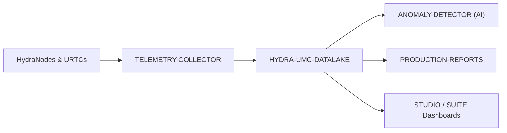

<p align="center">
  
</p>

# 🗄️ HYDRA-UMC-DATALAKE

<p align="center"><a href="README.md">🇺🇸 English</a> | <a href="README_spa.md">🇪🇸 Español</a> | <a href="README_fra.md">🇫🇷 Français</a> | <a href="README_ita.md">🇮🇹 Italiano</a> | <a href="README_deu.md">🇩🇪 Deutsch</a> | 🇨🇳 <b>简体中文</b> | <a href="README_jpn.md">🇯🇵 日本語</a></p>

### 📊 面向工业机器人数据的可扩展时序存储系统

<p align="left">
  
  
  
</p>

---

## 1. 🛠️ 技术概述

**HYDRA-UMC-DATALAKE** 是工厂当前的时序存储。它为生态系统产生的规范化
遥测数据提供真实的 SQLite 支持仓库，包括电机电流、关节角度、传感器读数
和 AI 推理日志。

它是分析、预测性维护和生产报告的软件基础。当前 SQLite 实现已在本地测试；
外部 InfluxDB/TimescaleDB 部署仍是未来的基础设施决策，而不是声称已在运行的功能。

### 关键特性：
* 🗄️ **SQLite 支持的存储：** 使用 Python 标准库 `sqlite3` 的真实、ACID、磁盘时序存储。*(已实现)*
* 📊 **统一数据模式：** 面向 HYDRA-UMC 和 URTC 来源的规范化长格式遥测（`source/kind/field/timestamp/value`）。*(已实现)*
* 🔍 **确定性查询：** 结果按时间戳和稳定的决胜条件排序；受限读取拒绝非正 limit。*(已实现)*
* 🔁 **幂等重试处理：** 重传一个 `(source, kind, field, timestamp)` 点会替换其值（最后写入获胜），避免重试扩大重复数据。*(已实现)*
* 🧬 **可逆的模式迁移：** 真实的、经过测试的 `migrate_up()`/`migrate_down()`，通过 SQLite 自身的 `PRAGMA user_version` 进行跟踪——切勿修改已发布的迁移，而是新增一个。*(已实现)*
* 🕐 **显式 UTC 时间戳：** `GET /stats/range` 以原始毫秒数和显式的 UTC ISO 8601 字符串两种形式，报告真实的最早/最新数据。*(已实现)*
* 🗑️ **经过验证的保留策略：** 按序列、可选启用的保留窗口（`GET`/`POST /retention`、`POST /retention/apply`）——非正数窗口会被直接拒绝。*(已实现)*

---

## 2. 🔄 数据架构



---

## 3. 🧱 架构与设计决策

* **为何本项目是其 3 个子项目的集成父项目，而非平级项目。** HYDRA-UMC-TELEMETRY-COLLECTOR、HYDRA-UMC-ANOMALY-DETECTOR 和 HYDRA-UMC-PRODUCTION-REPORTS 都读写*同一个*底层时序存储——将该存储的所有权集中于一处（本仓库），可避免出现 3 个独立的、可能相互分歧的模式决策。
* **为何目前是 sqlite3，而不是 InfluxDB/TimescaleDB。** 外部数据库仍是长期部署的可能选择，但其运行是真正的基础设施工作，不应在未要求时声称或加入。`src/hydra_umc_datalake/store.py` 中的 `TimeSeriesStore` 今天是一个真实、符合 ACID、可查询的时序存储（Python 标准库 `sqlite3`），不是占位符；它保持在自身类之后，使未来后端能够在无需重写 HTTP 契约的情况下替换它。
* **为何是一张窄的“长”表（source/kind/field/timestamp/value），而非每个遥测字段一列。** HYDRA-UMC-TELEMETRY-COLLECTOR 自己的 `Sample.Fields` 是开放式的（任何字段名，任何来源都可以上报新字段）——窄表结构可以接受任何字段而无需迁移，其真实代价是每个样本的每个字段占一行，而不是每个样本一行。
* **为何 `aggregate()` 做的是真正的 SQL 按时间分桶，而不只是原始的 `query()`。** 一个仪表盘或报表询问“过去一周每分钟的平均电机温度”，需要在数百万条原始行上由数据库完成真正的降采样，而不是取出原始数据再在应用代码中求平均——`aggregate()` 的桶边界是确定性的（与查询本身的 `start` 对齐），因此同一查询针对同一数据总是画出相同的桶边界。
* **这如何融入生态系统的其余部分。** 作为 数据与分析 系列的集成父项目——HYDRA-UMC-TELEMETRY-COLLECTOR 从 HYDRA-UMC-SERVER 向其输入数据，HYDRA-UMC-ANOMALY-DETECTOR 和 HYDRA-UMC-PRODUCTION-REPORTS 都从其自身存储的遥测数据中回读。
* **为何模式版本控制使用 SQLite 自身的 `PRAGMA user_version`，而非手写的表。** SQLite 已经提供了正是这种真实机制（文件头中的一个整数）——一张并行的记账表只会成为同一事实的第二个、可能相互分歧的真相来源。
* **为何保留策略是按 `(kind, field)` 可选启用，而非全局默认值。** 一个拥有数十个真实遥测序列的存储，不应让某个操作员的保留假设悄悄地套用到每一个序列上——`apply_retention()` 只会处理通过 `set_retention_policy()`/`POST /retention` 明确设置了策略的序列。
* **为何重试身份是 `(source, kind, field, timestamp)`。** 规范化遥测契约没有序列/事件 ID，因此完全重复的点被视为不确定的网络重试，并以确定性的最后写入获胜规则合并。这避免重复行扭曲计数和聚合，同时不会对历史数据执行全局破坏性清理。
* **为何 `/stats/range` 是一个新端点，而不是扩展 `/stats`。** `/stats` 现有的 `{"sampleCount": <int>}` 结构已经是真实且经过测试的——毫无理由地为其添加字段将是一次真实的破坏性变更，而增加一个附加的第二端点则不需要任何代价。

---

## 📂 目录结构

纯软件服务（摄取/分析集成器）——没有自己的硬件、固件或操作系统；这些目录
按照仓库结构策略予以省略。

```text
HYDRA-UMC-DATALAKE/
├── src/hydra_umc_datalake/  # 源代码
│   ├── __init__.py          # 包版本
│   ├── store.py             # TimeSeriesStore：通过 sqlite3 实现的真实摄取/查询/聚合
│   ├── api.py                # 封装 store 且具有限制的 JSON/HTTP 处理器
│   └── main.py               # 入口点：连接 store+API，启动 HTTP 服务器
├── tests/                   # pytest——store 逻辑、真实迁移、真实 HTTP 往返测试
├── docs/
│   └── API.md               # 真实的 HTTP 端点参考（请求、响应、状态码）
├── images/                  # 媒体与图示
├── systemd/
│   └── hydra-umc-datalake.service # CM5 本地摄取/分析 API 的 systemd 单元
├── tools/
│   ├── build_test.py        # 不递增版本号的构建/编译检查
│   └── ci_validate.py       # CI 使用的 manifest/CHANGELOG/docs 校验
├── build/                   # 构建输出（已被 gitignore）
├── pyproject.toml           # 包元数据、版本、依赖项
├── bump_version.py          # 里程表式版本递增（由构建运行）
├── bump_manifest_version.py # 将 hydra-umc.project.json 的版本与原生版本同步（--sync）
├── docker-compose.yml       # 集成 TELEMETRY-COLLECTOR / ANOMALY-DETECTOR / PRODUCTION-REPORTS
├── build.sh / build.bat     # 真实构建：venv + 可编辑安装 + 版本递增 + 测试
├── run.sh / run.bat         # 真实运行：启动 HTTP API
└── README.md
```

从原始模板中省略：`hardware/`、`firmware/`、`os/`——这是一个纯软件
服务（Python 包），没有专属硬件或固件，也没有需要维护的操作系统镜像。
完整的 HTTP 端点参考见 [`docs/API.md`](docs/API.md)。

---

## 4. ⚙️ 构建与运行

需要 Python >= 3.10。一个真实的、可查询的时序存储，带有 HTTP API，
而不只是一个能导入的骨架。

```bash
# Linux/macOS
./build.sh
./run.sh --port 8095

# Windows
build.bat
run.bat --port 8095
```

`build` 创建/激活本地 `.venv`，以可编辑模式（含 dev 附加项）安装该包，
验证导入，并运行真实的测试套件（`pytest`）。`run` 启动 HTTP API，并
转发任何标志（`--addr`、`--port`、`--db`）。

```bash
# 摄取一个样本（与 HYDRA-UMC-TELEMETRY-COLLECTOR 自己的 Sample 相同的归一化形态）
curl -X POST localhost:8095/ingest \
  -d '{"sourceId":"robot-1","kind":"motor_temp","timestamp":1700000000000,"fields":{"value":42.5}}'

# 将其查询回来
curl "localhost:8095/query?sourceId=robot-1"

# 在真实时间范围上降采样为 1 分钟的桶
curl "localhost:8095/aggregate?kind=motor_temp&field=value&bucketMs=60000&start=0&end=1800000000000&agg=avg"

curl localhost:8095/stats
```

```bash
python -m pytest tests/ -v   # store.py（插入/查询/聚合，包括可手工
                              # 验证的分桶数学）以及 api.py（针对真实
                              # ThreadingHTTPServer 在临时端口上的真实
                              # HTTP 往返测试）
```

要将本项目与其 3 个子项目（Telemetry-Collector、Anomaly-Detector、
Production-Reports，作为同级目录检出）一同启动：

```bash
docker compose up --build
```

---

## 🚀 路线图
* **第一阶段：** 数据湖的高吞吐量摄取和索引，用于历史分析。
* **第二阶段：** 遥测采集器的边缘压缩和安全传输协议。
* **第三阶段：** 使用无监督学习和电机振动分析进行异常检测。
* **第四阶段：** 与 Grafana 集成，实现高级实时可视化以及生产报告自动化。

---

## 🔗 相关项目

本项目是同一作者(JuanenRac / Electro Hobby 3D)打造的 HYDRA-UMC 机器人生态系统的一部分。值得了解,因为某个请求实际上可能是关于这些项目之一,而非本仓库本身。

**子项目** —— 每一个都写入或读取本数据湖自身的存储
- **[HYDRA-UMC-TELEMETRY-COLLECTOR](https://github.com/JuanenRac/HYDRA-UMC-TELEMETRY-COLLECTOR)** —— 面向 DATALAKE 的真实 CAN/WebSocket 数据摄入管道,支持序列去重。
- **[HYDRA-UMC-ANOMALY-DETECTOR](https://github.com/JuanenRac/HYDRA-UMC-ANOMALY-DETECTOR)** —— 具备漂移监测能力的真实 FFT + 统计基线异常检测器。
- **[HYDRA-UMC-PRODUCTION-REPORTS](https://github.com/JuanenRac/HYDRA-UMC-PRODUCTION-REPORTS)** —— 基于 DATALAKE 历史数据的真实 OEE/可用率计算,支持可复现的 CSV 导出。

**直接相关**
- **[HYDRA-UMC-SERVER](https://github.com/JuanenRac/HYDRA-UMC-SERVER)** —— 每个控制客户端真正通信的真实无头后端(REST/WebSocket);本项目所摄入日志/遥测数据的来源。
- **[HYDRA-UMC-DASHBOARD-AI](https://github.com/JuanenRac/HYDRA-UMC-DASHBOARD-AI)** —— 基于 DATALAKE/ANOMALY-DETECTOR 的智能摘要与异常高亮面板,具备诚实的统计回退机制;直接根据本数据湖自身真实的查询/聚合历史计算其智能摘要。

**生态系统中的其他项目**

*核心硬件与平台*
- **[HYDRA-UMC](https://github.com/JuanenRac/HYDRA-UMC)** —— 机器人手臂的真实主板——CM5 主机 + 双核 STM32H745,通过 CAN-OTA/SPI-OTA 协调最多 8 条工具臂。
- **[HYDRA-UMC-OS](https://github.com/JuanenRac/HYDRA-UMC-OS)** —— 面向 CM5 的可复现 Raspberry Pi OS 产品层——只读代理、经过验证的配置/配置文件、WiFi 首次配网。
- **[HYDRA-UMC-SDK](https://github.com/JuanenRac/HYDRA-UMC-SDK)** —— 每个桥接都据此校验自身指令的共享 JSON-Schema 契约与安全门限边界。

*核心后端与客户端*
- **[HYDRA-UMC-STUDIO](https://github.com/JuanenRac/HYDRA-UMC-STUDIO)** —— 具有实时多机器人 3D 可视化的网页控制面板。
- **[HYDRA-UMC-SUITE](https://github.com/JuanenRac/HYDRA-UMC-SUITE)** —— 面向多台服务器的桌面(PySide6)集群指挥中心,打包为独立可执行文件。
- **[HYDRA-UMC-ANDROID-CONTROL](https://github.com/JuanenRac/HYDRA-UMC-ANDROID-CONTROL)** —— 具有生物识别登录和配对 Wear OS 伴侣应用的原生 Android 控制应用。
- **[HYDRA-UMC-IOS-CONTROL](https://github.com/JuanenRac/HYDRA-UMC-IOS-CONTROL)** —— 具有实时 WebSocket 同步的 iOS/iPadOS 控制应用(Flutter)。
- **[HYDRA-UMC-DSI](https://github.com/JuanenRac/HYDRA-UMC-DSI)** —— 面向机载 7 英寸 DSI 触摸屏的原生触控界面,直接嵌入 CM5 本体。
- **[HYDRA-UMC-EDITOR-URDF](https://github.com/JuanenRac/HYDRA-UMC-EDITOR-URDF)** —— 将完成的模型推送到 STUDIO 自身目录的桌面版图形化 URDF 创建/编辑工具。
- **[HYDRA-UMC-BRIDGE-AMR](https://github.com/JuanenRac/HYDRA-UMC-BRIDGE-AMR)** —— 通过真实的 VDA 5050 MQTT 发布者为 AGV/AMR 车队提供的协调边界。
- **[HYDRA-UMC-BRIDGE-CNC](https://github.com/JuanenRac/HYDRA-UMC-BRIDGE-CNC)** —— 具备真实 GRBL 状态/控制字节访问能力的高层 CNC 单元协调器。
- **[HYDRA-UMC-BRIDGE-DROIDS](https://github.com/JuanenRac/HYDRA-UMC-BRIDGE-DROIDS)** —— 面向足式/人形机器人的协调边界,具备真实的 Boston Dynamics Spot 指令发送器。
- **[HYDRA-UMC-BRIDGE-LASER](https://github.com/JuanenRac/HYDRA-UMC-BRIDGE-LASER)** —— 读取 3 项真实钥匙/外壳/联锁 GPIO 安全信号的激光单元安全协调器。
- **[HYDRA-UMC-BRIDGE-OPENPNP](https://github.com/JuanenRac/HYDRA-UMC-BRIDGE-OPENPNP)** —— 面向 OpenPnP 贴片机板级流程的安全高层协调器。
- **[HYDRA-UMC-BRIDGE-PRINTER3D](https://github.com/JuanenRac/HYDRA-UMC-BRIDGE-PRINTER3D)** —— 面向 Moonraker/Klipper 3D 打印机的安全协调边界,具备真实的受控作业指令。
- **[HYDRA-UMC-BRIDGE-ROS2](https://github.com/JuanenRac/HYDRA-UMC-BRIDGE-ROS2)** —— 具备真实的惰性导入 rclpy ROS 2 传输层的安全协调器。
- **[HYDRA-UMC-BRIDGE-UAV](https://github.com/JuanenRac/HYDRA-UMC-BRIDGE-UAV)** —— 面向搭载摄像头的无人机的协调边界,具备真实的 MAVLink 指令发送器。

*URTC 工具平台*
- **[URTC](https://github.com/JuanenRac/URTC)** —— 面向实体 Universal Robot Tool Controller 板卡的固件,通过 CAN 总线支持 25 种以上工具配置。
- **[URTC-FLASHER](https://github.com/JuanenRac/URTC-FLASHER)** —— 面向 URTC 板卡的桌面图形烧录工具,支持 CAN-OTA 以及全芯片 SWD/JTAG。
- **[URTC-TESTER](https://github.com/JuanenRac/URTC-TESTER)** —— 面向 URTC 板卡的桌面实时 CAN 总线诊断工具,每种工具配置对应一个面板。
- **[URTC-WEB-STUDIO](https://github.com/JuanenRac/URTC-WEB-STUDIO)** —— 通过 Web Serial API 实现的浏览器版 URTC-TESTER 替代方案,无需本地安装。

*视觉 AI 节点(Hailo-8)*
- **[HYDRA-UMC-VISION-NODE](https://github.com/JuanenRac/HYDRA-UMC-VISION-NODE)** —— 面向 Hailo-8 视觉流水线的集成中枢,具备逐阶段的真实硬件就绪检测。
- **[HYDRA-UMC-DETECTION-HEF](https://github.com/JuanenRac/HYDRA-UMC-DETECTION-HEF)** —— 具备 Hailo 架构/校验和安全加载验证的真实编译模型注册表。
- **[HYDRA-UMC-VISION-STREAMER](https://github.com/JuanenRac/HYDRA-UMC-VISION-STREAMER)** —— 具备真实 HailoRT 集成边界的真实 GStreamer 流水线 + MediaMTX 配置生成器。
- **[HYDRA-UMC-VISUAL-SERVOING-API](https://github.com/JuanenRac/HYDRA-UMC-VISUAL-SERVOING-API)** —— 具备真实 Position-Based Visual Servoing 修正律,并依据上游区域状态进行安全门控。
- **[HYDRA-UMC-SAFETY-ZONES](https://github.com/JuanenRac/HYDRA-UMC-SAFETY-ZONES)** —— 具备校准新鲜度强制检查的真实区域入侵检测与 E-STOP 请求。

*认知 AI 节点(Hailo-10)*
- **[HYDRA-UMC-COGNITIVE-NODE](https://github.com/JuanenRac/HYDRA-UMC-COGNITIVE-NODE)** —— 面向 Hailo-10 认知流水线(LLM/VLA/语音编排)的集成中枢。
- **[HYDRA-UMC-VLA-ENGINE](https://github.com/JuanenRac/HYDRA-UMC-VLA-ENGINE)** —— 面向 Vision-Language-Action 模型的真实动作 token 编解码与轨迹生成。
- **[HYDRA-UMC-VOICE-UI](https://github.com/JuanenRac/HYDRA-UMC-VOICE-UI)** —— 具备受限、需确认的 Watch 中继的真实语音前端(VAD + 意图解析)。
- **[HYDRA-UMC-SEMANTIC-PLANNER](https://github.com/JuanenRac/HYDRA-UMC-SEMANTIC-PLANNER)** —— 基于真实规则的任务分解,以及针对 MCU 错误码的语义化错误恢复。
- **[HYDRA-UMC-DOCS-QA](https://github.com/JuanenRac/HYDRA-UMC-DOCS-QA)** —— 面向本生态系统自身 Markdown 文档的真实纯标准库 TF-IDF 文档检索。

*编排与集群*
- **[HYDRA-UMC-ORCHESTRATOR](https://github.com/JuanenRac/HYDRA-UMC-ORCHESTRATOR)** —— 具备真实 gRPC/Protobuf 健康报告契约与任务状态机的集成中枢。
- **[HYDRA-UMC-JOB-DISPATCHER](https://github.com/JuanenRac/HYDRA-UMC-JOB-DISPATCHER)** —— 基于真实 HTTP API 的真实优先级任务队列,支持去重。
- **[HYDRA-UMC-NODE-HEALING](https://github.com/JuanenRac/HYDRA-UMC-NODE-HEALING)** —— 具备重试/退避与身份不匹配检测的真实基于 gRPC 的车队健康看门狗。
- **[HYDRA-UMC-PATH-PLANNER-3D](https://github.com/JuanenRac/HYDRA-UMC-PATH-PLANNER-3D)** —— 具备真实障碍物/工作空间碰撞校验的真实基于 RRT 的三维路径规划器。
- **[HYDRA-UMC-SWARM-SYNC](https://github.com/JuanenRac/HYDRA-UMC-SWARM-SYNC)** —— 经过多单元收敛属性测试的真实 CRDT LWW-Element-Map 状态同步。

*数字孪生与仿真*
- **[HYDRA-UMC-TWIN](https://github.com/JuanenRac/HYDRA-UMC-TWIN)** —— 面向数字孪生引擎的集成中枢,具备真实的版本兼容性同步契约。
- **[HYDRA-UMC-HIL-BRIDGE](https://github.com/JuanenRac/HYDRA-UMC-HIL-BRIDGE)** —— 在仿真与真实硬件之间路由指令的真实硬件在环安全联锁。
- **[HYDRA-UMC-PHYSICS-REPLICA](https://github.com/JuanenRac/HYDRA-UMC-PHYSICS-REPLICA)** —— 面向真实 URDF 子集的真实正向运动学与关节限位校验。
- **[HYDRA-UMC-SYNTHETIC-DATA-GEN](https://github.com/JuanenRac/HYDRA-UMC-SYNTHETIC-DATA-GEN)** —— 具备 YOLO/COCO 标注导出功能的真实程序化 2D 场景生成器。

*工业网关*
- **[HYDRA-UMC-GATEWAY-INDUSTRIAL](https://github.com/JuanenRac/HYDRA-UMC-GATEWAY-INDUSTRIAL)** —— 中继至工业协议的集成中枢,具备真实的指令白名单/背压控制层。
- **[HYDRA-UMC-OPCUA-SERVER](https://github.com/JuanenRac/HYDRA-UMC-OPCUA-SERVER)** —— 经真实二进制协议客户端会话验证的真实 OPC-UA 地址空间。
- **[HYDRA-UMC-MQTT-BROKER](https://github.com/JuanenRac/HYDRA-UMC-MQTT-BROKER)** —— 具备可选按客户端认证与主题 ACL 的真实 MQTT 代理。
- **[HYDRA-UMC-MTCONNECT-ADAPTER](https://github.com/JuanenRac/HYDRA-UMC-MTCONNECT-ADAPTER)** —— 具备降级模式输出的真实 MTConnect `/probe` 与 `/current` XML 端点。

*辅助工具与生态系统运维*
- **[HYDRA-UMC-TOOL-CLI](https://github.com/JuanenRac/HYDRA-UMC-TOOL-CLI)** —— 具备真实、稳定退出码契约的车队 CLI,是 HYDRA-UMC-SERVER 自身 API 的真实在线客户端。
- **[HYDRA-UMC-WATCH](https://github.com/JuanenRac/HYDRA-UMC-WATCH)** —— 具备真实触觉提醒与配对手机语音中继功能的 WearOS 伴侣应用。
- **[URTC-SMART-RACK](https://github.com/JuanenRac/URTC-SMART-RACK)** —— 面向板卡安装机架的固件,具备真实的工具 ID 解码与 Smart Idle 预热逻辑。
- **[URTC-VISION-TOOL](https://github.com/JuanenRac/URTC-VISION-TOOL)** —— 面向热成像/RGB 检测工具头的固件及真实 Python 视觉伴侣程序。
- **[HYDRA-UMC-UPDATER](https://github.com/JuanenRac/HYDRA-UMC-UPDATER)** —— 发现、克隆并更新本生态系统中每个仓库的管理类桌面工具。


---

## 📚 文档与社区

- **[CONTRIBUTING.md](CONTRIBUTING.md)** —— 提交 Pull Request 所需的技术栈和编码规范。
- **[CODE_OF_CONDUCT.md](CODE_OF_CONDUCT.md)** —— 本社区所期望的行为准则。
- **[SECURITY.md](SECURITY.md)** —— 如何报告漏洞，以及本项目真实的安全关注重点。
- **[SUPPORT.md](SUPPORT.md)** —— 在哪里提问和报告缺陷。
- **[LICENSE.md](LICENSE.md)** —— 本项目自身的许可证。

## 👤 作者
**JuanenRac** (Electro Hobby 3D)
📧 electrohobby3d@gmail.com
📺 [youtube.com/@electrohobby3d](https://youtube.com/@electrohobby3d)

## 📜 许可证
GPL-3.0 —— 详见 LICENSE。
